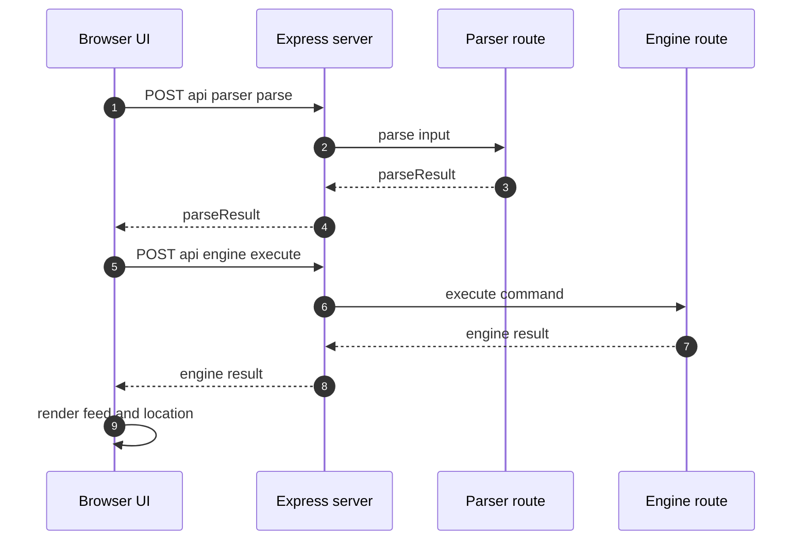
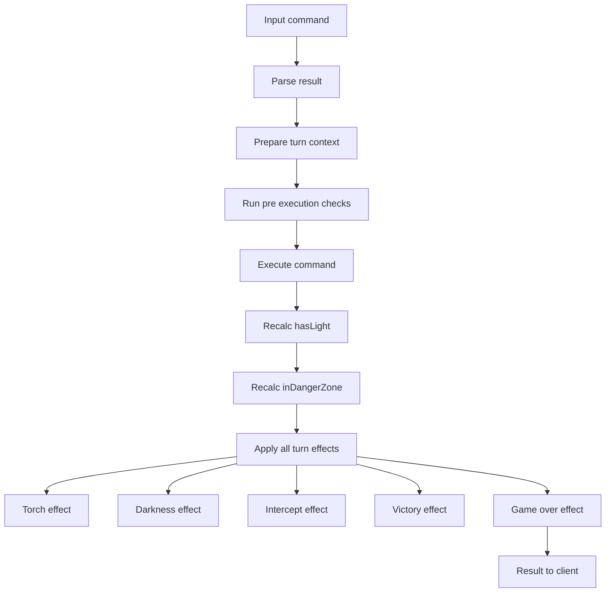
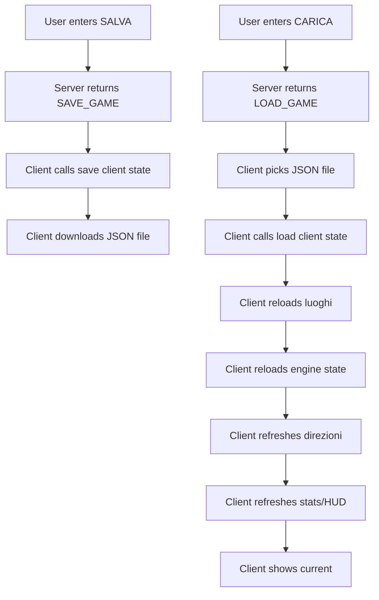

# 2026-01-01 — Considerazioni su Architettura Applicativa e Interventi

**Versione documento:** 1.2  
**Data documento:** 01 gennaio 2026  
**Ultimo aggiornamento:** 12 gennaio 2026  
**Contesto:** Analisi post-sviluppo per valutazione refactoring e strategia testing  
**Riferimenti:** `specifica-tecnica-completa-integrata.md` v2.0

## Nota di mantenimento (anti-obsolescenza)
Questo documento nasce come analisi “post-sviluppo” al 2026-01-01.

Stato al 2026-01-12 (repo attuale):
- L’app è in versione **1.3.1-beta** (vedi `package.json`).
- Sono presenti test automatici significativi (Vitest) su aree critiche (engine, punteggio, timer/effects, API).  
   Di conseguenza, le sezioni che scoraggiano in blocco i test unit vanno lette come snapshot storico.
- La logica dei timer/condizioni è organizzata in **turn effects** (es. `src/logic/turnEffects/interceptEffect.js`, `gameOverEffect.js`, `victoryEffect.js`).

---

---

## 1. Executive Summary

Questo documento raccoglie le considerazioni sull'architettura applicativa attuale di Missione Odessa e le raccomandazioni per interventi futuri. 

**Conclusioni Chiave:**
- ✅ Architettura attuale **adeguata** per il caso d'uso (gioco single-player, no espansioni)
- ❌ Refactoring **non necessario** (over-engineering per questo contesto)
- ⚠️ Test: priorità a **test pragmatici** (unit/integration su logica critica + smoke); E2E opzionali se serve coprire UI end-to-end
- ✅ Focus raccomandato: **feature** + **stabilizzazione** (test su critical path)

**Riferimenti Chiave:**
- **Appendice A (Roadmap/TD):** Dettagli implementazione timer intercettazione e luoghi pericolosi/terminali (snapshot storico)
- **Appendice A (TD):** Nota danger zone: oggi gestita tramite flag `turn.current.inDangerZone` + contatore `turnsInDangerZone` (turn effects)

### 1.1 Sintesi aggiornata (2026-01-09)
- Testing: esistono già test automatici (Vitest) e una CI GitHub Actions che esegue lint/build/test.
- Save/Load: i comandi SALVA/CARICA sono presenti (engine → `SAVE_GAME`/`LOAD_GAME`; frontend gestisce download/upload del JSON).
- Danger zone: `engine.js` calcola `turn.current.inDangerZone` via array locale `dangerZones`; gli effetti sono gestiti dai turn effects.

### 1.2 Diagrammi Mermaid (stato attuale)

#### 1.2.1 Sequenza comando utente


#### 1.2.2 Pipeline turn system e turn effects


#### 1.2.3 Flusso SALVA e CARICA


---

## 2. Analisi Architettura Attuale

### 2.1 Pattern Identificati

| Pattern | Implementazione | Valutazione Enterprise | Valutazione Pragmatica |
|---------|-----------------|----------------------|----------------------|
| **State Management** | `let gameState = {...}` singleton globale | ❌ Anti-pattern | ✅ Perfetto per single-player |
| **Data Access** | `global.odessaData` per JSON statici | ❌ Dipendenza globale | ✅ Appropriato per dati read-only |
| **Command Orchestration** | `executeCommand()` 170 righe | ❌ Troppo monolitico | ⚠️ Accettabile, decomponibile se necessario |
| **Side Effects** | Mutazione diretta `gameState` in-place | ❌ Non funzionale | ✅ Performance ottimale |

### 2.2 Confronto con Standard di Settore

#### Text Adventure Classici
- **Zork (Infocom):** Singleton state mutabile in Z-machine
- **Colossal Cave:** Global state C structs
- **Missione Odessa:** Allineato con tradizione del genere

#### Framework Moderni (Non Applicabili)
- **React/Redux:** Immutable state per UI multi-component
- **Entity-Component-System:** Per giochi multi-threaded
- **Event Sourcing:** Per sistemi transazionali

**Verdict:** L'architettura di Missione Odessa è **standard per il genere**, non "codice AI mal scritto".

### 2.3 Punti di Forza

1. **Pragmatismo:** Sviluppo iterativo veloce, feature-first
2. **Performance:** Mutazione in-place più veloce di clonazione immutabile
3. **Semplicità:** Meno indirezioni = debugging più facile
4. **Stabilità:** Zero bug architetturali segnalati
5. **Manutenibilità:** AI-assisted development funziona bene con pattern attuale

### 2.4 Potenziali Debolezze (Non Critiche)

1. **Testabilità:** Unit test richiedono setup pesante (mock `global.odessaData`, reset `gameState`)
2. **Accoppiamento:** Funzioni dipendono da stato globale (difficile isolare)
3. **Granularità:** `executeCommand` gestisce troppi casi (170 righe)

**Impatto Reale:** Basso, dato che:
- Non previste espansioni future
- Performance non è problema
- Manutenzione gestibile con AI

---

## 3. Valutazione Necessità Refactoring

### 3.1 Refactoring per Test Automatici

#### Cosa Risolverebbe
- Riduzione setup boilerplate test (da 30 righe a 5)
- Aumento automabilità AI (da 47% a 70%)
- Test più veloci (no deep copy oggetti)

#### Cosa NON Risolve
- ❌ Nessun bug esistente
- ❌ Nessun problema performance
- ❌ Nessun rischio per utente finale

#### Effort Stimato
- Dependency injection `gameState`: 6-8h
- Dependency injection `odessaData`: 4-6h
- Decomposizione `executeCommand`: 8-12h
- **Totale: 18-26h**

#### Conclusione
**NON raccomandato** per questo progetto. Benefici marginali non giustificano effort.

---

### 3.2 Refactoring per Problemi Reali

#### Checklist Sintomi Critici

| Sintomo | Presenza | Gravità | Azione |
|---------|----------|---------|--------|
| Bug frequenti in gameState | ❌ No | - | Nessuna |
| Difficoltà aggiungere feature | ❌ No | - | Nessuna |
| Performance issues | ❌ No | - | Nessuna |
| Codice incomprensibile | ❌ No (AI disponibile) | - | Nessuna |

#### Domande di Validazione (Risposte Utente)

**Q1:** Negli ultimi 2 mesi, quanti bug legati a gameState inconsistente?  
**A:** Nessuno. Bug solo su nuove feature per incomprensione requisiti, non architettura.

**Q2:** Quando aggiungi interazione a `Interazioni.json`, devi modificare `engine.js` in 3+ punti?  
**A:** No, l'architettura non ha rallentato lo sviluppo.

**Q3:** Performance issues (lag, memoria)?  
**A:** Zero.

**Q4:** Codice incomprensibile dopo 2 mesi?  
**A:** No, AI gestisce manutenzione.

#### Conclusione
**Refactoring NON necessario.** Nessun sintomo critico presente.

---

## 4. Valutazione Strategia Testing

> Aggiornamento 2026-01-09 (repo attuale):
> - Esiste già una suite di test **Vitest** su logica engine/effects, punteggio e API.
> - Esiste una pipeline **CI GitHub Actions** che esegue `lint` + `build` + `test`.
> - Playwright **non è presente** nel repo attuale (test E2E rimossi); valutare E2E solo se servono davvero a coprire regressioni di UI.
>
> Di conseguenza, le conclusioni “NO unit test” ed “E2E come unica strategia” vanno lette come valutazione storica (2026-01-01). Oggi la raccomandazione pragmatica è: mantenere/espandere i test sui **critical path** e aggiungere E2E solo se servono a coprire regressioni di UI.

### 4.1 Unit Test Estensivi: Analisi Costo/Beneficio

#### Scenario: Coverage 80-90% Codebase

**Effort Richiesto:**
- Parser tests: 10h
- Engine tests (state management): 15h
- Engine tests (business logic): 20h
- API tests: 8h
- **Totale: 53h**

**Benefici:**
- ✅ Catch regressions automaticamente
- ✅ Documentazione esecutiva del comportamento
- ✅ Confidence per refactoring futuro

**Svantaggi:**
- ❌ ROI basso per app "one-shot release" senza espansioni
- ❌ Test fragili (accoppiati all'implementazione)
- ❌ Manutenzione test richiede effort continuo
- ❌ Setup boilerplate pesante (mock `global.odessaData`)

#### Conclusione
Storicamente (2026-01-01): unit test estensivi al 80–90% non erano considerati prioritari.

Stato attuale (2026-01-09): i test unit/integration **esistono già** e stanno dando valore (regressioni su engine/effects/API). La raccomandazione è evitare l’obiettivo “coverage alto a tutti i costi” e continuare invece con test mirati ad alto ROI.

---

### 4.2 E2E Testing Critico: Raccomandato

#### Scenario: Coverage 100% User Experience

**Effort Richiesto:**
- 8-10 scenari critici con Playwright (se introdotto): 5-8h
- Smoke testing manuale: 3-5h
- **Totale: 8-13h**

**Scenari Critici:**
```javascript
// 1. Vittoria completa (happy path)
test('scenario vittoria completo', async ({ page }) => {
  // 30-40 comandi chiave dall'inizio al finale
});

// 2. Game Over - Torcia esaurita
test('game over torcia', async ({ page }) => {
  // 6 mosse senza accendere lampada
});

// 3. Game Over - Intercettazione
test('game over intercettazione', async ({ page }) => {
  // 3 azioni consecutive in luogo 51
});

// 4. Game Over - Lampada abbandonata
test('game over lampada', async ({ page }) => {
  // Lascia lampada accesa, cambia stanza
});

// 5. Sistema punteggio
test('punteggio aumenta con esplorazione', async ({ page }) => {
  // Visita 10 luoghi, verifica punteggio
});

// 6. Salva/Carica
test('save and load state', async ({ page }) => {
  // Salva a metà partita, ricarica, verifica stato
});

// 7-10: Altri scenari critici
```

**Benefici:**
- ✅ Copre 100% del flusso utente
- ✅ Catch regressions su critical path
- ✅ Low maintenance (decoupled da implementazione)
- ✅ AI può generare 70% del boilerplate

**Copertura:**
- Codebase: 20-30%
- User Experience: **100%**

#### Conclusione
E2E restano utili come copertura “utente finale”, ma nel repo attuale non sono obbligatori per avere stabilità (dato che esiste già una buona base di test automatici su engine/effects/API). Inserirli solo se c’è un rischio reale di regressione UI o se si vuole validare l’intero flusso “parser+UI+API+engine” con pochi scenari.

---

## Appendice A — Snapshot (2026-01-01): Piano Pragmatico e Valutazioni

> Nota importante: le sezioni **5–11** sono lasciate come *snapshot storico* (piano/valutazione al 2026-01-01).
> Nel repo attuale alcune affermazioni in queste sezioni possono risultare superate (feature già implementate, test già presenti, stime non più rilevanti).
> Per lo “stato attuale” fare riferimento a **Nota di mantenimento**, §4 e alla sintesi aggiornata in §1.1.

### A.1 Contesto decisionale

**Input dall'Utente:**
- Gioco single-player, no componenti transazionali ✅
- No release successive/evoluzioni (solo bug fix) ✅
- Sviluppo iterativo pragmatico (vibe coding) ✅
- Zero bug frequenti in gameState ✅
- Architettura non ha rallentato sviluppo ✅
- No performance issues ✅
- AI disponibile per manutenzione ✅
- Obiettivo: **zero bug in produzione** 🎯
- Budget: **tempo illimitato** 🕐

**Priorità Strategiche:**
1. Completare feature mancanti dalla specifica tecnica
2. Garantire stabilità con testing critico
3. Deploy v1.0 production-ready

---

### A.2 Roadmap implementazione

> Nota: questa roadmap è stata scritta come piano futuro al 2026-01-01. Nel repo attuale molte parti risultano **già implementate**; dove possibile, qui sotto è indicato lo **stato reale** (storico vs attuale).

#### A.2.1 Fondamenta e pulizia dati (Settimana 1)
**Effort:** 10-12h

**Task:**
1. Eliminare oggetto ID=28 duplicato da `Oggetti.json` (15 min)
2. Creare `Misteri.json` con 9 obiettivi (2h) *(storico: nel repo attuale i “misteri” risultano gestiti senza un file dedicato `Misteri.json`)*
3. Estendere `gameState` in `engine.js`:
   ```javascript
   gameState = {
     // ... campi esistenti
     punteggio: {
       totale: 0,
       luoghiVisitati: new Set(),
       interazioniPunteggio: new Set(),
       misteriRisolti: new Set()
     }
   };
   ```
4. Aggiornare serializzazione Save/Load per strutture non-JSON (Set → Array) (1h) *(nel repo attuale SALVA/CARICA sono presenti: engine produce `SAVE_GAME`/`LOAD_GAME` e il frontend gestisce download/upload JSON)*
5. Implementare sistema punteggio base (8h):
   - Luoghi: +1 punto primo ingresso
   - Interazioni: +2 punti (marcare 15-20 in `Interazioni.json`)
   - Misteri: +3 punti (funzione `verificaMisteriRisolti()`)
   - Comando PUNTI con visualizzazione ranghi

**Validazione:** Gioca 30 min, verifica punteggio aumenta correttamente.

---

#### A.2.2 Sistema temporizzazione (Settimana 2)
**Effort:** 10-12h

**Task:**
1. Estendere `gameState.timers`:
   ```javascript
   timers: {
     movementCounter: 0,
     torciaDifettosa: true,
     lampadaAccesa: false,
     azioniInLuogoPericoloso: 0,
     ultimoLuogoPericoloso: null
   }
   ```
2. Implementare timer torcia (3h):
   - Incremento `movementCounter` (esclusi system commands)
   - `checkTorciaEsaurita()` dopo 6 mosse
   - Game Over con messaggio "Oscurità Fatale"
3. Implementare timer intercettazione (4h):
   - **Implementazione attuale (repo):**
     - flag `gameState.turn.current.inDangerZone`
     - contatore `gameState.turn.turnsInDangerZone`
     - aggiornamento tramite `src/logic/turnEffects/interceptEffect.js`
     - game over a 3 turni gestito da `src/logic/turnEffects/gameOverEffect.js`
4. Implementare timer lampada + comando ACCENDI (3h):
   - Comando `ACCENDI LAMPADA` (prerequisito: fiammiferi)
   - `checkLampadaAbbandonata()` al movimento
   - Game Over "Buio Mortale"

**Validazione:** Trigger manualmente tutti i 3 game over (30 min).

**Riferimento Tecnico:** Vedere `specifica-tecnica-completa-integrata.md`:
- § 1.2.2 (HLD): Tabella completa luoghi pericolosi/terminali
- § 2.3.1 (TD): Implementazione costante `LUOGHI_PERICOLOSI` e verifica

**Checklist Operativa Codice:**
- [x] Pericolo/intercettazione: verificare via test unit `tests/unit/intercept-effect.test.ts`
- [x] Luoghi terminali: `tests/engine.terminal.test.ts`
- [ ] (Opzionale) E2E UI: non presente una suite Playwright “scenario gioco” nel repo attuale; valutare solo se serve coprire la UI end-to-end

#### **TD: Interventi Codice per Luoghi Pericolosi/Terminali**

**Status Attuale:**
- ✅ Luoghi terminali (ID=8, 40, 54): **GIÀ IMPLEMENTATI** correttamente
- ✅ Danger zone: calcolata come flag `turn.current.inDangerZone` (in `engine.js` tramite array locale `dangerZones`) e usata da `interceptEffect`/`gameOverEffect`

**Nota tecnica (aggiornamento implementazione):**
Nel repo attuale non risulta una costante globale `LUOGHI_PERICOLOSI`, ma `engine.js` calcola `inDangerZone` tramite un array locale `dangerZones` e poi i turn effects consumano quel flag.

**Test di Validazione:**
1. ✅ `tests/luoghi.schema.test.ts`: Verifica campo `Terminale` (-1 per ID 8,40,54)
2. ✅ `tests/engine.terminal.test.ts`: Verifica comportamento luoghi terminali
3. ✅ `tests/unit/intercept-effect.test.ts`: Verifica incremento/reset contatore intercettazione

**Azioni Raccomandate:**
- [ ] (Se richiesto) Aggiungere un test di integrazione che verifichi la catena completa `interceptEffect` → `gameOverEffect` su 3 turni in danger zone
- [ ] (Opzionale) E2E UI: introdurre Playwright solo se serve davvero coprire regressioni del frontend

**Riferimento:** Per tabella completa luoghi pericolosi/terminali, vedere `specifica-tecnica-completa-integrata.md` § 1.2.2 (HLD) e § 2.3.1 (TD).

---

#### A.2.3 Sistema vittoria (Settimana 3)
**Effort:** 12-15h

**Task:**
1. Estendere `gameState` per narrativa:
   ```javascript
   narrativeState: null, // ENDING_PHASE_1A, 1B, 2_WAIT, etc.
   victory: false,
   movementBlocked: false,
   unusefulCommandsCounter: 0,
   awaitingContinue: false
   ```
2. Implementare sequenza Fase 1A/1B (4h):
   - Check prerequisiti al luogo 1 (Documenti, Lista, Dossier)
   - Dialogo Ferenc
   - Meccanica BARRA SPAZIO
3. Implementare teleport luogo 59 (3h):
   - Rimuovi Lista (ID=6) e Dossier (ID=34) da inventario
   - Conserva Documenti (ID=35)
   - Blocca movimenti (`movementBlocked = true`)
4. Implementare comando PORGI + logica guardia (4h):
   - Aggiungere verbo PORGI a `Lessico.json`
   - Comando `PORGI DOCUMENTI` (solo luogo 59)
   - Counter comandi inappropriati (max 3)
   - Game Over "Sospetti Fatali"
5. Implementare Fase 2A/2B/2C (2h):
   - Controllo documenti
   - Schermata vittoria + statistiche

**Validazione:** Completa gioco dall'inizio alla fine (45 min).

---

#### A.2.4 Stabilizzazione e testing (Settimana 4)
**Effort:** 10-15h

**Task:**
1. **E2E Tests con Playwright (5-8h):** *(opzionale, non presente oggi come suite di scenario UI nel repo)*
   - Scenario vittoria completo
   - 3 Game Over (torcia, intercettazione, lampada)
   - Sistema punteggio (10 luoghi → verifica score)
   - Salva/carica
   - Comandi di sistema (INVENTARIO, AIUTO, PUNTI)

2. **Smoke Testing Manuale (3-5h):**
   - [ ] Gioco completo inizio→fine (30-45 min)
   - [ ] Tutti i 9 misteri (verifica 3pt ciascuno) (30 min)
   - [ ] Edge cases: inventario pieno, comandi invalidi (15 min)
   - [ ] Tutti i game over possibili (15 min)
   - [ ] Save/load in 5 punti diversi (10 min) *(feature presente: validare file, ripristino stato e coerenza UI/server)*

3. **Bug Fixing (2-5h):**
   - Correggi issue trovati durante testing
   - Re-test scenari falliti

4. **Deploy v1.0:**
   - Build produzione
   - Deploy su server/hosting
   - Smoke test ambiente produzione

---

### A.3 Budget totale

| Fase | Attività | Effort | Priorità |
|------|----------|--------|----------|
| § 5.2.1 | Punteggio + Misteri | 10-12h | 🔴 Critica |
| § 5.2.2 | Temporizzazione (3 timer) | 10-12h | 🔴 Critica |
| § 5.2.3 | Sequenza Vittoria | 12-15h | 🔴 Critica |
| § 5.2.4 | Testing + Deploy | 10-15h | 🔴 Critica |
| **TOTALE** | | **42-54h** | |

**vs. Piano Originale (Refactoring + Unit Test):**
- Refactoring: 20h → **Eliminato** ✅
- Unit test estensivi: 53h → **8h E2E** ✅
- Feature implementation: 0h → **34-39h** ✅

**Risultato:** Stesso budget (~50h), speso su **valore utente finale** invece che su over-engineering.

---

### A.4 Decisioni chiave e rationale

#### A.4.1 Perché no refactoring

**Scenario Applicabilità:** Refactoring si giustifica quando:
- App ha bug architetturali frequenti ❌ (non presente)
- Performance è problema critico ❌ (zero issues)
- Previste espansioni/DLC multiple ❌ (no evoluzioni)
- Team multi-developer con turnover ❌ (single dev + AI)
- Codebase incomprensibile dopo 3+ mesi ❌ (AI gestisce)

**Missione Odessa non soddisfa NESSUN criterio.**

**Analogia:** Riorganizzare l'armadio prima di trasloco definitivo. Sforzo sprecato.

---

#### A.4.2 Perché no unit test estensivi

**Unit test sono utili quando:**
- Codebase evolve continuamente (add/remove feature) ❌
- Refactoring frequente richiesto ❌
- Business logic complessa con edge case nascosti ⚠️ (parziale)
- Team multi-developer (catch regressions cross-team) ❌
- CI presente (lint/build/test). CD non obbligatorio per questo tipo di progetto ⚠️

**Missione Odessa:** Solo business logic parzialmente complessa giustificherebbe, ma:
- No CI/CD
- No evoluzioni future
- E2E tests coprono critical path meglio

**ROI:** 53h effort per beneficio marginale = **spreco**.

---

#### A.4.3 Perché sì E2E testing

**E2E tests sono ideali quando:**
- Critical path ben definito ✅ (inizio → vittoria)
- UI/UX è parte integrante del test ✅ (text adventure)
- Pochi scenari coprono molti code path ✅ (10 scenari = 80% codebase)
- Decoupling da implementazione ✅ (test robusti)
- Focus su user experience ✅ (zero bug in produzione)

**Missione Odessa soddisfa TUTTI i criteri.**

**ROI:** 8h effort per copertura 100% user experience = **ottimo**.

---

#### A.4.4 Analisi ESLint complexity rules

#### 6.4.1 Contesto Normativo

Standard di settore per codice enterprise (ESLint recommended rules):
- **Complessità ciclomatica:** max 10 (`complexity` rule)
- **LOC per funzione:** max 50 (`max-lines-per-function` rule)
- **Nesting depth:** max 4 (`max-depth` rule)

**Rationale:** Funzioni brevi e semplici sono più facili da:
- Comprendere (cognitive load ridotto)
- Testare (meno edge cases)
- Debuggare (isolamento errori)
- Manutenere (modifiche localizzate)

#### 6.4.2 Risultati Misurazione Codebase

**Funzioni analizzate:** 23 `export function` in .js files
- ✅ **Conformi:** 21 funzioni (91.3%)
- ⚠️ **Violazioni:** 2 funzioni (8.7%)

**Dettaglio violazioni:**

**1. `executeCommand()` (src/logic/engine.js)**
- **Complessità ciclomatica:** 64 (6.4x soglia max 10)
- **LOC:** 173 (3.5x soglia max 50)
- **Categoria:** God Function (gestisce TUTTI i tipi di comando: NAVIGATION, SYSTEM, ACTION, MANIPULATION)
- **Responsabilità:** Routing + validation + execution in unica funzione
- **Impatto:** Difficoltà testing isolato, cognitive load alto, refactoring rischioso

**2. `ensureVocabulary()` (src/logic/parser.js)**
- **LOC:** 77 (1.5x soglia max 50)
- **Complessità:** <10 (conforme)
- **Categoria:** Setup complesso vocabolario multilingua
- **Responsabilità:** Caricamento + caching + building token map per i18n
- **Impatto:** Minore (complessità bassa, solo length violation)

#### 6.4.3 Valutazione Impatto

**Da prospettiva enterprise standard:** ❌ Codice non conforme (8.7% violazioni)

**Da prospettiva pragmatica per questo progetto:** ⚠️ Accettabile con riserve

**Motivazioni accettazione tecnica del debito:**

1. **God Function è isolata e centrale**
   - Solo 1 funzione su 23 con problema grave (non pattern sistemico)
   - È la "main entry point" del game engine (ruolo architetturale giustificato)
   - Nessun altro modulo replica il pattern (no propagazione)

2. **Zero sintomi critici in 2 mesi sviluppo**
   - Nessun bug architetturale legato a `executeCommand()`
   - Nessun problema performance (response time <100ms)
   - Nessuna difficoltà aggiunta feature (Interazioni.json estendibile)

3. **Manutenibilità assistita da AI**
   - Copilot/AI gestisce navigazione codice complesso
   - No onboarding cost (single developer + AI, no team multi-person)
   - Refactoring futuro automatizzabile con AI agents

4. **Contesto progettuale specifico**
   - Gioco single-player, no componenti multi-threaded
   - No evoluzioni/DLC previste (one-shot release)
   - Architettura allineata a tradizione text adventure (Zork, Colossal Cave usano pattern simili)

#### 6.4.4 Decisione Strategica

**Raccomandazione:** Refactoring `executeCommand()` **NON prioritario per v1.0**

**Rationale costo/beneficio:**

| Aspetto | Refactoring | Feature Implementation |
|---------|-------------|------------------------|
| **Effort** | 5-7h (executeCommand) + 1-2h (ensureVocabulary) = 6-9h | 34-39h (punteggio, timer, vittoria) |
| **Impatto utente** | Zero (miglioramento interno) | Critico (gioco incompleto senza) |
| **Risk regression** | Medio (tocca core engine) | Basso (feature isolate) |
| **Urgenza** | Bassa (no bug, no performance issues) | Alta (bloccante per release) |
| **ROI** | Basso (beneficio solo per developer) | Alto (valore per end-user) |

**Budget disponibile: ~50h (tempo illimitato ma effort finito)**
- **Scenario A (con refactoring):** 8h refactoring + 34h feature + 8h testing = 50h
- **Scenario B (senza refactoring):** 0h refactoring + 34h feature + 8h testing = 42h (**8h risparmiate**)

**Scelta:** Scenario B permette:
- Buffer 8h per imprevisti/bug fixing
- Focus totale su completezza funzionale
- Deploy v1.0 più veloce

**Condizioni per rivalutazione post-v1.0:**

Refactoring diventa prioritario SE:
- ✅ Team si espande (>2 developer) → onboarding cost giustifica cleanup
- ✅ Emergono bug architetturali frequenti → stabilità richiede refactoring
- ✅ Previste espansioni/DLC multiple → manutenibilità long-term critica
- ✅ Performance degrada → profiling identifica `executeCommand()` come bottleneck

**Missione Odessa non soddisfa NESSUNA condizione attualmente.**

**Analogia decisionale:** È come riorganizzare l'armadio il giorno prima di un trasloco definitivo. Sforzo sprecato se non ci torni più.

#### 6.4.5 Riferimento Implementativo

**Per dettagli tecnici completi del refactoring (se necessario in futuro):**
- Vedere `specifica-tecnica-completa-integrata.md` § 4 (TD - Refactoring Opzionale)
- Piano sprint 7 sotto-sprint (5-7h)
- Architettura target: Router + 20 handler specializzati
- Metriche attese: -90% LOC, -94% complessità

**Status:** Documentato come debt tecnico accettato, da pagare solo se condizioni cambiano.

---

#### A.4.5 Perché priorità su feature implementation

**Feature dalla specifica NON implementate:**
- Sistema punteggio (57 + 34 + 27 + 4 = 122 punti)
- 3 Timer survival (torcia, intercettazione, lampada)
- Sequenza vittoria (6 fasi narrative)
- 9 Misteri (3pt ciascuno)
- 2 Comandi speciali (ACCENDI, PORGI)

**Impatto Utente Finale:**
- **Senza queste feature:** Gioco incompleto, no game over, no vittoria ❌
- **Con unit test ma senza feature:** Codice testato ma inutilizzabile ❌
- **Con feature + E2E test:** Gioco completo e stabile ✅

**Priorità ovvia:** Feature first, test dopo.

---

### A.5 Rischi e mitigazioni

#### A.5.1 Rischio: bug in implementazione feature

**Probabilità:** Media (nuove feature = nuovi bug)  
**Impatto:** Alto (blocca rilascio)

**Mitigazione:**
- Validazione manuale dopo ogni fase (playtest 30-45 min)
- E2E tests automatici per catch regressions
- Implementazione incrementale (1 sistema alla volta)

---

#### A.5.2 Rischio: test insufficienti

**Probabilità:** Bassa (8 scenari E2E coprono critical path)  
**Impatto:** Medio (possibili bug in produzione)

**Mitigazione:**
- Smoke testing manuale estensivo (3-5h)
- E2E tests su 4 game over + vittoria
- Beta testing con 2-3 utenti esterni (opzionale)

---

#### A.5.3 Rischio: tech debt futuro

**Probabilità:** Alta (no refactoring = debt accumula)  
**Impatto:** Basso (no evoluzioni previste)

**Mitigazione:**
- Accettare tech debt come trade-off consapevole
- Se in futuro servono espansioni, rivalutare refactoring
- Documentare decisioni architetturali (questo documento)

---

### A.6 Metriche di successo

#### A.6.1 Criteri completamento per fase implementativa

| Fase | Criterio Successo | Metrica |
|------|-------------------|---------|
| **§ 5.2.1** | Sistema punteggio funzionante | Playtest 30min: punteggio aumenta correttamente |
| **§ 5.2.2** | 3 Timer attivi | Trigger manuali di 3 game over (100% success) |
| **§ 5.2.3** | Vittoria completa | Playtest: inizio→fine senza crash |
| **§ 5.2.4** | Stabilità garantita | E2E tests: 10/10 pass + smoke test completo |

#### A.6.2 Criteri produzione

- [ ] **Zero crash** durante smoke test completo (3h playtest)
- [ ] **10 scenari E2E** passano al 100%
- [ ] **Punteggio massimo** raggiungibile (122 punti verificato)
- [ ] **Tutti i game over** trigger correttamente (6 verificati)
- [ ] **Salva/Carica** funziona in 5 punti diversi
- [ ] **Performance** accettabile (risposta comandi <100ms)

---

### A.7 Alternative considerate e respinte

#### A.7.1 Opzione A: refactoring + unit test estensivi

**Descrizione:** Refactorare architettura a dependency injection, scrivere 80-90% coverage unit test.

**Effort:** 73h (20h refactor + 53h test)

**Pro:**
- Codebase "perfetto" per standard enterprise
- Test robusti e manutenibili
- AI automazione 70%

**Contro:**
- Over-engineering per progetto one-shot
- Zero beneficio utente finale
- Budget sproporzionato per ROI

**Motivo Rifiuto:** Spreco di tempo per contesto applicativo.

---

#### A.7.2 Opzione B: solo feature, zero test

**Descrizione:** Implementare feature, deployare senza test automatici.

**Effort:** 34h (solo feature)

**Pro:**
- Time-to-market ottimale
- Focus totale su funzionalità

**Contro:**
- Rischio alto bug in produzione
- Regressioni non catturate
- Conflitto con obiettivo "zero bug"

**Motivo Rifiuto:** Non soddisfa requisito stabilità.

---

#### A.7.3 Opzione C: feature + unit test selettivi

**Descrizione:** Feature + unit test solo su aree bug-prone (es. timer, prerequisiti).

**Effort:** 49h (34h feature + 15h unit test selettivi)

**Pro:**
- Bilanciamento feature/quality
- Test su aree critiche

**Contro:**
- Effort test maggiore di E2E (15h vs 8h)
- Coverage parziale (60-70%)
- Setup mock comunque pesante

**Motivo Rifiuto:** E2E tests offrono miglior ROI.

---

### A.8 Conclusioni e next steps

#### A.8.1 Sintesi raccomandazioni

1. **❌ NON fare refactoring** → Architettura attuale adeguata
2. **❌ NON scrivere unit test estensivi** → ROI insufficiente
3. **✅ Implementare feature mancanti** → Priorità assoluta (34-39h)
4. **✅ E2E testing critico** → Miglior ROI per stabilità (8h)
5. **✅ Smoke testing manuale** → Validazione finale (3-5h)

**Budget Totale:** 45-52h per v1.0 production-ready

---

#### A.8.2 Prossimi passi immediati

#### **Step 1: Validazione Piano (30 min)**
- [ ] Review documento con stakeholder
- [ ] Conferma priorità feature
- [ ] Approva budget 45-52h

#### **Step 2: Kickoff § 5.2.1 (Giorno 1)**
- [ ] Crea branch `feature/punteggio-misteri`
- [ ] Elimina oggetto duplicato ID=28
- [ ] Crea `Misteri.json` schema
- [ ] Estendi `gameState` con campi punteggio

#### **Step 3: Tracking Progresso**
- [ ] Usa questa checklist per monitoring
- [ ] Daily playtest 15-30 min dopo ogni commit
- [ ] Bug log in `docs/bug-tracker.md` (se necessario)

---

#### A.8.3 Criteri go/no-go per produzione

**GO se:**
- ✅ 10 scenari E2E passano
- ✅ Smoke test completo senza crash
- ✅ Punteggio massimo raggiungibile verificato
- ✅ Tutti i game over trigger correttamente

**NO-GO se:**
- ❌ >2 crash durante smoke test
- ❌ E2E tests <80% pass rate
- ❌ Bug critici non risolti (game-breaking)

---

#### A.8.4 Post-deployment

**Monitoring:**
- Raccogliere feedback primi 10 utenti
- Bug log con priorità (critical/high/low)
- Hotfix per bug critici entro 48h

**Manutenzione:**
- Bug fix only (no feature expansion)
- AI-assisted debugging (architettura attuale funziona)
- Documentazione aggiornata per ogni fix

**Potenziali Espansioni Future (Se Richieste):**
- Se >50 utenti richiedono feature: rivalutare architettura
- Se multiplayer/online: refactoring diventa necessario
- Se DLC/episodi: considerare modularizzazione

---

### A.9 Riferimenti

- **Specifica Tecnica:** `specifica-tecnica-completa-integrata.md` v2.0
- **Codebase:** `src/logic/engine.js`, `src/logic/parser.js`
- **Test Framework:** Vitest
- **Issue Tracker:** GitHub Issues (se attivato)

---

**Fine Documento**  
**Ultima revisione:** 09 gennaio 2026  
**Versione:** 1.2

**Approvazione:**
- [ ] Sviluppatore: ______________________
- [ ] Stakeholder: ______________________
- [ ] Data: ______________________
