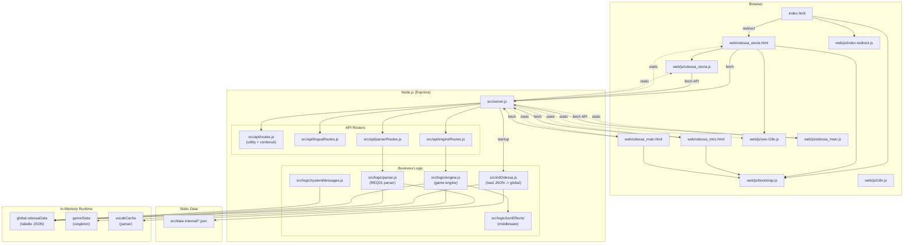
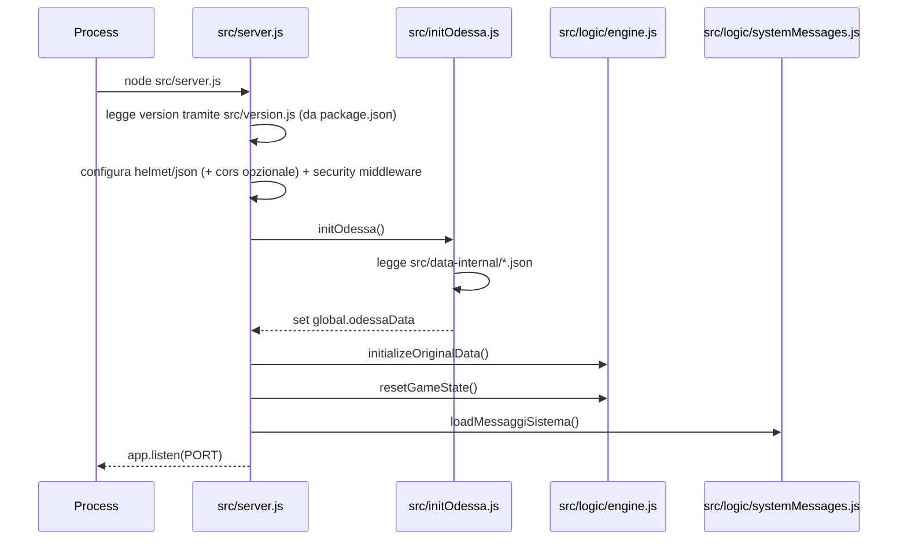
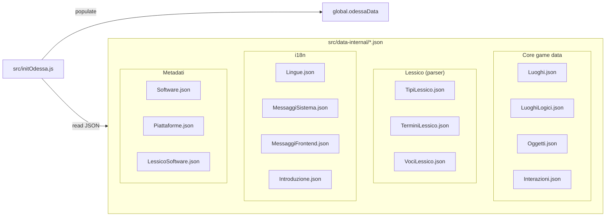
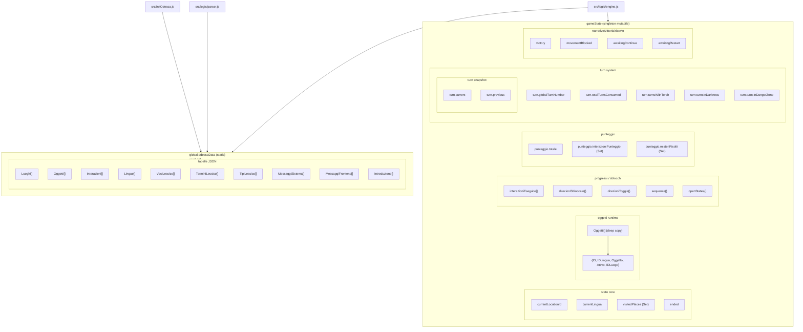
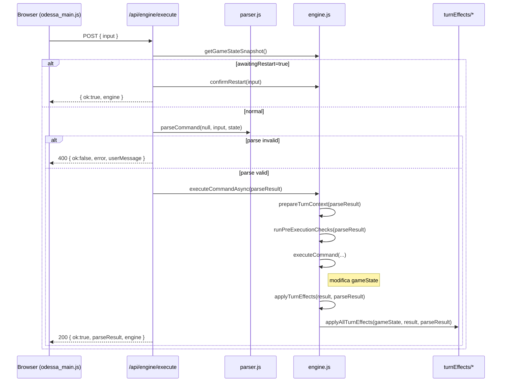
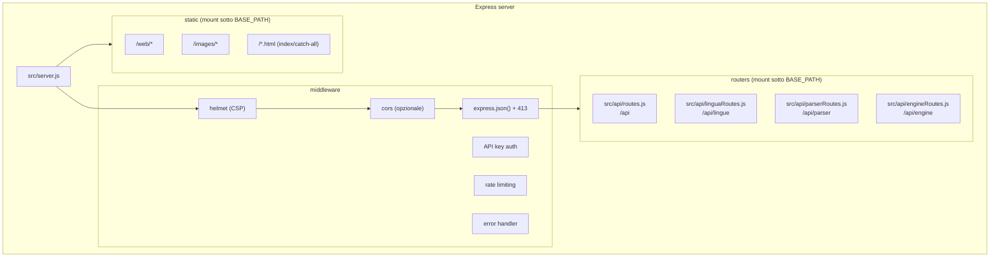
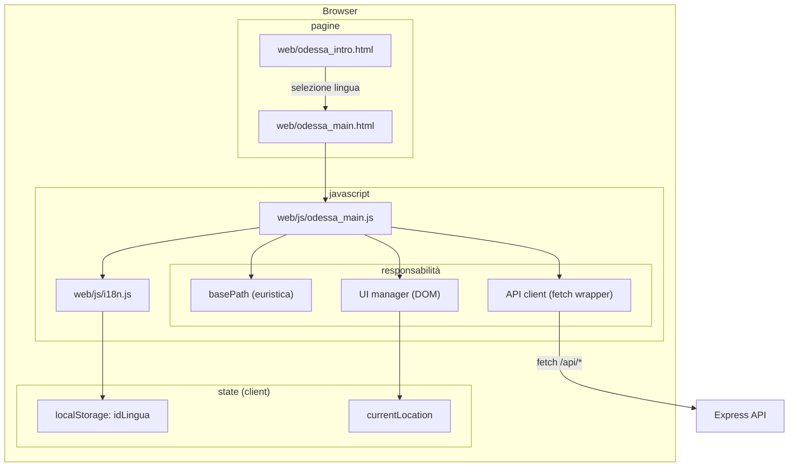
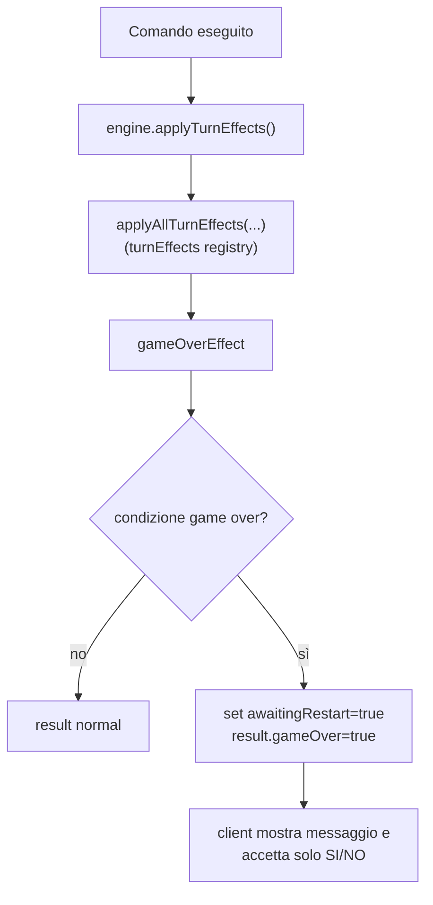

# Missione Odessa — Architettura Applicativa (Snapshot 2026-01-11)

Questo documento descrive l’architettura **corrente** dell’app Missione Odessa (v1.3.1-beta, 11 gen 2026), con focus su:
- server Node.js/Express e routing con `BASE_PATH`
- modello dati **JSON in-memory** (niente DB runtime)
- game engine (stato in memoria + turn effects)
- frontend statico (pagine HTML + JS) e chiamate API

> Nota: esiste già un documento generale “storico” (ora archiviato) in `docs/obsolete/architettura-applicazione.md`. Questo file è uno **snapshot datato** e allineato al codice corrente.

---

## 1) Vista d’insieme

### 1.1 Diagramma architetturale (alto livello)

### 1.2 Principi chiave

- **Dati**: caricati da file JSON in `src/data-internal/` e mantenuti in `global.odessaData`.
- **Stato di gioco**: singleton in memoria (`gameState` dentro `src/logic/engine.js`).
- **Parser**: server-side conforme REQ01 (`src/logic/parser.js`) con cache del vocabolario per lingua.
- **Turn system**: pattern “middleware” post-esecuzione (`src/logic/turnEffects/`).
- **Frontend**: statico (HTML/CSS/JS) servito da Express; il client usa fetch verso API REST.

Nota frontend (as-is):
- `index.html` è una pagina di lancio/redirect verso `web/odessa_storia.html`.
- `web/js/bootstrap.js` inizializza `window.basePath` e gestisce la compatibilità `file://` reindirizzando a `http://localhost:3001` per le pagine sotto `web/`.
- `web/js/index-redirect.js` effettua il redirect includendo `idLingua` e rispettando `window.basePath`.

---

## 2) Bootstrap e lifecycle server

### 2.1 Sequenza di startup

### 2.2 `BASE_PATH` (deploy in sottocartella)

- `BASE_PATH` (env) viene concatenato ai path di mount:
  - `app.use(BASE_PATH + '/api', ...)`
  - `app.use(BASE_PATH + '/api/engine', ...)`
  - `app.use(BASE_PATH, express.static(ROOT))`
  - catch-all `app.use(BASE_PATH, sendFile(index.html))`
- Redirect opzionale: se `BASE_PATH` è valorizzato, `GET /` redirige a `BASE_PATH + '/'`.
- Endpoint “config”: `GET /api/config` risponde con `{ basePath: '<normalized>/' }` (sempre con slash finale).
  - Se `BASE_PATH` è valorizzato, è disponibile anche come `BASE_PATH + /api/config` (stesso payload).

---

## 3) Data model e store in memoria

### 3.0 Diagramma data layer (file JSON)

Questo livello è “static data”: viene caricato all’avvio e poi consultato in read-only durante il runtime.

### 3.1 `global.odessaData`

- Popolato da `src/initOdessa.js` leggendo i file JSON.
- Contiene “tabelle” come array: `Luoghi`, `Oggetti`, `Lingue`, `MessaggiSistema`, `VociLessico`, ecc.
- È usato sia dal parser sia dal motore per leggere configurazioni e contenuti.

### 3.2 `gameState` (engine)

- Gestito da `src/logic/engine.js`.
- Include:
  - posizione corrente (`currentLocationId`), set luoghi visitati, inventario/oggetti runtime (`Oggetti`)
  - flags “narrative / victory / end/restart” (`awaitingEndConfirm`, `awaitingRestart`, `awaitingContinue`, `victory`, ecc.)
  - punteggio e progressi (set e contatori)
  - sottostruttura `turn` con snapshot `current` e `previous`

### 3.3 Dati originali immutabili

- `initializeOriginalData()` salva una deep copy di `global.odessaData.Oggetti` in `originalOggetti`.
- `resetGameState()` ripristina `gameState` e re-inizializza gli oggetti runtime (deep copy).

### 3.4 Diagramma in-memory store (dettaglio)

Questo diagramma esplicita le due strutture principali che vivono in RAM:
- `global.odessaData` (dati statici caricati dai JSON)
- `gameState` (stato mutabile della partita)

---

## 4) Parser REQ01 (server)

### 4.1 Flusso

- `parseCommand(null, input, gameState)`:
  - normalizza input (trim/uppercase/collapse spazi + rimozione diacritici)
  - elimina stopword
  - valida struttura (1-3 token) e produce `ParseResult`

### 4.2 Vocabolario e cache

- `ensureVocabulary(gameState)` costruisce `tokenMap` da `global.odessaData` filtrando per lingua corrente.
- Cache per processo: `vocabCache` (reset con `resetVocabularyCache()`).
- Il caricamento di uno “save” (vedi §6) esegue un reset della cache per evitare incoerenze.

---

## 5) Engine e Turn System

### 5.1 Esecuzione comando (happy path)

### 5.2 Turn effects registry

Il registry è in `src/logic/turnEffects/index.js`:
- `torchEffect` (illuminazione)
- `darknessEffect` (morte dopo N turni al buio)
- `gameOverEffect` (verifica condizioni game over)
- `interceptEffect` (zone pericolose)
- `victoryEffect` (sequenza finale)

> L’ordine è significativo: alcuni effetti dipendono dai valori calcolati da quelli precedenti.

---

## 6) API surface (server)

### 6.1 Mounting

Con `BASE_PATH`:
- `BASE_PATH + /api` → `src/api/routes.js`
- `BASE_PATH + /api/lingue` → `src/api/linguaRoutes.js`
- `BASE_PATH + /api/parser` → `src/api/parserRoutes.js`
- `BASE_PATH + /api/engine` → `src/api/engineRoutes.js`

### 6.2 Endpoint principali (riassunto)

**Utility / contenuti** (`src/api/routes.js`):
- `GET /api/luoghi`
- `GET /api/luogo-oggetti?idLuogo&?idLingua`
- `GET /api/introduzione?id&lingua` (markdown)
- `GET /api/frontend-messages/:lingua`

**Engine** (`src/api/engineRoutes.js`):
- `POST /api/engine/execute` (parser+engine)
- `GET /api/engine/state`
- `POST /api/engine/reset`
- `POST /api/engine/set-location` (legacy/deprecato; disabilitabile con `DISABLE_LEGACY_ENDPOINTS=1`)
- `POST /api/engine/save-client-state` (download JSON)
- `POST /api/engine/load-client-state` (ripristino)
- `GET /api/engine/direzioni/:idLuogo`
- `GET /api/engine/stats`

Nota (input gioco): il flusso target usa **solo** `POST /api/engine/execute`. Anche `POST /api/parser/parse` è legacy/deprecato (disabilitabile con `DISABLE_LEGACY_ENDPOINTS=1`).

**Versioning/config** (`src/server.js`):
- `GET /api/version` (sotto `BASE_PATH`)
- `GET /api/config` (root assoluta)
- `GET BASE_PATH + /api/config` (se `BASE_PATH` è impostato)

### 6.3 Diagramma server layer (Express)

---

## 7) Frontend: pagine e flussi

### 7.1 Pagine

- `web/odessa_intro.html`
  - selezione lingua / introduzione
  - usa `web/js/bootstrap.js` per inizializzare `window.basePath` (compatibile con deploy root o in sottocartella)

- `web/odessa_main.html`
  - UI principale (feed, input comandi, pannello direzioni)
  - usa `web/js/bootstrap.js` per inizializzare `window.basePath`

### 7.2 Client runtime (`web/js/odessa_main.js`)

- Usa `window.basePath` inizializzato da `web/js/bootstrap.js`.
- Fallback: se `bootstrap.js` non è presente, applica una euristica (root se primo segmento è tra `web/images/src/api`, altrimenti primo segmento come BASE_PATH).
- Invoca l’engine server via `/api/engine/*` per:
  - esecuzione comandi
  - navigazione (anche via click: invia comando e usa `POST /api/engine/execute`)
  - save/load
  - stats

### 7.3 Diagramma client layer (Browser)

Nota: il client non fa parsing del lessico; invia input grezzo al server e renderizza la risposta.

---

## 8) Sicurezza (stato attuale)

- Helmet con CSP (**`'unsafe-inline'` solo per `style-src`**; per gli script: **`script-src 'self'`** e **`script-src-attr 'none'`**).
- CORS **disabilitato di default** (same-origin). Cross-origin è abilitabile solo via whitelist (`ALLOWED_ORIGINS`).
- API protette con **API key** su `BASE_PATH + /api/*` (header `X-API-Key`), con eccezioni pubbliche minime: `GET BASE_PATH + /api/version` e `GET /api/config`.
  - Nota: `GET /api/config` è sempre disponibile a path assoluto e, se `BASE_PATH` è impostato, anche come `BASE_PATH + /api/config` (stesso payload).
- Rate limiting su `/api/*` e limiti più stretti per endpoint CPU/pesanti (`/api/parser/parse`, `/api/engine/execute`).
- Limitazione payload JSON (`express.json({ limit })`) con risposta `413` standardizzata.
- Error handling globale: sanitizzazione dei 5xx in produzione (evita leak di dettagli interni).
- Per hardening e raccomandazioni, vedere `docs/20260108_security_review_01.md`.

## 8.1 Diagramma game over (flusso logico)

Diagramma sintetico del flusso “turn effects → game over”: non descrive tutti i dettagli UI, ma chiarisce dove viene presa la decisione e quali flag bloccano l’input.

---

## 9) Testing

- Unit/integration: Vitest (`tests/`).

---

## 10) Rischi/attenzioni note (architetturali)

- **Stato singleton**: non adatto a scaling orizzontale senza persistenza/sessione.
- **BASE_PATH**: fonte primaria lato client `web/js/bootstrap.js` (`window.basePath`). L'endpoint config espone sempre un `basePath` normalizzato (con slash finale) ed è disponibile sia come `/api/config` sia come `BASE_PATH + /api/config`.
