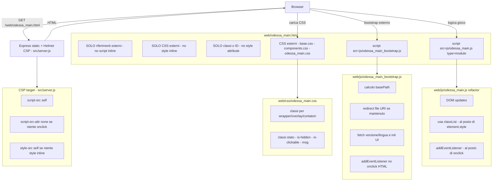
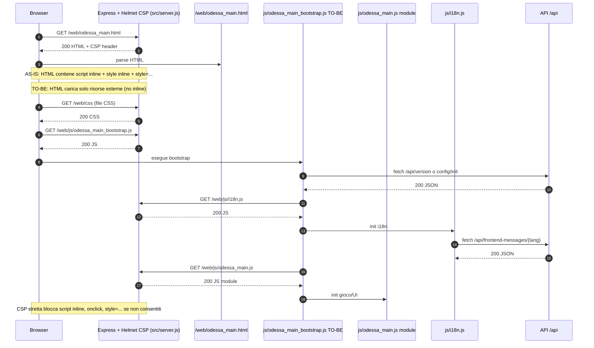

# 2026-01-09 — CSP review 01

## Obiettivo
Rendere la Content Security Policy (CSP) **più stretta**, riducendo o eliminando l’uso di `unsafe-inline` (script e/o style) dove possibile, senza introdurre regressioni nel frontend.

## Contesto e vincoli (scope)
- Questa review considera lo stato attuale del repository alla data 2026-01-09.
- Due file sono **destinati a cambiare a breve**, quindi le indicazioni su di essi **non vanno usate come base di refactor** (rimangono solo come fotografia dello stato attuale):
  - `index.html` (pagina di lancio / selezione lingua — cambierà)
  - `web/odessa_intro.html` (modalità di gestione in evoluzione — cambierà)
- Le raccomandazioni operative qui sotto sono focalizzate su:
  - `web/odessa_main.html`
  - `web/js/odessa_main.js` (perché anche il JS può “forzare” l’uso di inline style)

## CSP attuale (server)
La CSP è impostata in `src/server.js` tramite Helmet:
- `style-src` include `unsafe-inline`
- `script-src` include `unsafe-inline`
- `script-src-attr` include `unsafe-inline`
- `font-src` include anche `http://localhost:3001` (utile in locale, ma allarga la policy)

Nota: al momento non è presente una direttiva `style-src-attr`; in assenza, i browser applicano `style-src` anche agli attributi `style="..."`.

## Findings (fotografia: dove oggi serve `unsafe-inline`)

### Fuori scope per refactor immediato (ma inline presenti)
Questi file contengono inline JS/CSS/event handler, ma **non vanno considerati prioritari** per il refactor per via dei cambi imminenti:
- `index.html`
  - `<script>...</script>` inline
  - (nota: nello stato attuale non risultano `onclick="..."` o `style="..."` in markup)
- `web/odessa_intro.html`
  - `<script>...</script>` inline (basePath + redirect file://)
  - handler impostati via JS (`button.onclick = ...`, `img.onload = ...`, ecc.)

### In scope (target refactor)
#### `web/odessa_main.html`
- Contiene **script inline** (blocchi `<script>...</script>`).

#### `web/js/odessa_main.js`
Non risultano usi di `eval()`/`new Function()` nel codice applicativo sotto `web/js`.
Tuttavia `web/js/odessa_main.js` utilizza spesso `element.style.* = ...` per color/fontWeight/cursor/display ecc.

Impatto CSP:
- Se l’obiettivo è eliminare **solo** `unsafe-inline` per gli script, gli `element.style.*` possono rimanere.
- Se l’obiettivo è eliminare anche `unsafe-inline` per gli style (quindi bloccare **style attribute**), allora `element.style.*` diventa problematico (perché di fatto porta a style inline sul DOM) e va sostituito con classi CSS.

## Modifiche da realizzare (dettaglio) — `web/odessa_main.html` + `web/js/odessa_main.js`

## Diagrammi (AS-IS vs TO-BE)

### AS-IS (oggi): inline JS/CSS + style attribute
Il diagramma mostra perché, nello stato attuale, servono `unsafe-inline` in `script-src` e `style-src`.

```mermaid
flowchart TD
  U[Browser] -->|GET /web/odessa_main.html| S[Express static + Helmet CSP - src/server.js]
  S -->|HTML| U

  subgraph HTML[web/odessa_main.html]
    H1[script inline - basePath - redirect file URI - bootstrap - fetch]
    H2[style inline - (oggi migrato in CSS esterni)]
    H3[style attribute in markup - (oggi evitato)]
    H4[CSS esterni - base.css - components.css - odessa_main.css]
    H5[script src=js/odessa_main.js type=module]
  end

  U -->|esegue inline| H1
  U -->|applica inline| H2
  U -->|applica inline| H3
  U -->|carica CSS esterni| H4
  U -->|carica JS esterno| H5

  subgraph JS[web/js/odessa_main.js]
    J1[DOM updates]
    J2[usa element.style - color - fontWeight - cursor - display]
    J3[assegna handler JS - el.onclick]
  end
  H5 --> JS

  subgraph CSP[CSP effettiva - src/server.js]
    C1[script-src self unsafe-inline]
    C2[script-src-attr unsafe-inline]
    C3[style-src self unsafe-inline]
  end
  S --> CSP
```

### TO-BE (target): no inline JS/CSS + classi CSS al posto di style inline
Il diagramma descrive lo stato obiettivo per poter rimuovere `unsafe-inline` (almeno lato script; opzionalmente anche lato style).



### Aggiunta (1): Sequence diagram (caricamento `odessa_main`)
Il sequence diagram riassume i passaggi principali e dove la CSP interviene.



### Aggiunta (2): Matrice “direttive CSP → cause → intervento → file”

| Direttiva CSP | Cosa blocca / permette | Causa attuale (dove) | Impatto | Intervento consigliato | File principali |
|---|---|---|---|---|---|
| `script-src` | Caricamento ed esecuzione script (inline e file) | `<script>...</script>` inline | Richiede `unsafe-inline` | Spostare inline JS in file esterno (bootstrap) | `web/odessa_main.html` |
| `script-src-attr` | Handler inline tipo `onclick="..."` | (oggi in scope: evitarli) | Se presenti, richiede `unsafe-inline` su attr | Usare `addEventListener` ovunque | `web/odessa_main.html`, `web/js/odessa_main.js` |
| `style-src` | CSS inline (`<style>`, `style="..."`) e fogli esterni | `<style>...</style>` inline + `style="..."` in markup | Richiede `unsafe-inline` | Spostare CSS in `.css` esterni e sostituire `style="..."` con classi | `web/odessa_main.html`, `web/css/odessa_main.css` |
| `style-src-attr` (opz.) | Attributi `style="..."` (browser moderni) | `style="..."` in markup; `element.style.*` in JS | Se impostata a `none`, rompe UI che usa style inline | Migrare a `classList.*` e classi CSS; poi valutare `style-src-attr 'none'` | `web/odessa_main.html`, `web/js/odessa_main.js` |
| `style-src-elem` (opz.) | Elementi `<style>` e `<link rel=stylesheet>` | `<style>...</style>` inline | Se impostata a `'self'`, ok per CSS esterni | Rimuovere `<style>` inline; tenere CSS esterni | `web/odessa_main.html`, `web/css/*.css` |
| `connect-src` | Fetch/XHR/WebSocket | Fetch a `/api/...` | Se troppo stretta, rompe i fetch | Tenere `'self'` (ok) ed elencare eventuali domini extra solo se necessari | `web/js/i18n.js`, `web/js/odessa_main.js` |
| `img-src` | Immagini (incl. `data:`) | immagini locali + eventuale `data:` | Se manca `data:`, può rompere placeholder/inline | Tenere `'self' data:` se serve | `web/odessa_main.html`, `web/js/odessa_main.js` |
| `font-src` | Font | include `http://localhost:3001` | Allarga policy in prod | Condizionare: in prod solo `'self' data:` | `src/server.js` |

Note: `index.html` e `web/odessa_intro.html` rimangono fuori scope per refactor immediato (contengono inline e quindi, se serviti con la stessa CSP, continueranno a richiedere eccezioni finché non verranno riscritti).

### Aggiunta (3): Piano di migrazione (step-by-step, a basso rischio)

Obiettivo: arrivare a CSP più stretta senza “big bang”, con verifiche incrementali.

**Fase A — rimozione inline script (abilita CSP più stretta per gli script)**
- Creare `web/js/odessa_main_bootstrap.js` e spostare lì tutta la logica oggi inline in `web/odessa_main.html`.
- Agganciare eventi con `addEventListener` (zero attributi `on*=` in HTML).
- Applicare CSP aggiornata: rimuovere `unsafe-inline` da `script-src` e (se applicabile) da `script-src-attr`.
- Done-when: nessuna violazione CSP legata a script in console; UI e gameplay base ok.

**Fase B — rimozione inline CSS e style attribute (abilita CSP più stretta per gli style)**
- Spostare `<style>...</style>` in `web/css/odessa_main.css`.
- Sostituire tutti i `style="..."` nel markup con classi/ID.
- (Opzionale ma consigliato se vuoi bloccare davvero gli style inline) Migrare in `web/js/odessa_main.js` da `element.style.*` a `classList.*`.
- Applicare CSP aggiornata: rimuovere `unsafe-inline` da `style-src`; valutare `style-src-attr 'none'` e `style-src-elem 'self'`.
- Done-when: nessuna violazione CSP su style; niente `style="..."` residui nei file in scope.

**Fase C — hardening finale e pulizia policy**
- Condizionare `font-src` (rimuovere `http://localhost:3001` in produzione).
- (Consigliato) Eseguire una finestra in modalità Report-Only prima di rendere la policy definitiva.
- Done-when: Report-Only pulita per un ciclo completo di utilizzo; poi enforcement.

**Rollback semplice**
- Se emergono regressioni, ripristinare temporaneamente `unsafe-inline` sulle sole direttive necessarie e riaprire il refactor in piccoli blocchi.

**Verifica consigliata per ogni fase**
- DevTools Console: 0 errori CSP (o solo Report-Only, se attivo).
- Smoke: caricamento pagina, cambio lingua, comandi base, immagini/UI.
- Eseguire smoke manuale dopo ogni fase.

### 1) Eliminare script inline da `web/odessa_main.html`
Obiettivo: poter rimuovere `unsafe-inline` da `script-src` (e idealmente anche da `script-src-attr`).

Azioni:
- Spostare la logica inline (basePath/redirect file://, fetch versione, lingua, ecc.) in un file JS esterno, ad esempio:
  - `web/js/odessa_main_bootstrap.js` (nome indicativo)
- Includere lo script esterno con `<script src="js/odessa_main_bootstrap.js" type="module"></script>` oppure senza module, in base allo stile scelto.
- Evitare attributi evento HTML (`onclick=...`) in `odessa_main.html` (attualmente non ne vedo, ma è un vincolo per tenere `script-src-attr` stretto): usare sempre `addEventListener`.

Output atteso:
- `web/odessa_main.html` non contiene più blocchi `<script>...</script>`.

### 2) Eliminare `<style>...</style>` inline da `web/odessa_main.html`
Obiettivo: rendere compatibile la rimozione di `unsafe-inline` da `style-src`.

Azioni:
- Spostare le regole presenti nel `<style>` inline dentro uno dei CSS già caricati:
  - preferibilmente `web/css/odessa_main.css` (o un file dedicato se già esiste un pattern nel repo).

Output atteso:
- `web/odessa_main.html` non contiene più `<style>...</style>`.

### 3) Eliminare `style="..."` nel markup di `web/odessa_main.html`
Obiettivo: poter rendere stretta anche la parte “style attributes” (in browser moderni si può gestire anche con `style-src-attr`, ma la strada migliore è non avere proprio style inline).

Azioni:
- Per ogni elemento con `style="..."`, creare una classe CSS e applicarla:
  - es.: `.temp-img-wrapper { text-align:center; ... }`
  - es.: `#placeNameOverlay { position:absolute; ... }` (se è un ID unico ha senso usare un selettore ID)
  - es.: per i contatori, classi condivise (stesso font-size/color/margin) per ridurre duplicazioni
- Rimuovere gli attributi `style="..."` dal markup.

Output atteso:
- `web/odessa_main.html` non contiene più attributi `style="..."`.

### 4) Ridurre/azzerare `element.style.*` in `web/js/odessa_main.js` (solo se vuoi togliere `unsafe-inline` dagli style)
Questo è l’intervento più “invasivo” ma è quello che abilita una CSP davvero stretta sul fronte style.

Azioni consigliate:
- Sostituire settaggi tipo:
  - `el.style.cursor = ...`
  - `msg.style.color = ...`
  - `msg.style.fontWeight = ...`
  - `mainImg.style.display = 'none'`
  - ecc.
  con:
  - `classList.add/remove/toggle(...)`
  - e classi CSS dedicate (es. `.is-hidden`, `.is-clickable`, `.msg-system`, `.msg-error`, `.msg-gameover`, ...)

Output atteso:
- `web/js/odessa_main.js` non imposta più stili inline, ma solo classi.

### 5) Aggiornare la CSP in `src/server.js` (dopo refactor)
Una volta rimossi script/style inline:
- rimuovere `unsafe-inline` da `script-src`
- valutare di rimuovere `unsafe-inline` da `script-src-attr` (se non ci sono `onclick=...` ecc.)
- se anche gli style inline sono eliminati:
  - rimuovere `unsafe-inline` da `style-src`
  - (opzionale) aggiungere esplicitamente `style-src-attr 'none'` e `style-src-elem 'self'` per essere più chiari nei browser moderni
- rimuovere `http://localhost:3001` da `font-src` in produzione (tenendolo solo in dev, se serve)

Nota operativa:
- Conviene introdurre la CSP “stretta” inizialmente come modalità opzionale (es. flag env) o in Report-Only, per verificare l’assenza di violazioni prima di renderla default.

## Checklist di verifica (post-refactor)
- Caricamento `web/odessa_main.html` senza errori in console.
- Flusso base gioco funzionante (input comandi, feed, direzioni, immagini).
- Nessun errore CSP nei DevTools (tab Console / tab Network / Security).
- Test e2e / smoke (se disponibili) continuano a passare.

