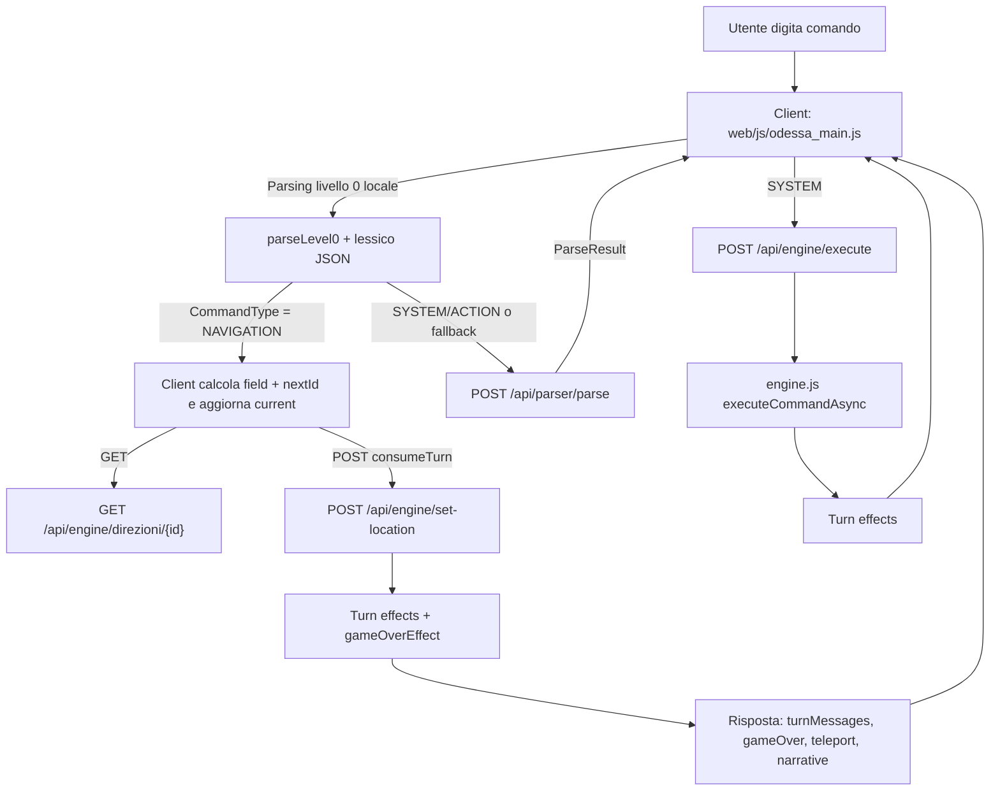
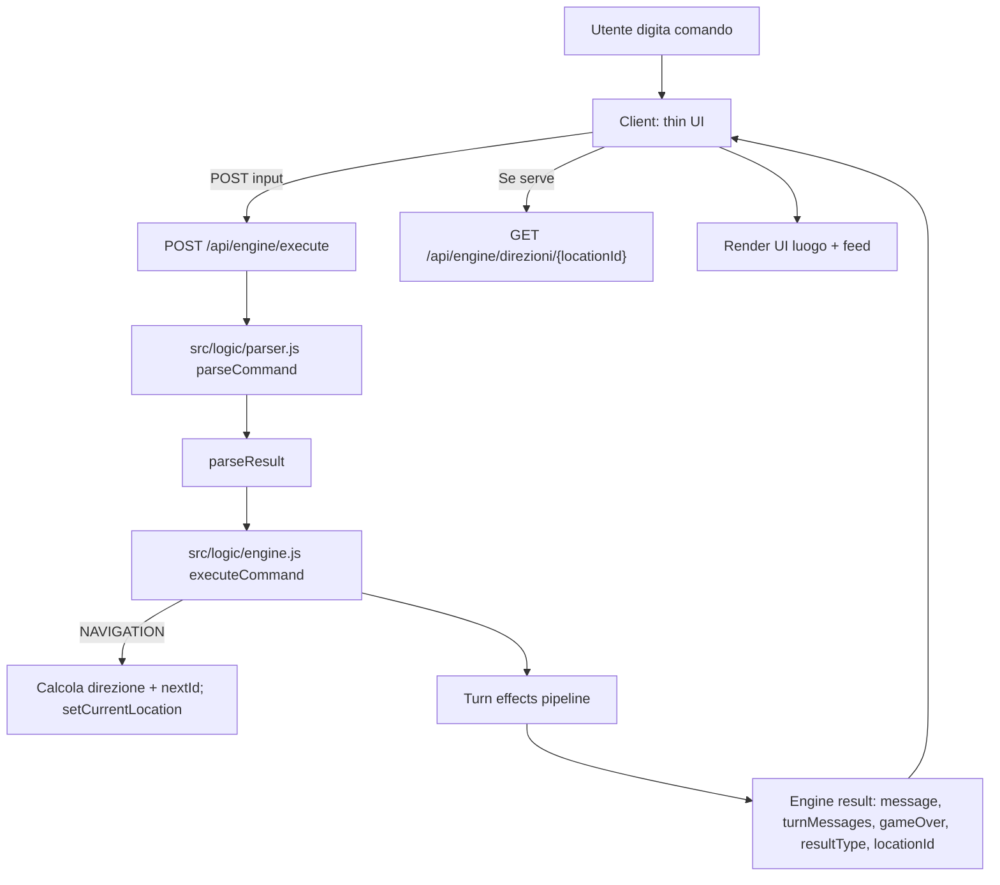

# 2026-01-11 — Revisione Navigation: eliminare parsing lato client e centralizzare su server

## Stato (aggiornamento)
**Implementato in v1.3.1 (12 gennaio 2026).**

- Pipeline unica per l’input: `POST /api/engine/execute` (server-side parsing + esecuzione) con risposta arricchita (`state/ui/stats`).
- Restart: hard reset server-side (preserva lingua), con gestione `awaitingRestart`.
- Fine gioco (comando `FINE`): conferma server-side (bypass parser) con flag `awaitingEndConfirm`.
- Endpoint legacy (`POST /api/parser/parse`, `POST /api/engine/set-location`): deprecati e disabilitabili con `DISABLE_LEGACY_ENDPOINTS=1`.

Riferimenti rapidi:
- Smoke checklist: `docs/20260111_smoke_checklist_4.1.6.md`
- Release notes: `RELEASE_NOTES.md`
- Test hardening navigation via HTTP: `tests/api.engine.navigation.http.test.ts`

Nota: le sezioni seguenti restano utili come contesto storico (AS IS/TO BE) e razionale di design.

## Scopo del documento
Questo documento fotografa lo stato attuale (“AS IS”) della gestione comandi di navigazione (direzioni) e propone una migrazione (“TO BE”) verso un’architettura **full-server parsing**, in cui il browser non interpreta più i comandi e non mantiene logiche di parsing del lessico.

Obiettivo principale:
- **Eliminare il parser lato client** (in particolare la logica “livello 0” oggi presente nel client) e rendere il server **unica fonte di verità** per parsing + esecuzione + cambi luogo + effetti turno + game over.

Obiettivi secondari:
- Ridurre duplicazioni (lessico caricato anche nel browser).
- Ridurre superficie di bug (divergenze tra parsing client e parsing server).
- Semplificare la UI: il client diventa thin UI che renderizza una risposta dell’engine.

Non-obiettivi (in questo step):
- Ripensare l’intero modello dei dati o la struttura del lessico.
- Migrare a DB o cambiare il formato dei JSON.
- Stravolgere UX o layout della pagina di gioco.

---

## Requisito (nuovo / esplicito)
### REQ-NAV-SERVER-ONLY (nuovo)
**Il parsing dei comandi deve essere effettuato esclusivamente lato server.**

Vincoli:
1. Il client **non deve caricare** i JSON di lessico per fare parsing.
2. Il client **non deve** avere funzioni di parsing/normalizzazione del comando utente che producano un parseResult.
3. Il client invia al server solo:
   - `input: string` (comando grezzo dell’utente)
   - eventuali campi di contesto strettamente necessari (es. `idLingua` se non persistito lato server; idealmente no)
4. Il server decide:
   - tipo comando (`NAVIGATION`, `ACTION`, `SYSTEM`, …)
   - effetti e messaggi
   - cambio luogo (se navigation) e condizioni di game over
5. Il client renderizza:
   - messaggi
   - stato/luogo corrente e direzioni
   - richieste secondarie (es. fetch immagini o direzioni) guidate dalla risposta server.

Criterio di accettazione (macro):
- Nessuna parte del codice client contiene logica equivalente a `parseCommand`/`ensureVocabulary`/`parseLevel0`.
- La navigazione (`Nord/Est/Sud/Ovest/Su/Giu` e sinonimi) funziona interamente tramite `POST /api/engine/execute`.

---

## AS IS — Stato attuale
### Sintesi
Oggi la navigazione è **mista**:
- Il client interpreta NAVIGATION in locale (con un parser “livello 0”) e gestisce il cambio luogo aggiornando una variabile `current`.
- Per consumare turno/triggerare il sistema turn effects e i game over, il client chiama `POST /api/engine/set-location`.
- Per tutti gli altri comandi (o per fallback), il client chiama `POST /api/parser/parse`, poi decide cosa fare; per `SYSTEM` chiama `POST /api/engine/execute`.

Conseguenza: c’è duplicazione di responsabilità:
- Parsing: presente sia nel browser (livello 0) sia nel server (`parseCommand`).
- Navigazione: calcolo destinazione e update UI avviene nel browser; il server viene “informato” a posteriori via `set-location`.

### Evidenze nel codice (punti chiave)
- Client:
  - `web/js/odessa_main.js` contiene:
    - calcolo `basePath`
    - caricamento JSON lessico (`src/data-internal/TerminiLessico.json`, `VociLessico.json`, `TipiLessico.json`) per “livello 0”
    - parser livello 0 (`ensureVocabulary`, `parseLevel0`) che produce un oggetto simile al parseResult
    - branch specifica: se `level0Result.CommandType === 'NAVIGATION'`, gestisce spostamento localmente
    - chiamate a `POST /api/engine/set-location` con `{ consumeTurn: true }` per attivare turn system
    - fallback: `POST /api/parser/parse`, ma anche lì se la risposta è NAVIGATION il client continua a fare lo spostamento localmente

- Server:
  - `src/api/parserRoutes.js` espone `POST /api/parser/parse` e ritorna il parseResult.
  - `src/api/engineRoutes.js` espone `POST /api/engine/execute` che:
    - se `awaitingEndConfirm` interpreta input come `SI/NO` (bypass parser)
    - se `awaitingRestart` interpreta input come `SI/NO` (bypass parser)
    - altrimenti chiama `parseCommand` e poi `executeCommandAsync`.
  - `src/logic/engine.js`:
    - ha un wrapper turn-based (`executeCommand`) che prepara contesto turno e applica effetti.
    - ma la `NAVIGATION` nel core legacy risulta ancora “stub” (non cambia luogo in modo reale).
  - `src/logic/turnEffects/gameOverEffect.js` verifica:
    - buio, intercettazione, luogo terminale (Terminale === -1), ecc.
    - e imposta `awaitingRestart`.

### Diagramma AS IS (mermaid)


### Problemi e rischi dell’AS IS
1. **Duplicazione del parser** (server vs client): rischio divergenze su normalizzazione, stopword, sinonimi, accenti.
2. **Doppia sorgente di verità** per la navigazione:
   - il client decide il cambio luogo
   - il server applica effetti e game over “a posteriori” basandosi sul `currentLocationId` aggiornato tramite `set-location`
3. **Complessità e fragilità**: la UI deve orchestrare sequenze asincrone (fetch direzioni, set-location, eventuale teleport, pendingGameOver).
4. **Sicurezza e controllo**: più logica nel browser = più difficoltà nel garantire coerenza e prevenire edge-case; inoltre il client carica dati di lessico che non sarebbero necessari.

---

## TO BE — Obiettivo target (full-server)
### Sintesi
Nel target:
- Il client invia sempre il comando grezzo a `POST /api/engine/execute`.
- Il server:
  - esegue parsing (`parseCommand`)
  - esegue il comando (`executeCommand`/`executeCommandAsync`)
  - per `NAVIGATION` calcola destinazione, aggiorna gameState, applica turn effects
  - ritorna una risposta “engine” completa (inclusi eventuali `locationId`, `gameOver`, `turnMessages`, ecc.)
- Il client si limita a:
  - mostrare messaggi
  - se `locationId` presente, aggiornare `current` e fare fetch direzioni per rendering (o, meglio, ricevere direzioni già in risposta)

### Diagramma TO BE (mermaid)


---

## High Level Design (HLD)
### Componenti
1. **Client (web)**
   - Responsibility: UI/UX (input, feed messaggi, rendering luogo, pulsanti direzioni/click).
   - Non deve contenere parsing.
   - Invoca un solo endpoint principale per l’input: `POST /api/engine/execute`.

2. **API Engine (server)**
   - Responsibility: orchestrazione parsing+engine.
   - Gestisce `awaitingRestart` e `confirmRestart` come già fa.

3. **Parser (server)**
   - Responsibility: trasformare `input: string` in `parseResult` coerente con lessico e regole (stopword, normalizzazione, sinonimi).

4. **Engine + GameState (server)**
   - Responsibility: applicare regole di gioco, cambiare stato, calcolare effetti, produrre risposta.

### Contratto API proposto (HLD)
Endpoint unico per input:
- `POST /api/engine/execute`
  - Request: `{ input: string }`
  - Response (success):
    ```json
    {
      "ok": true,
      "engine": {
        "accepted": true,
        "resultType": "OK|NARRATIVE|TELEPORT|GAME_OVER|...",
        "message": "...",
        "turnMessages": ["..."],
        "gameOver": false,
        "locationId": 12
      },
      "parseResult": { "CommandType": "NAVIGATION", "VerbConcept": "NORD", ... }
    }
    ```
  - Response (parse error):
    - HTTP 400 con `userMessage` + `parseResult` come già avviene.

Nota: il client può continuare a usare `GET /api/engine/direzioni/:id` per aggiornare le direzioni (o in alternativa il server può includere `direzioni` in `engine` per ridurre roundtrip).

---

## Technical Design (dettagli implementativi)
### 1) Implementare NAVIGATION server-side in engine
Problema tecnico oggi:
- `executeCommandLegacy` per `NAVIGATION` ritorna un messaggio stub e non aggiorna `gameState.currentLocationId`.

Soluzione tecnica proposta:
- Nel ramo `case 'NAVIGATION'` (engine legacy) implementare:
  1. Determinare `directionField` da `parseResult.VerbConcept`.
     - Mappatura:
       - `NORD` → `Nord`
       - `EST` → `Est`
       - `SUD` → `Sud`
       - `OVEST` → `Ovest`
       - `ALTO` → `Su`
       - `BASSO` → `Giu`
  2. Calcolare destinazione usando **direzioni effettive** (toggle + sblocchi) via `getDirezioniLuogo(gameState.currentLocationId)`.
     - Questo evita di leggere direttamente `Luoghi.json` ignorando stato.
  3. Se destinazione è 0 o mancante: ritornare `accepted:false` e messaggio coerente (idealmente i18n).
  4. Se destinazione è valida (>=1): chiamare `setCurrentLocation(nextId)`.
  5. Restituire un result con:
     - `accepted:true`
     - `resultType:'OK'`
     - `locationId: nextId`
     - `showLocation:true` (opzionale, se già usato dal client)

Effetti a catena:
- Dopo `setCurrentLocation(nextId)`, il wrapper turn-based applicherà `applyTurnEffects`.
- Il `gameOverEffect` valuterà il luogo terminale con `Terminale === -1` *dopo* il cambio location.

Nota importante:
- In AS IS il client gestisce anche casi speciali come `-1` (destinazione terminale) facendo una chiamata apposita a `set-location`.
- In TO BE questo caso diventa naturale: se si entra in un luogo con `Terminale:-1`, il `gameOverEffect` imposterà `gameOver`.

### 2) Semplificare il client: rimozione parser livello 0 e fallback parser API
Modifiche tecniche principali su `web/js/odessa_main.js`:
- Rimuovere:
  - caricamento lessico JSON (`TerminiLessico.json`, `VociLessico.json`, `TipiLessico.json`)
  - `ensureVocabulary`, `parseLevel0` e strutture `odessaData`/`vocabCache`
  - branch “se NAVIGATION valido, gestisci localmente”
  - chiamata a `POST /api/parser/parse` (non necessaria nel target)

Nuova pipeline input nel client:
1. `POST /api/engine/execute` con `{ input: val }`.
2. Se risposta è parse-error (HTTP 400): mostrare `userMessage`.
3. Se `engine.gameOver === true` o `engine.resultType === 'GAME_OVER'`: mostrare messaggio game over e bloccare input finché non arriva `SI/NO`.
4. Se `engine.resultType === 'NARRATIVE'`: append messaggio narrativo; eventuale logica di continue resta invariata se già presente.
5. Se `engine.resultType === 'TELEPORT'` e `engine.locationId`: aggiornare `current` e mostrare luogo.
6. Se `engine.locationId` presente (normale NAVIGATION):
   - aggiornare `current`
   - fetch `GET /api/engine/direzioni/:id` per aggiornare direzioni dinamiche
   - chiamare `showCurrent()`

### 3) Considerazioni su restart e comandi SI/NO
Già oggi il server gestisce `awaitingRestart` bypassando parser e interpretando input come `SI/NO` in `engineRoutes`.

Nel target:
- la UI non deve avere logica duplicata “awaitingRestart”: può affidarsi al server.
- tuttavia, per UX, la UI può mantenere un flag locale per disabilitare input non ammessi e mostrare il prompt.

### 4) Messaggistica e i18n
Opzione consigliata:
- il server ritorna `errorCode` + `params` al posto di stringhe “hard-coded”, e il client localizza.

Opzione più semplice (per migrazione rapida):
- il server ritorna `message` user-friendly già localizzato usando `getSystemMessage`.

Considerazione:
- oggi esiste una doppia sorgente di messaggi: `MessaggiFrontend.json` (client) e `MessaggiSistema` (server). In full-server conviene convergere verso messaggi server-side.

---

## Sezione Test (da eseguire dopo implementazione)
### Test automatici (Vitest)
Aggiungere un nuovo file test, ad esempio `tests/api.engine.navigation.test.ts`, con casi minimi:

1) **NAVIGATION base**
- Setup: reset engine (`POST /api/engine/reset` o chiamata diretta a funzioni se testano i moduli).
- Azione: `POST /api/engine/execute` con `{ input: 'Sud' }` (o una direzione valida dal luogo iniziale).
- Assert:
  - `ok === true`
  - `engine.locationId` cambia
  - `GET /api/engine/state` riflette `currentLocationId` aggiornato

2) **Direzione bloccata (muro / 0)**
- Azione: dal luogo iniziale, inviare una direzione che porta a 0.
- Assert:
  - `ok === true` o `ok === false` (da decidere come convenzione)
  - `engine.accepted === false` oppure errore coerente
  - `currentLocationId` invariato

3) **Luogo terminale**
- Setup: forzare una location che ha una direzione verso un luogo terminale (Terminale:-1) oppure impostare `currentLocationId` vicino a un caso noto.
- Azione: inviare la direzione che porta al luogo terminale.
- Assert:
  - risposta con `engine.gameOver === true` e `resultType === 'GAME_OVER'`
  - `state.awaitingRestart === true`

4) **awaitingRestart: SI/NO bypass parser**
- Setup: mettere in stato `awaitingRestart` (entrando in terminale o impostandolo nel gameState).
- Azione: inviare `SI`.
- Assert:
  - `currentLocationId` torna a 1
  - `awaitingRestart` false

### Test manuali (smoke)
- Navigazione da UI:
  - digitando “Nord/Est/Sud/Ovest/Su/Giu”
  - cliccando sulle direzioni (se la UI le supporta come shortcut)
- Verifica game over (luogo terminale) e prompt riavvio.
- Verifica coerenza direzioni dinamiche (toggle/sblocchi) dopo azioni che le modificano.

---

## Valutazione finale: complessità, impatto, rischio
### Complessità
- **Media** se ci si limita a:
  - implementare `NAVIGATION` server-side
  - rimuovere parsing client e usare solo `/api/engine/execute`
- **Medio-alta** se si vuole anche:
  - rifattorizzare i messaggi per avere un protocollo `errorCode`/`params`
  - includere direzioni direttamente nella risposta engine per eliminare roundtrip

### Impatto
- **Alto (positivo)** sulla manutenibilità:
  - una sola implementazione del parser
  - una sola pipeline di esecuzione
- **Medio** sul client:
  - rimozione di parecchia logica (semplificazione)
  - possibile revisione delle sequenze asincrone (teleport/narrative/gameover)
- **Basso/medio** sul server:
  - aggiunta della logica `NAVIGATION` in engine
  - potenziale aggiornamento messaggi

### Rischi
1. **Regressioni UX**: alcune ottimizzazioni client (pendingGameOver, orchestrazioni) potrebbero essere state introdotte per bug reali; migrando al server bisogna garantire che la sequenza di rendering rimanga corretta.
2. **Contratto risposta**: il client oggi si aspetta certi campi (`resultType`, `gameOver`, `locationId`, `turnMessages`). Va definito e stabilizzato.
3. **Direzioni dinamiche**: è fondamentale che l’engine, quando naviga, usi `getDirezioniLuogo` (toggle/sblocchi). Se si legge il `Luoghi.json` “nudo”, si perde stato.
4. **Copertura test**: senza test dedicati alla navigazione server-side, il refactor rischia regressioni invisibili.

Mitigazioni:
- Migrazione incrementale (feature flag o branch condizionale):
  - prima implementare NAVIGATION nel server mantenendo temporaneamente fallback client
  - poi togliere parseLevel0 e `/api/parser/parse` dal client.
- Aggiungere test Vitest mirati a `POST /api/engine/execute` per `NAVIGATION`.

---

## Piano di delivery (Sprint 4.1.x)
Questa sezione traduce il **TO BE full-server** (REQ-NAV-SERVER-ONLY) in sprint incrementali. Ogni sprint è pensato per essere “rilasciabile” e ridurre il rischio di regressioni, mantenendo la UI utilizzabile durante la migrazione.

Nota sulla strategia:
- Prima si rende il server *capace* di navigare davvero (`NAVIGATION` non stub), poi si sposta il client a consumare **solo** `POST /api/engine/execute`, e solo alla fine si eliminano gli endpoint/percorsi legacy.
- Si privilegia l’uso di `getDirezioniLuogo(...)` (direzioni dinamiche) per evitare divergenze con toggle/sblocchi.

### Sprint 4.1.1 — Stabilizzazione contratto `/api/engine/execute` + baseline test
**Obiettivo:** rendere esplicito e stabile il contratto dell’endpoint principale prima di spostare il carico sul server.

Interventi collegati:
1. Definire chiaramente (e rendere consistente) la struttura di risposta di `POST /api/engine/execute`, in particolare:
  - presenza di `engine` con campi minimi (`accepted`, `resultType`, `message`, `turnMessages`, `gameOver`, `locationId` se rilevante)
  - presenza opzionale ma utile di `parseResult` (per debug/telemetria lato client; non per logica).
2. Verificare che l’endpoint gestisca in modo consistente:
  - parse error (HTTP 400 con messaggio utente)
  - bypass `awaitingRestart` (SI/NO) con risposta strutturata.
3. Aggiungere una baseline di test API che fotografi l’attuale contratto (anche parziale), così da avere un “guard-rail” durante le modifiche successive.

Sorgenti coinvolte (principali):
- `src/api/engineRoutes.js` (contratto HTTP, gestione errori, awaitingRestart)
- `src/logic/engine.js` (shape del risultato dell’engine, resultType, turnMessages)
- `tests/` (nuovi test o estensione di test esistenti)

Impatto atteso:
- **Server:** basso/medio (più coerenza e qualche normalizzazione output).
- **Client:** nullo in questa fase.
- **Rischio:** basso; aumenta la controllabilità (test).

Criterio di uscita sprint:
- Test Vitest verdi.
- Un test dimostra che `POST /api/engine/execute` restituisce sempre un payload coerente (almeno per 2-3 casi: comando qualunque, parse error, awaitingRestart).

### Sprint 4.1.2 — Implementazione `NAVIGATION` server-side (engine)
**Obiettivo:** eliminare lo “stub” e rendere `NAVIGATION` eseguibile lato server, aggiornando realmente lo stato (`currentLocationId`).

Interventi collegati:
1. Implementare `case 'NAVIGATION'` nel ramo legacy/centrale dell’engine:
  - mappatura `VerbConcept` → direzione (`Nord/Est/Sud/Ovest/Su/Giu`)
  - calcolo destinazione usando `getDirezioniLuogo(gameState.currentLocationId)`
  - aggiornamento stato con `setCurrentLocation(nextId)`
  - gestione “muro/0” come `accepted:false` (o altra convenzione, ma coerente)
2. Verificare che il pipeline turn-based applichi correttamente gli effetti *dopo* la navigazione.
3. Verificare caso luogo terminale: entrando in una location con `Terminale:-1` deve risultare in `gameOver` tramite `gameOverEffect`.

Sorgenti coinvolte (principali):
- `src/logic/engine.js` (ramo `NAVIGATION`, `setCurrentLocation`, pipeline turno)
- `src/logic/parser.js` (verifica che `VerbConcept` sia coerente per direzioni)
- `src/logic/turnEffects/gameOverEffect.js` (game over su terminale)
- `src/logic/*` e dati `src/data-internal/*` (direzioni dinamiche e luoghi)

Impatto atteso:
- **Server:** medio (nuova funzionalità effettiva, ma localizzata).
- **Client:** ancora nullo; in questa fase la UI può continuare a muoversi come prima.
- **Rischio:** medio (tocca logica core), mitigato da test.

Criterio di uscita sprint:
- Test automatico dedicato dimostra che una direzione valida cambia `currentLocationId` sul server.
- Test dimostra che una direzione verso muro non cambia location.
- Test dimostra che un luogo terminale attiva `awaitingRestart`.

### Sprint 4.1.3 — End-to-end API per navigation via `/api/engine/execute`
**Obiettivo:** rendere `POST /api/engine/execute` la fonte completa per `NAVIGATION`, includendo i dati necessari al rendering.

Interventi collegati:
1. Assicurare che per `NAVIGATION` la risposta includa sempre:
  - `engine.locationId` (nuova location)
  - `turnMessages` (se applicabili)
  - eventuale `resultType` utile (`OK`, `GAME_OVER`, `TELEPORT`, …).
2. Decisione esplicita sul “roundtrip direzioni”:
  - Opzione A (minima): il client continua a chiamare `GET /api/engine/direzioni/{locationId}` dopo ogni cambio.
  - Opzione B (più efficiente): includere le direzioni già in risposta engine per eliminare una chiamata.
3. Introdurre (se serve) un flag di compatibilità temporaneo lato client/server per poter fare rollout graduale.

Sorgenti coinvolte (principali):
- `src/api/engineRoutes.js` (payload di risposta, eventuali campi aggiuntivi)
- `src/logic/engine.js` (propagazione locationId e dati utili)
- `src/api/engineRoutes.js` + endpoint `GET /api/engine/direzioni/:id` (se si mantiene opzione A)

Impatto atteso:
- **Server:** basso/medio (un po’ più di dati in risposta).
- **Client:** ancora minimo (potenzialmente solo adattamenti per leggere `locationId`).
- **Rischio:** medio-basso; il contratto già stabilizzato nello sprint precedente.

Criterio di uscita sprint:
- Un test API (o più) dimostra che inviando `input: 'Nord'` (o equivalente) l’engine ritorna `locationId` coerente e lo stato server è aggiornato.

### Sprint 4.1.4 — Refactor client: thin UI (rimozione parsing e lessico)
**Obiettivo:** rispettare pienamente REQ-NAV-SERVER-ONLY: il client non interpreta più comandi e non carica il lessico.

Interventi collegati:
1. Rimuovere dal client:
  - fetch/uso di `src/data-internal/TerminiLessico.json`, `VociLessico.json`, `TipiLessico.json`
  - `ensureVocabulary`, `parseLevel0` e qualunque normalizzazione che produca un parseResult
  - chiamate a `POST /api/parser/parse` per la pipeline input (rimane eventualmente solo per debug, ma idealmente eliminata)
2. Sostituire la pipeline con:
  - `POST /api/engine/execute` sempre e solo
  - aggiornamento `current` basato su `engine.locationId`
  - refresh direzioni con `GET /api/engine/direzioni/{id}` (se si mantiene roundtrip)
3. Gestire correttamente:
  - parse error (HTTP 400) mostrando `userMessage`
  - `awaitingRestart` (UI: disabilitare input o mostrare prompt) ma lasciando la decisione al server.

Sorgenti coinvolte (principali):
- `web/js/odessa_main.js` (rimozione parser livello 0 e nuova pipeline)
- `index.html` / asset web correlati (se esistono hook o script che dipendono dal lessico)

Impatto atteso:
- **Client:** alto (rimozione di parecchia logica, ma refactor significativo).
- **Server:** nullo (server già pronto).
- **Beneficio:** forte riduzione di duplicazioni e rischio divergenze.

Criterio di uscita sprint:
- Navigazione funziona da UI digitando direzioni, senza chiamate a `/api/parser/parse`.
- Il network mostra come unico endpoint di input `POST /api/engine/execute`.

### Sprint 4.1.5 — Hardening: test completi, regressioni, cleanup legacy
**Obiettivo:** mettere in sicurezza la migrazione (test + pulizia) e ridurre debito tecnico.

Interventi collegati:
1. Aggiungere test Vitest dedicati alla navigazione server-side (vedi sezione Test), coprendo:
  - direzione valida
  - direzione muro
  - luogo terminale + awaitingRestart
  - bypass SI/NO.
2. Valutare se mantenere o deprecare:
  - `POST /api/engine/set-location` (probabile legacy dopo refactor)
  - `POST /api/parser/parse` (può restare come endpoint diagnostico, ma non usato dal client).
3. Allineare messaggistica (almeno per `NAVIGATION`): evitare che il client debba avere messaggi “equivalenti” a quelli server.

Sorgenti coinvolte (principali):
- `tests/api.engine.navigation.test.ts` (nuovo)
- `src/api/*` (eventuale deprecazione/cleanup endpoints)
- `web/js/odessa_main.js` (rimozione definitiva fallback/branch morti)

Impatto atteso:
- **Qualità:** alto (riduce rischio regressioni future).
- **Manutenzione:** medio (meno rami legacy).

Criterio di uscita sprint:
- Suite test verde.
- Nessuna dipendenza del client da endpoint parser o set-location.

### Sprint 4.1.6 — Release & documentazione
**Obiettivo:** chiudere la linea 4.1 con una release beta (o equivalente) e documentazione aggiornata.

Interventi collegati:
1. Bump versione (proposta): `1.3.1` (dopo che i test sono verdi e la UI è verificata).
2. Aggiornare note di rilascio e documentazione tecnica:
  - evidenziare la rimozione parsing client e il nuovo flusso unico `POST /api/engine/execute`.
3. (Opzionale) Aggiungere una checklist di smoke test rapida per pre-release.

Sorgenti coinvolte (principali):
- `package.json` (version)
- `RELEASE_NOTES.md`
- `docs/20260111_revisione_Navigation.md` (questo documento come riferimento di architettura)

Impatto atteso:
- **Operativo:** basso (rilascio).
- **Utente finale:** dovrebbe percepire solo maggiore robustezza/coerenza.

Criterio di uscita sprint:
- Release/tag creati *dopo* validazione funzionale (manuale) e test verdi.

## Prossimi passi consigliati
1. Implementare `NAVIGATION` in engine (server).
2. Aggiungere test API per navigation.
3. Semplificare `web/js/odessa_main.js` eliminando parser livello 0 e chiamata a `/api/parser/parse`.
4. (Opzionale) Stabilizzare un protocollo messaggi `errorCode/params` per localizzazione coerente.
