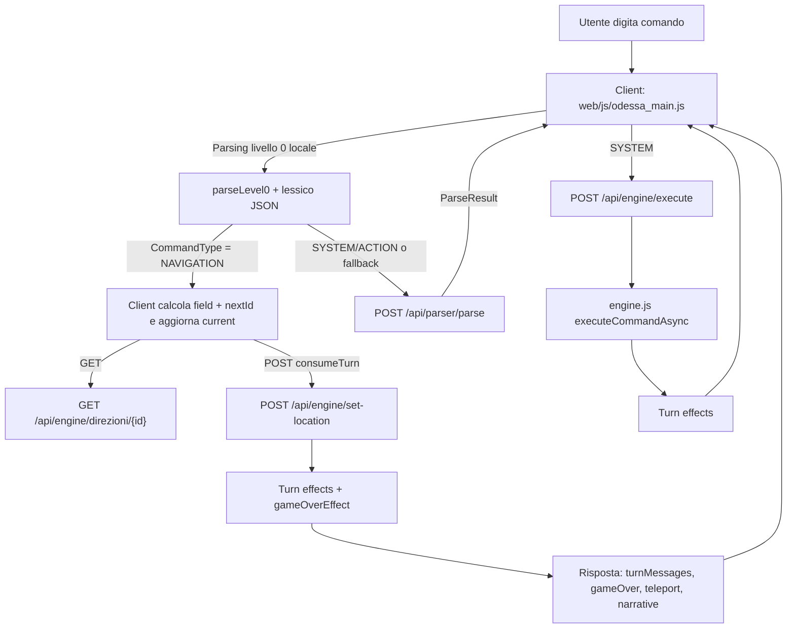
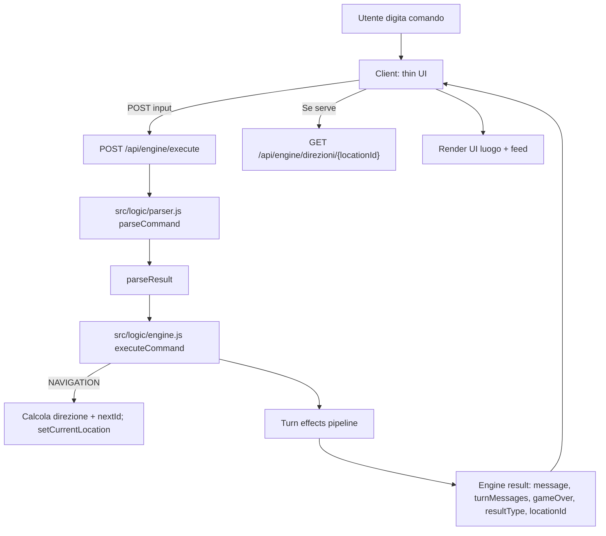

# 2026-01-11 — Revisione Navigation: eliminare parsing lato client e centralizzare su server

## Scopo del documento
Questo documento fotografa lo stato attuale (“AS IS”) della gestione comandi di navigazione (direzioni) e propone una migrazione (“TO BE”) verso un’architettura **full-server parsing**, in cui il browser non interpreta più i comandi e non mantiene logiche di parsing del lessico.

Obiettivo principale:
- **Eliminare il parser lato client** (in particolare la logica “livello 0” oggi presente nel client) e rendere il server **unica fonte di verità** per parsing + esecuzione + cambi luogo + effetti turno + game over.

Obiettivi secondari:
- Ridurre duplicazioni (lessico caricato anche nel browser).
- Ridurre superficie di bug (divergenze tra parsing client e parsing server).
- Semplificare la UI: il client diventa thin UI che renderizza una risposta dell’engine.

Non-obiettivi (in questo step):
- Ripensare l’intero modello dei dati o la struttura del lessico.
- Migrare a DB o cambiare il formato dei JSON.
- Stravolgere UX o layout della pagina di gioco.

---

## Requisito (nuovo / esplicito)
### REQ-NAV-SERVER-ONLY (nuovo)
**Il parsing dei comandi deve essere effettuato esclusivamente lato server.**

Vincoli:
1. Il client **non deve caricare** i JSON di lessico per fare parsing.
2. Il client **non deve** avere funzioni di parsing/normalizzazione del comando utente che producano un parseResult.
3. Il client invia al server solo:
   - `input: string` (comando grezzo dell’utente)
   - eventuali campi di contesto strettamente necessari (es. `idLingua` se non persistito lato server; idealmente no)
4. Il server decide:
   - tipo comando (`NAVIGATION`, `ACTION`, `SYSTEM`, …)
   - effetti e messaggi
   - cambio luogo (se navigation) e condizioni di game over
5. Il client renderizza:
   - messaggi
   - stato/luogo corrente e direzioni
   - richieste secondarie (es. fetch immagini o direzioni) guidate dalla risposta server.

Criterio di accettazione (macro):
- Nessuna parte del codice client contiene logica equivalente a `parseCommand`/`ensureVocabulary`/`parseLevel0`.
- La navigazione (`Nord/Est/Sud/Ovest/Su/Giu` e sinonimi) funziona interamente tramite `POST /api/engine/execute`.

---

## AS IS — Stato attuale
### Sintesi
Oggi la navigazione è **mista**:
- Il client interpreta NAVIGATION in locale (con un parser “livello 0”) e gestisce il cambio luogo aggiornando una variabile `current`.
- Per consumare turno/triggerare il sistema turn effects e i game over, il client chiama `POST /api/engine/set-location`.
- Per tutti gli altri comandi (o per fallback), il client chiama `POST /api/parser/parse`, poi decide cosa fare; per `SYSTEM` chiama `POST /api/engine/execute`.

Conseguenza: c’è duplicazione di responsabilità:
- Parsing: presente sia nel browser (livello 0) sia nel server (`parseCommand`).
- Navigazione: calcolo destinazione e update UI avviene nel browser; il server viene “informato” a posteriori via `set-location`.

### Evidenze nel codice (punti chiave)
- Client:
  - `web/js/odessa_main.js` contiene:
    - calcolo `basePath`
    - caricamento JSON lessico (`src/data-internal/TerminiLessico.json`, `VociLessico.json`, `TipiLessico.json`) per “livello 0”
    - parser livello 0 (`ensureVocabulary`, `parseLevel0`) che produce un oggetto simile al parseResult
    - branch specifica: se `level0Result.CommandType === 'NAVIGATION'`, gestisce spostamento localmente
    - chiamate a `POST /api/engine/set-location` con `{ consumeTurn: true }` per attivare turn system
    - fallback: `POST /api/parser/parse`, ma anche lì se la risposta è NAVIGATION il client continua a fare lo spostamento localmente

- Server:
  - `src/api/parserRoutes.js` espone `POST /api/parser/parse` e ritorna il parseResult.
  - `src/api/engineRoutes.js` espone `POST /api/engine/execute` che:
    - se `awaitingRestart` interpreta input come `SI/NO` (bypass parser)
    - altrimenti chiama `parseCommand` e poi `executeCommandAsync`.
  - `src/logic/engine.js`:
    - ha un wrapper turn-based (`executeCommand`) che prepara contesto turno e applica effetti.
    - ma la `NAVIGATION` nel core legacy risulta ancora “stub” (non cambia luogo in modo reale).
  - `src/logic/turnEffects/gameOverEffect.js` verifica:
    - buio, intercettazione, luogo terminale (Terminale === -1), ecc.
    - e imposta `awaitingRestart`.

### Diagramma AS IS (mermaid)


### Problemi e rischi dell’AS IS
1. **Duplicazione del parser** (server vs client): rischio divergenze su normalizzazione, stopword, sinonimi, accenti.
2. **Doppia sorgente di verità** per la navigazione:
   - il client decide il cambio luogo
   - il server applica effetti e game over “a posteriori” basandosi sul `currentLocationId` aggiornato tramite `set-location`
3. **Complessità e fragilità**: la UI deve orchestrare sequenze asincrone (fetch direzioni, set-location, eventuale teleport, pendingGameOver).
4. **Sicurezza e controllo**: più logica nel browser = più difficoltà nel garantire coerenza e prevenire edge-case; inoltre il client carica dati di lessico che non sarebbero necessari.

---

## TO BE — Obiettivo target (full-server)
### Sintesi
Nel target:
- Il client invia sempre il comando grezzo a `POST /api/engine/execute`.
- Il server:
  - esegue parsing (`parseCommand`)
  - esegue il comando (`executeCommand`/`executeCommandAsync`)
  - per `NAVIGATION` calcola destinazione, aggiorna gameState, applica turn effects
  - ritorna una risposta “engine” completa (inclusi eventuali `locationId`, `gameOver`, `turnMessages`, ecc.)
- Il client si limita a:
  - mostrare messaggi
  - se `locationId` presente, aggiornare `current` e fare fetch direzioni per rendering (o, meglio, ricevere direzioni già in risposta)

### Diagramma TO BE (mermaid)


---

## High Level Design (HLD)
### Componenti
1. **Client (web)**
   - Responsibility: UI/UX (input, feed messaggi, rendering luogo, pulsanti direzioni/click).
   - Non deve contenere parsing.
   - Invoca un solo endpoint principale per l’input: `POST /api/engine/execute`.

2. **API Engine (server)**
   - Responsibility: orchestrazione parsing+engine.
   - Gestisce `awaitingRestart` e `confirmRestart` come già fa.

3. **Parser (server)**
   - Responsibility: trasformare `input: string` in `parseResult` coerente con lessico e regole (stopword, normalizzazione, sinonimi).

4. **Engine + GameState (server)**
   - Responsibility: applicare regole di gioco, cambiare stato, calcolare effetti, produrre risposta.

### Contratto API proposto (HLD)
Endpoint unico per input:
- `POST /api/engine/execute`
  - Request: `{ input: string }`
  - Response (success):
    ```json
    {
      "ok": true,
      "engine": {
        "accepted": true,
        "resultType": "OK|NARRATIVE|TELEPORT|GAME_OVER|...",
        "message": "...",
        "turnMessages": ["..."],
        "gameOver": false,
        "locationId": 12
      },
      "parseResult": { "CommandType": "NAVIGATION", "VerbConcept": "NORD", ... }
    }
    ```
  - Response (parse error):
    - HTTP 400 con `userMessage` + `parseResult` come già avviene.

Nota: il client può continuare a usare `GET /api/engine/direzioni/:id` per aggiornare le direzioni (o in alternativa il server può includere `direzioni` in `engine` per ridurre roundtrip).

---

## Technical Design (dettagli implementativi)
### 1) Implementare NAVIGATION server-side in engine
Problema tecnico oggi:
- `executeCommandLegacy` per `NAVIGATION` ritorna un messaggio stub e non aggiorna `gameState.currentLocationId`.

Soluzione tecnica proposta:
- Nel ramo `case 'NAVIGATION'` (engine legacy) implementare:
  1. Determinare `directionField` da `parseResult.VerbConcept`.
     - Mappatura:
       - `NORD` → `Nord`
       - `EST` → `Est`
       - `SUD` → `Sud`
       - `OVEST` → `Ovest`
       - `ALTO` → `Su`
       - `BASSO` → `Giu`
  2. Calcolare destinazione usando **direzioni effettive** (toggle + sblocchi) via `getDirezioniLuogo(gameState.currentLocationId)`.
     - Questo evita di leggere direttamente `Luoghi.json` ignorando stato.
  3. Se destinazione è 0 o mancante: ritornare `accepted:false` e messaggio coerente (idealmente i18n).
  4. Se destinazione è valida (>=1): chiamare `setCurrentLocation(nextId)`.
  5. Restituire un result con:
     - `accepted:true`
     - `resultType:'OK'`
     - `locationId: nextId`
     - `showLocation:true` (opzionale, se già usato dal client)

Effetti a catena:
- Dopo `setCurrentLocation(nextId)`, il wrapper turn-based applicherà `applyTurnEffects`.
- Il `gameOverEffect` valuterà il luogo terminale con `Terminale === -1` *dopo* il cambio location.

Nota importante:
- In AS IS il client gestisce anche casi speciali come `-1` (destinazione terminale) facendo una chiamata apposita a `set-location`.
- In TO BE questo caso diventa naturale: se si entra in un luogo con `Terminale:-1`, il `gameOverEffect` imposterà `gameOver`.

### 2) Semplificare il client: rimozione parser livello 0 e fallback parser API
Modifiche tecniche principali su `web/js/odessa_main.js`:
- Rimuovere:
  - caricamento lessico JSON (`TerminiLessico.json`, `VociLessico.json`, `TipiLessico.json`)
  - `ensureVocabulary`, `parseLevel0` e strutture `odessaData`/`vocabCache`
  - branch “se NAVIGATION valido, gestisci localmente”
  - chiamata a `POST /api/parser/parse` (non necessaria nel target)

Nuova pipeline input nel client:
1. `POST /api/engine/execute` con `{ input: val }`.
2. Se risposta è parse-error (HTTP 400): mostrare `userMessage`.
3. Se `engine.gameOver === true` o `engine.resultType === 'GAME_OVER'`: mostrare messaggio game over e bloccare input finché non arriva `SI/NO`.
4. Se `engine.resultType === 'NARRATIVE'`: append messaggio narrativo; eventuale logica di continue resta invariata se già presente.
5. Se `engine.resultType === 'TELEPORT'` e `engine.locationId`: aggiornare `current` e mostrare luogo.
6. Se `engine.locationId` presente (normale NAVIGATION):
   - aggiornare `current`
   - fetch `GET /api/engine/direzioni/:id` per aggiornare direzioni dinamiche
   - chiamare `showCurrent()`

### 3) Considerazioni su restart e comandi SI/NO
Già oggi il server gestisce `awaitingRestart` bypassando parser e interpretando input come `SI/NO` in `engineRoutes`.

Nel target:
- la UI non deve avere logica duplicata “awaitingRestart”: può affidarsi al server.
- tuttavia, per UX, la UI può mantenere un flag locale per disabilitare input non ammessi e mostrare il prompt.

### 4) Messaggistica e i18n
Opzione consigliata:
- il server ritorna `errorCode` + `params` al posto di stringhe “hard-coded”, e il client localizza.

Opzione più semplice (per migrazione rapida):
- il server ritorna `message` user-friendly già localizzato usando `getSystemMessage`.

Considerazione:
- oggi esiste una doppia sorgente di messaggi: `MessaggiFrontend.json` (client) e `MessaggiSistema` (server). In full-server conviene convergere verso messaggi server-side.

---

## Sezione Test (da eseguire dopo implementazione)
### Test automatici (Vitest)
Aggiungere un nuovo file test, ad esempio `tests/api.engine.navigation.test.ts`, con casi minimi:

1) **NAVIGATION base**
- Setup: reset engine (`POST /api/engine/reset` o chiamata diretta a funzioni se testano i moduli).
- Azione: `POST /api/engine/execute` con `{ input: 'Sud' }` (o una direzione valida dal luogo iniziale).
- Assert:
  - `ok === true`
  - `engine.locationId` cambia
  - `GET /api/engine/state` riflette `currentLocationId` aggiornato

2) **Direzione bloccata (muro / 0)**
- Azione: dal luogo iniziale, inviare una direzione che porta a 0.
- Assert:
  - `ok === true` o `ok === false` (da decidere come convenzione)
  - `engine.accepted === false` oppure errore coerente
  - `currentLocationId` invariato

3) **Luogo terminale**
- Setup: forzare una location che ha una direzione verso un luogo terminale (Terminale:-1) oppure impostare `currentLocationId` vicino a un caso noto.
- Azione: inviare la direzione che porta al luogo terminale.
- Assert:
  - risposta con `engine.gameOver === true` e `resultType === 'GAME_OVER'`
  - `state.awaitingRestart === true`

4) **awaitingRestart: SI/NO bypass parser**
- Setup: mettere in stato `awaitingRestart` (entrando in terminale o impostandolo nel gameState).
- Azione: inviare `SI`.
- Assert:
  - `currentLocationId` torna a 1
  - `awaitingRestart` false

### Test manuali (smoke)
- Navigazione da UI:
  - digitando “Nord/Est/Sud/Ovest/Su/Giu”
  - cliccando sulle direzioni (se la UI le supporta come shortcut)
- Verifica game over (luogo terminale) e prompt riavvio.
- Verifica coerenza direzioni dinamiche (toggle/sblocchi) dopo azioni che le modificano.

---

## Valutazione finale: complessità, impatto, rischio
### Complessità
- **Media** se ci si limita a:
  - implementare `NAVIGATION` server-side
  - rimuovere parsing client e usare solo `/api/engine/execute`
- **Medio-alta** se si vuole anche:
  - rifattorizzare i messaggi per avere un protocollo `errorCode`/`params`
  - includere direzioni direttamente nella risposta engine per eliminare roundtrip

### Impatto
- **Alto (positivo)** sulla manutenibilità:
  - una sola implementazione del parser
  - una sola pipeline di esecuzione
- **Medio** sul client:
  - rimozione di parecchia logica (semplificazione)
  - possibile revisione delle sequenze asincrone (teleport/narrative/gameover)
- **Basso/medio** sul server:
  - aggiunta della logica `NAVIGATION` in engine
  - potenziale aggiornamento messaggi

### Rischi
1. **Regressioni UX**: alcune ottimizzazioni client (pendingGameOver, orchestrazioni) potrebbero essere state introdotte per bug reali; migrando al server bisogna garantire che la sequenza di rendering rimanga corretta.
2. **Contratto risposta**: il client oggi si aspetta certi campi (`resultType`, `gameOver`, `locationId`, `turnMessages`). Va definito e stabilizzato.
3. **Direzioni dinamiche**: è fondamentale che l’engine, quando naviga, usi `getDirezioniLuogo` (toggle/sblocchi). Se si legge il `Luoghi.json` “nudo”, si perde stato.
4. **Copertura test**: senza test dedicati alla navigazione server-side, il refactor rischia regressioni invisibili.

Mitigazioni:
- Migrazione incrementale (feature flag o branch condizionale):
  - prima implementare NAVIGATION nel server mantenendo temporaneamente fallback client
  - poi togliere parseLevel0 e `/api/parser/parse` dal client.
- Aggiungere test Vitest mirati a `POST /api/engine/execute` per `NAVIGATION`.

---

## Prossimi passi consigliati
1. Implementare `NAVIGATION` in engine (server).
2. Aggiungere test API per navigation.
3. Semplificare `web/js/odessa_main.js` eliminando parser livello 0 e chiamata a `/api/parser/parse`.
4. (Opzionale) Stabilizzare un protocollo messaggi `errorCode/params` per localizzazione coerente.
