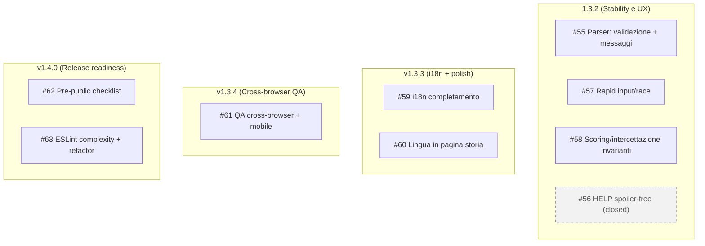
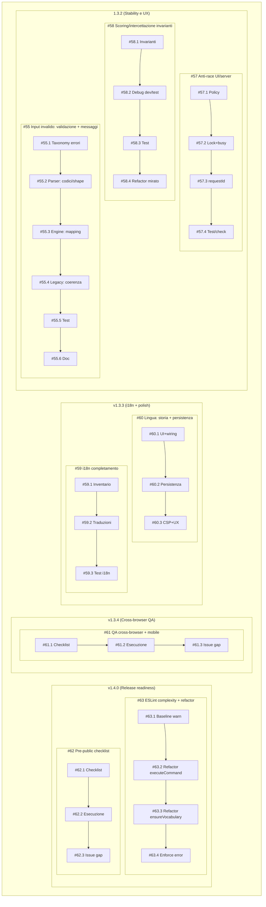

# 2026-01-13 — Next steps (Issues & Milestones)

## Abstract
Questo documento sintetizza i prossimi step di sviluppo di **Missione Odessa App** alla data **13 gennaio 2026**, a partire dalle **GitHub Issues** già create e collegate alle **Milestones**.

## Premessa
### Scope
- Fornire una vista “navigabile” (umana) delle attività pianificate.
- Collegare in modo esplicito **Issues ↔ Milestones**.
- Riportare per ogni issue: contesto, soluzione proposta, criteri di accettazione, labels e stato.

**Fonte di verità operativa:** GitHub (Issues + Milestones). Questo documento è una sintesi/indice.

### Workflow operativo (Branch + Pull Request)
Anche se il branch `main` non è protetto, usare le Pull Request (PR) come “contenitore” di ogni sprint rende più semplice tracciare cosa è stato fatto e (se desiderato) automatizza la chiusura delle issue.

**Concetti chiave**
- **PR (Pull Request)**: proposta di merge di un branch in `main` con diff, review e (se presenti) check automatici.
- **Milestone**: avanza automaticamente quando si chiudono le issue assegnate alla milestone.

**Keywords GitHub (Issue linking/closing)**
- `Refs #NN` / `Part of #NN`: collega la PR alla issue senza chiuderla (consigliato per sprint intermedi).
- `Fixes #NN` / `Closes #NN` / `Resolves #NN`: chiude automaticamente la issue #NN quando la PR viene mergiata in `main`.

**Convenzione consigliata per gli sprint**
- **1 branch per sprint**: `issue-55/sprint-55.2-validation` (o equivalente).
- **Titolo PR**: `#55.2 Input validation uniformata (API)`.
- **Descrizione PR**:
  - Sprint intermedio: include `Part of #55`.
  - Sprint finale che soddisfa i criteri di accettazione della issue: include `Fixes #55`.

**Definition of Done (DoD) minima per PR di sprint**
- Test verdi (almeno `npm test`) e niente regressioni note.
- Nessun leak tecnico user-facing (stack trace/path) e nessun `500` introdotto in casi “invalid input”.
- Note d’impatto in PR (se cambia contract/shape o UX).

**Cleanup (regola) quando una issue è completata**
- Quando la issue viene chiusa (tipicamente tramite PR finale con `Fixes #NN`), si considera chiusa anche la “sequenza di sprint” associata.
- Cleanup tecnico: eliminare le branch di sprint (remota via GitHub “Delete branch”, e locale se non serve più).
- Cleanup documentale: rimuovere da questo documento la breakdown dettagliata degli sprint di quell’issue (o spostarla in sezione “obsolete/archivio”), mantenendo solo il link alla issue e, se utile, alla PR finale.

Nota: l’assegnazione della issue alla milestone si fa una sola volta sulla issue; l’avanzamento della milestone avviene automaticamente quando la issue viene chiusa.

### Contesto di progetto
- **Prodotto:** adventure testuale (single-player) con backend Node.js/Express, frontend statico e API REST basate su JSON caricati in memoria.
- **Stato sviluppo:** codebase consolidata, con test automatizzati (Vitest) e workflow di lint/build/test.
- **Complessità raggiunta:** esistono aree “core” con logica articolata (parser/engine, save/load, scoring, intercettazione). In particolare sono state evidenziate opportunità di miglioramento su complessità/manutenibilità (quality gates + refactor mirati).
- **Struttura progetto (macro):**
  - `src/` backend + logica (engine, parser, middleware, API routes)
  - `web/` frontend statico (storia/intro/main)
  - `tests/` suite Vitest
  - `docs/` documentazione e note tecniche

\pagebreak

## Elenco issues (snapshot 2026-01-13)
| ID | Titolo | Stato (open/closed) | Milestone | Labels principali | Link |
|---:|---|---|---|---|---|
| 55 | Parser: validazione + messaggi per input/comandi invalidi | open | 1.3.2 (Stability e UX) | `type:chore`, `area:parser`, `priority:P1`, `stability` | https://github.com/Aqualung61/MissioneOdessa/issues/55 |
| 56 | HELP: ridurre hints (spoiler-free) e rendere l’aiuto più neutro | closed | 1.3.2 (Stability e UX) | `type:chore`, `priority:P2`, `ux`, `i18n` | https://github.com/Aqualung61/MissioneOdessa/issues/56 |
| 57 | Rapid input/race: prevenire doppie esecuzioni e desync UI/server | open | 1.3.2 (Stability e UX) | `type:chore`, `priority:P1`, `stability`, `ux` | https://github.com/Aqualung61/MissioneOdessa/issues/57 |
| 58 | Scoring/intercettazione/game over: debug esteso + invarianti + test | open | 1.3.2 (Stability e UX) | `type:chore`, `type:test`, `area:engine`, `priority:P2`, `stability` | https://github.com/Aqualung61/MissioneOdessa/issues/58 |
| 59 | i18n: completare messaggi e label mancanti (backend + frontend) | open | v1.3.3 (i18n + polish) | `type:chore`, `priority:P1`, `ux`, `i18n` | https://github.com/Aqualung61/MissioneOdessa/issues/59 |
| 60 | Lingua: selettore + persistenza in pagina storia | open | v1.3.3 (i18n + polish) | `type:chore`, `priority:P2`, `ux`, `i18n` | https://github.com/Aqualung61/MissioneOdessa/issues/60 |
| 61 | QA cross-browser + mobile: checklist riproducibile (intro/storia/main) | open | v1.3.4 (Cross-browser QA) | `type:chore`, `type:test`, `ux`, `portability` | https://github.com/Aqualung61/MissioneOdessa/issues/61 |
| 62 | Release readiness: checklist pubblicazione repo (pre-public) | open | v1.4.0 (Release readiness) | `enhancement`, `documentation`, `priority:P1` | https://github.com/Aqualung61/MissioneOdessa/issues/62 |
| 63 | ESLint complexity rules + refactor di executeCommand()/ensureVocabulary() | open | v1.4.0 (Release readiness) | `type:feature`, `area:ci`, `area:engine`, `area:parser`, `priority:P2` | https://github.com/Aqualung61/MissioneOdessa/issues/63 |

Nota: il **dettaglio** sotto include solo le issue **open**; le issue **closed** restano elencate solo nella tabella.

## Collegamento Issues ↔ Milestones (Mermaid)


---

\pagebreak

## Piano complessivo (sinottico Sprint)


---

\pagebreak

## Issue #55 — Parser: validazione + messaggi per input/comandi invalidi
- **Stato:** open
- **Milestone:** 1.3.2 (Stability e UX)
- **Labels:** `priority:P1`, `area:parser`, `type:chore`, `stability`
- **Link:** https://github.com/Aqualung61/MissioneOdessa/issues/55

### Operatività (branch/PR)
- PR per sprint consigliate: `#55.1` → `#55.6` (una PR piccola per ogni sprint, con test verdi).
- PR intermedie: includere `Part of #55` nella descrizione.
- PR finale (quando tutti i criteri sono soddisfatti): includere `Fixes #55` per chiusura automatica della issue e avanzamento milestone.

### Descrizione
**Contesto**
Alcuni input non previsti/scorretti possono generare risposte incoerenti (o errori non gestiti). Obiettivo: messaggi chiari e consistenti, senza leak tecnici, e allineamento IT/EN.

**Soluzione proposta**
- Definire un comportamento standard per input invalidi:
  - comando vuoto / solo spazi
  - caratteri non ammessi / control chars
  - verbo sconosciuto
  - pattern non parsabile (es. “PRENDI” senza oggetto quando richiesto)
- Centralizzare la generazione dei messaggi di errore “user-facing” (con chiavi i18n o testi coerenti).
- Garantire che nessun caso “invalid input” produca 500: deve restare un esito gestito (tipicamente 200 con messaggio “non capisco” oppure 400 se API).
- Aggiungere/rafforzare test sui casi limite.

**Criteri di accettazione**
- Input non valido non produce mai 500 né stack trace in risposta.
- Messaggi coerenti e non ambigui per le principali classi di errore (vuoto, verbo sconosciuto, sintassi non riconosciuta).
- IT/EN allineati (stesso significato e stessa severità).
- Test Vitest coprono almeno: vuoto, solo spazi, control chars, verbo sconosciuto, frase non parsabile.

### High Level Design (HLD)
Obiettivo: rendere l’esperienza utente coerente e robusta quando il comando non è interpretabile, garantendo:
- nessun errore 500 (tutti i casi sono gestiti)
- messaggi utente uniformi e localizzati (IT/EN)
- comportamento consistente tra pipeline “engine” (source-of-truth) e pipeline “parser” (legacy/deprecata)

Approccio ad alto livello:
1) **Normalizzazione e validazione preliminare**: input “non utilizzabile” (non stringa, vuoto, fuori range, caratteri di controllo) viene intercettato prima della logica di parsing.
2) **Parse error taxonomy**: errori di parsing restituiti come codici (es. `COMMAND_UNKNOWN`, `SYNTAX_*`) e mai come testo “tecnico”.
3) **User messaging layer**: il mapping “errore → messaggio utente” è centralizzato, con chiavi i18n e un set limitato di messaggi canonici.
4) **Contract API stabile**:
   - endpoint legacy parser: continua a restituire `IsValid=false` ma con error code standardizzato
   - endpoint engine: non propaga stringhe tecniche, ma rende un messaggio utente coerente con la UX del gioco
5) **Test come guard-rail**: suite che blocca regressioni su casi limite e su coerenza IT/EN.

### Technical Design (TD)
Punti di intervento nel codice (indicativi):

1) **Validazione input a monte**
- Riutilizzare/estendere il middleware già esistente in `src/middleware/validation.js` (`validateCommandInput`) per coprire in modo uniforme:
  - tipo non stringa → 400 (API) / gestione “non capisco” (UI)
  - stringa vuota o solo spazi → classificazione dedicata (es. `EMPTY_INPUT`)
  - caratteri di controllo → `CONTROL_CHARS`
  - range lunghezza → `LENGTH_OUT_OF_RANGE`

2) **Standardizzazione parseResult per errori**
- Garantire che il parser restituisca un `parseResult` coerente quando `IsValid=false`, includendo:
  - `Error` (codice canonico)
  - eventuali dettagli minimali non sensibili (es. token sconosciuto) solo se necessari al messaggio utente

3) **Mapping centralizzato verso messaggi utente**
- Usare la funzione già presente `src/logic/messages.js` (`mapParseErrorToUserMessage`) come punto unico di traduzione.
- Completare le chiavi mancanti in `MessaggiSistema.json` (o dove risiedono i messaggi di sistema) per coprire i nuovi codici (`EMPTY_INPUT`, `CONTROL_CHARS`, ecc.) mantenendo IT/EN allineati.

4) **Allineamento pipeline engine**
- Nei punti in cui l’engine riceve `parseResult.IsValid !== true`, evitare messaggi tecnici (es. “Parse non valido: …”).
- Restituire un messaggio utente localizzato derivato dal mapping (o un fallback user-safe coerente) e garantire che la risposta HTTP non leak-chi stack/path.

5) **Allineamento pipeline parser (legacy)**
- In `POST /api/parser/parse` mantenere la shape (`IsValid=false`) ma assicurare:
  - `Error` canonico
  - assenza di stringhe tecniche
  - comportamento identico sui casi limite (vuoto/control chars ecc.) rispetto a engine.

6) **Test**
- Estendere `tests/api.validation.test.ts` e/o test del parser/engine per coprire:
  - vuoto/solo spazi
  - control chars
  - verbo sconosciuto / struttura non parsabile
  - coerenza dei messaggi IT/EN (almeno smoke su chiavi presenti)

### Plan
Pianificazione per sprint (convenzione `#55.x`). Ogni sprint produce un output verificabile.

#### Sprint #55.1 — Error taxonomy & i18n keys
**Descrizione**
- Definire un set minimo di codici errore “user-facing” (es. `EMPTY_INPUT`, `CONTROL_CHARS`, `LENGTH_OUT_OF_RANGE`, `COMMAND_UNKNOWN`, `SYNTAX_*`).
- Associare ogni codice a una chiave i18n (IT/EN) e a regole su eventuali placeholder (es. token sconosciuto).

**Valutazione impatto**
- **Impatto funzionale:** basso (solo classificazione/messaggistica).
- **Impatto architetturale:** basso (standardizzazione interfacce tra parser → messaging).

**Condizione di accettazione**
- Elenco codici e chiavi i18n definito e stabile (documentato nel testo issue o in docs dedicata).
- Esistono messaggi IT/EN per ciascun codice del set minimo.

#### Sprint #55.2 — Input validation uniformata (API)
**Descrizione**
- Allineare la validazione preliminare usando/estendendo `validateCommandInput` (`src/middleware/validation.js`).
- Rendere esplicita la classificazione: vuoto/solo spazi, control chars, out-of-range.

**Valutazione impatto**
- **Impatto funzionale:** medio (alcuni input prima “accettati” potrebbero ora essere rifiutati con 400 sugli endpoint API).
- **Rischio regressione:** medio (client/test che inviano input borderline).

**Condizione di accettazione**
- `POST /api/engine/execute` e `POST /api/parser/parse` gestiscono input invalidi in modo consistente (stessi codici/casi).
- Nessun 500 su input invalidi a livello HTTP.

#### Sprint #55.3 — Parser contract (parseResult coerente)
**Descrizione**
- Verificare che `parseCommand()` produca un `parseResult` coerente quando `IsValid=false`:
  - `Error` canonico
  - dettagli non sensibili (solo se necessari al messaggio utente)
- Allineare la gestione del “verbo sconosciuto” e delle strutture non parsabili (`SYNTAX_INVALID_STRUCTURE`, ecc.).

**Valutazione impatto**
- **Impatto funzionale:** basso/medio (cambia il tipo di errore restituito in alcuni casi).
- **Impatto su compatibilità:** medio (eventuali consumatori che si aspettano stringhe specifiche).

**Condizione di accettazione**
- A parità di input, l’errore restituito è deterministico e documentato.
- Nessuna stringa “tecnica” viene propagata come errore utente.

#### Sprint #55.4 — Engine integration (messaggi user-facing)
**Descrizione**
- Aggiornare la pipeline engine per evitare messaggi tecnici quando `parseResult.IsValid !== true`.
- Usare il mapping centralizzato (`src/logic/messages.js` → `mapParseErrorToUserMessage`) o fallback user-safe.

**Valutazione impatto**
- **Impatto funzionale:** medio (cambiano i testi/risposte in caso di input invalido).
- **Rischio regressione:** medio (test che matchano stringhe; UI che assume messaggi specifici).

**Condizione di accettazione**
- Per ogni classe di errore, l’engine restituisce un messaggio localizzato coerente (IT/EN).
- In `NODE_ENV=production` non vengono esposti stack/path/diagnostica.

#### Sprint #55.5 — Test & regressioni
**Descrizione**
- Estendere i test esistenti (es. `tests/api.validation.test.ts` e test parser/engine) per:
  - vuoto/solo spazi
  - control chars
  - verbo sconosciuto
  - struttura non parsabile
  - coerenza base IT/EN (smoke su chiavi presenti)

**Valutazione impatto**
- **Impatto funzionale:** nullo (solo test).
- **Rischio regressione:** basso.

**Condizione di accettazione**
- Test suite verde.
- I test falliscono se ricompare un 500 o se il parser/engine emettono messaggi tecnici.

#### Sprint #55.6 — Pulizia e documentazione
**Descrizione**
- Consolidare la documentazione minima del comportamento “invalid input”.
- Se necessario, aggiornare le note in docs/ROADMAP e/o guida per contributor.

**Valutazione impatto**
- **Impatto funzionale:** nullo.
- **Impatto architetturale:** nullo (solo consolidamento).

**Condizione di accettazione**
- Documentazione aggiornata e coerente con comportamento implementato e test.

**Note (attenzioni e rischi)**
- **Impatto architetturale:** cambiamento “soft” e già coerente con l’architettura attuale (esistono già layer di validation e mapping messaggi). Nessuna nuova dipendenza richiesta.
- **Compatibilità legacy:** l’endpoint `/api/parser/parse` è deprecato; evitare di introdurre differenze di comportamento rispetto a `/api/engine/execute` sui casi limite.
- **Rischio regressione (test):** molti test possono dipendere da stringhe; preferire asserzioni su codici/shape e usare messaggi solo dove necessario.
- **Rischio regressione (UX):** messaggi troppo “tecnici” o troppo generici riducono la qualità; mantenere un set piccolo ma utile.
- **Sicurezza:** assicurare che dettagli (token, input) non vengano riflessi senza sanitizzazione; in production evitare leak.

---

\pagebreak

## Issue #57 — Rapid input/race: prevenire doppie esecuzioni e desync UI/server
- **Stato:** open
- **Milestone:** 1.3.2 (Stability e UX)
- **Labels:** `priority:P1`, `type:chore`, `stability`, `ux`
- **Link:** https://github.com/Aqualung61/MissioneOdessa/issues/57

### Operatività (branch/PR)
- PR per sprint: `#57.1` → `#57.4` (una PR per “policy”, una per “UI lock/busy”, una per “requestId/out-of-order”, una per test/checklist).
- PR intermedie: includere `Part of #57`.
- PR finale: includere `Fixes #57`.

### Descrizione
**Contesto**
Con input molto rapido (invio ripetuto, key repeat, doppio click) possono verificarsi doppie esecuzioni o desincronizzazione tra UI e stato server.

**Soluzione proposta**
- Introdurre una strategia anti-race (una o più):
  - lock “in-flight” lato client: disabilitare input finché arriva la risposta
  - id di richiesta (requestId) e scarto di risposte fuori ordine
  - debounce/throttle sull’invio comando
- Definire il comportamento atteso quando arrivano più comandi in coda (scarto, accodamento, o blocco).
- Aggiungere test (unit/integration) dove possibile, o almeno una checklist riproducibile.

**Criteri di accettazione**
- Non si osservano doppie esecuzioni a parità di input inviato in rapida successione.
- Le risposte tardive non sovrascrivono lo stato “più recente”.
- L’UI segnala chiaramente lo stato “in elaborazione” (anche solo disabilitando input).
- Test o scenario riproducibile documentato.

### HLD (High Level Design)
- Gestire l’invio comandi come operazione asincrona “in-flight”, con un solo comando attivo alla volta (default), oppure con accodamento esplicito.
- Rendere l’ordinamento deterministico: ogni richiesta ha un `requestId` incrementale; l’UI accetta solo la risposta col `requestId` più recente (scarto out-of-order).
- Migliorare la UX con stato “busy”: disabilitazione input + indicatore leggero, senza cambiare il protocollo server se non necessario.

### TD (Technical Design)
- Client:
  - Aggiornare `web/js/odessa_main.js` per introdurre:
    - flag `inFlight` (lock) e/o coda comandi con policy definita.
    - `requestId` locale (incrementale) incluso nella request e validato al ritorno.
    - gestione UI “busy”: disabilita input e previene doppio invio da key-repeat/doppio click.
  - Allineare helper in `web/js/bootstrap.js`/`web/js/i18n.js` se serve per messaggi “in elaborazione”.
- Server (solo se necessario): estendere la response dell’endpoint execute per includere `requestId` (echo) senza side-effect.
- Test:
  - Aggiungere test e2e “simulati” dove possibile (chiamate HTTP in rapida successione) o almeno una checklist riproducibile in docs.

### Plan
#### Sprint #57.1 — Definire policy anti-race
**Descrizione**
- Scegliere una policy primaria: (A) lock one-at-a-time, oppure (B) accodamento con scarto duplicati.
- Definire cosa succede su ripetizione identica e su comandi diversi inviati in rapida sequenza.

**Valutazione impatto**
- **Impatto funzionale:** medio.
- **Rischio regressione:** medio.

**Condizione di accettazione**
- Policy documentata e applicata coerentemente.

#### Sprint #57.2 — Lock + stato “busy” UI
**Descrizione**
- Implementare lock “in-flight” in `web/js/odessa_main.js`.
- Disabilitare input e invio finché non arriva risposta (o timeout).

**Valutazione impatto**
- **Impatto funzionale:** medio.
- **Rischio regressione:** basso-medio.

**Condizione di accettazione**
- Non si riesce a generare doppia esecuzione con key repeat/doppio click.
- UI mostra chiaramente che la richiesta è in corso.

#### Sprint #57.3 — requestId + scarto risposte fuori ordine
**Descrizione**
- Introdurre `requestId` incrementale lato client.
- Scartare risposte con id < dell’ultimo accettato.

**Valutazione impatto**
- **Impatto funzionale:** medio.
- **Rischio regressione:** medio (compatibilità server/legacy).

**Condizione di accettazione**
- Risposte tardive non sovrascrivono lo stato più recente.

#### Sprint #57.4 — Test o checklist riproducibile
**Descrizione**
- Aggiungere un test di integrazione oppure una checklist manuale riproducibile con passi e risultato atteso.

**Valutazione impatto**
- **Impatto funzionale:** nullo.
- **Rischio regressione:** basso.

**Condizione di accettazione**
- Esiste un check ripetibile che dimostra l’assenza di double-execution/desync.

**Note (attenzioni e rischi)**
- Evitare queue implicite “invisibili”: meglio policy esplicita (lock o queue con indicatori).
- Attenzione a timeout/retry: definire comportamento su errori di rete.

---

\pagebreak

## Issue #58 — Scoring/intercettazione/game over: debug esteso + invarianti + test
- **Stato:** open
- **Milestone:** 1.3.2 (Stability e UX)
- **Labels:** `area:engine`, `type:chore`, `type:test`, `priority:P2`, `stability`
- **Link:** https://github.com/Aqualung61/MissioneOdessa/issues/58

### Operatività (branch/PR)
- PR per sprint: `#58.1` → `#58.4` (invarianti, debug dev/test, test invarianti, refactor mirato solo se serve).
- PR intermedie: includere `Part of #58`.
- PR finale: includere `Fixes #58`.

### Descrizione
**Contesto**
Serve rendere più verificabile e robusta la logica di scoring/intercettazione e le condizioni di game over: definire invarianti e aumentare copertura test sui punti critici.

**Soluzione proposta**
- Definire invarianti minime (esempi):
  - punteggio monotono (non diminuisce) oppure regole esplicite se può diminuire
  - game over blocca comandi/azioni successive (o comportamento esplicito)
  - contatori coerenti (es. intercettazioni, step, trigger)
- Aggiungere log/debug mirato (se già esiste una modalità debug) per isolare regressioni.
- Aggiungere test Vitest focalizzati su invarianti e casi limite.

**Criteri di accettazione**
- Invarianti definite e documentate (breve sezione in docs o README tecnico).
- Test coprono almeno:
  - progressione scoring in scenario base
  - condizione di game over e blocco/behavior post-game-over
  - coerenza contatori/trigger principali
- Nessuna regressione sulla suite esistente.

### HLD (High Level Design)
- Rendere la logica di scoring e di intercettazione più “osservabile” e verificabile tramite invarianti esplicite.
- Consolidare la transizione di stato “game over” come stato terminale (o con policy chiara per i comandi successivi).
- Aggiungere un debug layer attivabile (dev/test) che non altera la logica ma rende tracciabili delta punteggio/trigger.

### TD (Technical Design)
- Invarianti:
  - Documentare invarianti minime su punteggio, intercettazione e game over (documento breve in docs).
- Implementazione:
  - Individuare in `src/logic/engine.js` i punti di aggiornamento di:
    - `state.punteggio.totale`
    - contatori intercettazione (es. `azioniInLuogoPericoloso`)
    - transizione game over
  - Estrarre helper pure per “update scoring” e “check game over” se necessario per ridurre complessità.
- Debug:
  - Logging condizionale (es. env flag) oppure raccolta eventi debug in dev/test.
- Test:
  - Estendere `tests/scoring.*.test.ts` e/o `tests/engine.game.test.ts` con casi limite e invarianti.

### Plan
#### Sprint #58.1 — Definizione invarianti
**Descrizione**
- Formalizzare invarianti: monotonicità/variazioni consentite, comportamento post-game-over, coerenza contatori.

**Valutazione impatto**
- **Impatto funzionale:** nullo.
- **Rischio regressione:** nullo.

**Condizione di accettazione**
- Invarianti scritte e referenziate nei test.

#### Sprint #58.2 — Debug controllato (dev/test)
**Descrizione**
- Introdurre debug non invasivo per osservare delta punteggio, trigger intercettazione e transizione game over.

**Valutazione impatto**
- **Impatto funzionale:** basso (dev/test).
- **Rischio regressione:** basso.

**Condizione di accettazione**
- In dev/test è possibile ricostruire la sequenza decisionale.

#### Sprint #58.3 — Test invarianti e casi limite
**Descrizione**
- Aggiungere test mirati che falliscono se si viola un’invariante.

**Valutazione impatto**
- **Impatto funzionale:** nullo.
- **Rischio regressione:** basso.

**Condizione di accettazione**
- Suite verde; test intercettano regressioni.

#### Sprint #58.4 — Refactor mirato (solo se serve)
**Descrizione**
- Se emergono punti critici, estrarre helper e ridurre branch annidati nelle parti scoring/game over.

**Valutazione impatto**
- **Impatto funzionale:** potenzialmente medio.
- **Rischio regressione:** medio.

**Condizione di accettazione**
- Nessun cambiamento comportamentale non previsto; suite test copre regressioni.

**Note (attenzioni e rischi)**
- Evitare debug sempre-on in produzione.
- Se cambiano stringhe/shape, verificare impatti UI.

---

\pagebreak

## Issue #59 — i18n: completare messaggi e label mancanti (backend + frontend)
- **Stato:** open
- **Milestone:** v1.3.3 (i18n + polish)
- **Labels:** `priority:P1`, `type:chore`, `ux`, `i18n`
- **Link:** https://github.com/Aqualung61/MissioneOdessa/issues/59

### Operatività (branch/PR)
- PR per sprint: `#59.1` → `#59.3` (inventario, traduzioni, test anti-regressione i18n).
- PR intermedie: includere `Part of #59`.
- PR finale: includere `Fixes #59`.

### Descrizione
**Contesto**
Ci sono testi/label non completati o fallback incoerenti tra IT/EN. Serve completare e uniformare la terminologia su backend e frontend.

**Soluzione proposta**
- Inventariare chiavi/testi mancanti o incoerenti (backend + frontend).
- Completare traduzioni IT/EN, rimuovere fallback “silenziosi” dove non desiderati.
- Uniformare terminologia (glossario minimo: verbi, stati, messaggi standard).
- Aggiungere test “anti-regressione” (es. nessuna chiave mancante o placeholder).

**Criteri di accettazione**
- Nessuna chiave mancante/placeholder nelle viste principali e nei messaggi engine.
- IT/EN coerenti (stesso concetto, stesso tono).
- Test automatico (o check) che fallisce se compaiono chiavi mancanti nelle aree coperte.

### HLD (High Level Design)
- Centralizzare la “fonte di verità” delle stringhe (backend e frontend) e ridurre fallback silenziosi.
- Definire un glossario minimo (termini ricorrenti) e applicarlo in modo coerente.
- Garantire che ogni chiave i18n abbia almeno IT/EN, con meccanismo di check automatizzato.

### TD (Technical Design)
- Inventario:
  - Frontend: rivedere `web/js/i18n.js`, `web/js/seo-i18n.js` e le pagine `web/odessa_*.html` per chiavi mancanti.
  - Backend: rivedere `src/logic/systemMessages.js` e mappature in `src/logic/messages.js` per messaggi standard.
- Consistenza:
  - Aggiungere un check/test che verifica che un set di chiavi critiche abbia IT/EN (no placeholder).
- Test:
  - Nuovo test dedicato (o estensione dei test esistenti) che fallisce su missing/placeholder.

### Plan
#### Sprint #59.1 — Inventario chiavi e gap
**Descrizione**
- Elencare chiavi mancanti e/o fallback incoerenti su backend e frontend.

**Valutazione impatto**
- **Impatto funzionale:** nullo.
- **Rischio regressione:** nullo.

**Condizione di accettazione**
- Lista di chiavi/gap prioritarizzata e collegata alle aree interessate.

#### Sprint #59.2 — Completamento traduzioni IT/EN
**Descrizione**
- Compilare le traduzioni mancanti.
- Uniformare tono e terminologia (glossario minimo).

**Valutazione impatto**
- **Impatto funzionale:** basso (solo testi).
- **Rischio regressione:** basso-medio (test che matchano stringhe).

**Condizione di accettazione**
- Nessuna chiave placeholder nelle aree coperte (intro/storia/main + messaggi engine principali).

#### Sprint #59.3 — Test anti-regressione i18n
**Descrizione**
- Aggiungere un test che fallisce se una chiave critica manca in IT/EN o se compare un placeholder.

**Valutazione impatto**
- **Impatto funzionale:** nullo.
- **Rischio regressione:** basso.

**Condizione di accettazione**
- Suite verde; test fallisce introducendo artificialmente una chiave mancante.

**Note (attenzioni e rischi)**
- Preferire asserzioni su presenza chiavi rispetto a stringhe complete quando possibile.
- Verificare coerenza tra testi UI e messaggi engine (terminologia costante).

---

\pagebreak

## Issue #60 — Lingua: selettore + persistenza in pagina storia
- **Stato:** open
- **Milestone:** v1.3.3 (i18n + polish)
- **Labels:** `type:chore`, `priority:P2`, `ux`, `i18n`
- **Link:** https://github.com/Aqualung61/MissioneOdessa/issues/60

### Operatività (branch/PR)
- PR per sprint: `#60.1` → `#60.3` (UI+wiring, persistenza, rifiniture CSP/UX).
- PR intermedie: includere `Part of #60`.
- PR finale: includere `Fixes #60`.

### Descrizione
**Contesto**
Serve poter cambiare lingua nella pagina storia e mantenere la scelta (persistenza), con UI coerente con il resto dell’app.

**Soluzione proposta**
- Aggiungere selettore lingua in `web/odessa_storia.html`.
- Persistenza della scelta (localStorage) e applicazione al caricamento pagina.
- Allineare stile/UI al resto delle pagine (posizione, label, accessibilità minima).
- Garantire che la scelta lingua influenzi correttamente i contenuti testuali della pagina storia.

**Criteri di accettazione**
- Selettore lingua visibile e funzionante.
- Lingua persistita su refresh e su navigazione (quando si torna alla pagina).
- Nessun JS inline (coerenza con policy CSP adottata: script esterni).
- IT/EN completi nella pagina.

### HLD (High Level Design)
- Estendere il pattern i18n esistente anche alla pagina storia, mantenendo coerenza con intro/main.
- Persistenza preferenza lingua in `localStorage` come “single source of truth” lato client.
- UI del selettore coerente e accessibile (label chiara, focus visibile).

### TD (Technical Design)
- UI:
  - Aggiornare `web/odessa_storia.html` per includere il selettore (markup) senza script inline.
- JS:
  - Aggiornare `web/js/odessa_storia.js` per:
    - leggere/scrivere lingua su `localStorage`
    - applicare lingua al load della pagina
    - reagire al cambio del selettore
  - Riutilizzare helper in `web/js/i18n.js` per evitare duplicazioni.
- CSP:
  - Verificare compatibilità con policy CSP (script esterni già adottati).

### Plan
#### Sprint #60.1 — UI selettore + wiring base
**Descrizione**
- Inserire selettore lingua nella pagina storia e collegarlo a handler JS.

**Valutazione impatto**
- **Impatto funzionale:** medio.
- **Rischio regressione:** basso.

**Condizione di accettazione**
- Selettore visibile e il cambio lingua aggiorna i testi senza reload.

#### Sprint #60.2 — Persistenza e ripristino
**Descrizione**
- Salvare la scelta su `localStorage` e applicarla su refresh/rientro pagina.

**Valutazione impatto**
- **Impatto funzionale:** medio.
- **Rischio regressione:** basso.

**Condizione di accettazione**
- La lingua rimane impostata dopo refresh e navigazione.

#### Sprint #60.3 — Verifica CSP e rifiniture UX
**Descrizione**
- Confermare assenza di JS inline.
- Rifinire label/accessibilità minima (focus, eventuale aria-label).

**Valutazione impatto**
- **Impatto funzionale:** basso.
- **Rischio regressione:** basso.

**Condizione di accettazione**
- Nessun warning/errore in console; compatibilità CSP preservata.

**Note (attenzioni e rischi)**
- Assicurare che la pagina storia usi la stessa chiave storage della main (evitare duplicati).

---

\pagebreak

## Issue #61 — QA cross-browser + mobile: checklist riproducibile (intro/storia/main)
- **Stato:** open
- **Milestone:** v1.3.4 (Cross-browser QA)
- **Labels:** `type:chore`, `type:test`, `ux`, `portability`
- **Link:** https://github.com/Aqualung61/MissioneOdessa/issues/61

### Operatività (branch/PR)
- PR per sprint: `#61.1` (draft checklist). Per `#61.2`/`#61.3` valuta se versionare anche l’esito della run o solo la checklist (scelta di progetto).
- PR intermedie: includere `Part of #61`.
- PR finale: includere `Fixes #61` quando la checklist è completa e l’esecuzione è tracciata (PASS o issue aperte per gap).

### Descrizione
**Contesto**
Serve verificare compatibilità e UX su browser principali (Edge/Safari) e su mobile, con una checklist ripetibile per evitare regressioni.

**Soluzione proposta**
- Definire una checklist “smoke” riproducibile:
  - rendering pagine intro/storia/main
  - viewport/responsiveness
  - input (tastiera, focus, invio comandi)
  - eventuali differenze Safari (autoplay, focus, storage, caching)
- Eseguire verifica manuale e annotare risultati/bug trovati.
- (Opzionale) aggiungere piccoli fix mirati emersi dalla checklist.

**Criteri di accettazione**
- Checklist documentata (1 pagina) e ri-eseguibile.
- Verifica completata su almeno: Edge desktop, Safari (se disponibile), 1 device mobile o emulazione credibile.
- Eventuali bug aperti come issue separate con passi di riproduzione.

### HLD (High Level Design)
- Stabilire una checklist “smoke” ripetibile come artefatto QA leggero, versionato nel repo.
- Separare checklist base dai “risultati della run” (esito), così da riusarla nel tempo.
- Concentrarsi su flussi critici (intro → storia → main, input comandi, storage lingua, rendering) e differenze note (Safari/iOS).

### TD (Technical Design)
- Documentazione:
  - Creare un documento dedicato (es. `docs/qa_smoke_crossbrowser.md`) o estendere `docs/20260111_smoke_checklist_4.1.6.md` con sezione cross-browser/mobile.
  - Includere: prerequisiti, target browser/device, passi, expected, raccolta evidenze (screenshot/console).
- Esecuzione:
  - Eseguire su: Edge desktop, Safari (se disponibile) e mobile (device reale o emulazione).
- Follow-up:
  - Aprire issue separate per bug reali, linkando la checklist e includendo passi di riproduzione.

### Plan
#### Sprint #61.1 — Draft checklist QA
**Descrizione**
- Scrivere checklist (1 pagina) con passi ed expected outcome su intro/storia/main.

**Valutazione impatto**
- **Impatto funzionale:** nullo.
- **Rischio regressione:** nullo.

**Condizione di accettazione**
- Checklist eseguibile in < 20 minuti e comprensibile senza contesto.

#### Sprint #61.2 — Esecuzione e raccolta evidenze
**Descrizione**
- Eseguire checklist sui target e annotare esito (PASS o elenco fail).

**Valutazione impatto**
- **Impatto funzionale:** nullo.
- **Rischio regressione:** nullo.

**Condizione di accettazione**
- Esito registrato e ripetibile.

#### Sprint #61.3 — Apertura issue per gap
**Descrizione**
- Per ogni bug, aprire issue dedicata con passi, expected/actual e ambiente.

**Valutazione impatto**
- **Impatto funzionale:** nullo.
- **Rischio regressione:** nullo.

**Condizione di accettazione**
- Ogni gap ha una issue tracciabile; la checklist resta riusabile.

**Note (attenzioni e rischi)**
- Safari/iOS spesso differisce su focus/input e storage: testare esplicitamente questi punti.

---

\pagebreak

## Issue #62 — Release readiness: checklist pubblicazione repo (pre-public)
- **Stato:** open
- **Milestone:** v1.4.0 (Release readiness)
- **Labels:** `enhancement`, `documentation`, `priority:P1`
- **Link:** https://github.com/Aqualung61/MissioneOdessa/issues/62

### Operatività (branch/PR)
- PR per sprint: `#62.1` (checklist), `#62.2` (esecuzione) e `#62.3` (issue gap) se vuoi tenere tutto versionato.
- PR intermedie: includere `Part of #62`.
- PR finale: includere `Fixes #62` quando la checklist è definita ed eseguita con esito (PASS o issue aperte per gap).

### Descrizione
**Contesto**
Per rendere il progetto pubblicabile servono controlli “pre-public”: segreti, configurazioni, hardening, licenze/attribution, contenuti.

**Soluzione proposta**
- Creare checklist di pubblicazione che includa:
  - assenza di segreti (API key, token) nel repo
  - presenza e correttezza di `.env.example` e doc di configurazione
  - hardening minimo (CSP, headers, rate limit, error handling) se deploy pubblico
  - verifica LICENSE/attribution contenuti (immagini, testi, terze parti)
  - revisione README (come avviare, come testare, come deployare)
- Eseguire la checklist e aprire issue separate per eventuali gap.

**Criteri di accettazione**
- Checklist documentata e completata (con esito PASS o con issue aperte per gap).
- Nessun segreto nel repo.
- Documentazione minima di avvio/test/deploy presente e verificata.

### HLD (High Level Design)
- Introdurre una checklist “release readiness” come gate manuale (e, dove possibile, automatizzabile) per pubblicazione repo.
- Coprire tre aree: (1) sicurezza/segni di segreti, (2) configurazione/deploy, (3) compliance/licenze/attribution.
- Trattare ogni gap come issue separata, per mantenere la checklist come standard riusabile.

### TD (Technical Design)
- Documentazione:
  - Creare un documento dedicato (es. `docs/release_readiness_checklist.md`) con sezioni e checkbox.
  - Referenziare file chiave: `.env.example`, `README.md`, `web.config`, note CSP/hardening già in docs.
- Verifiche consigliate:
  - Ricerca segreti: `git grep` su pattern (token, key, secret) + controllo mirato sui file più a rischio.
  - Config: validare `npm install`, `npm test`, `npm run dev` e i prerequisiti dichiarati.
  - Licenze: verifica `LICENSE`, dipendenze (lockfile) e contenuti statici (immagini/testi/terze parti).
- Output:
  - Aggiungere sezione “Esito” con data e PASS/FAIL + link alle issue aperte per gap.

### Plan
#### Sprint #62.1 — Creazione checklist versionata
**Descrizione**
- Scrivere checklist completa e concisa, pronta per essere eseguita prima del public.

**Valutazione impatto**
- **Impatto funzionale:** nullo.
- **Rischio regressione:** nullo.

**Condizione di accettazione**
- Checklist copre segreti/config/hardening/licenze/README con checkbox chiare.

#### Sprint #62.2 — Esecuzione checklist e raccolta esito
**Descrizione**
- Eseguire tutti i punti e registrare l’esito (PASS o lista gap).

**Valutazione impatto**
- **Impatto funzionale:** nullo.
- **Rischio regressione:** nullo.

**Condizione di accettazione**
- Esito registrato con data e riferimenti puntuali.

#### Sprint #62.3 — Apertura issue per gap
**Descrizione**
- Per ogni gap emerso, aprire issue separata e collegarla nella checklist.

**Valutazione impatto**
- **Impatto funzionale:** nullo.
- **Rischio regressione:** nullo.

**Condizione di accettazione**
- Nessun gap resta solo “nella checklist”: tutto tracciato.

**Note (attenzioni e rischi)**
- La checklist deve restare agnostica rispetto all’ambiente dell’autore (niente path locali).

---

\pagebreak

## Issue #63 — ESLint complexity rules + refactor di executeCommand()/ensureVocabulary()
- **Stato:** open
- **Milestone:** v1.4.0 (Release readiness)
- **Labels:** `type:feature`, `area:engine`, `area:parser`, `area:ci`, `priority:P2`
- **Link:** https://github.com/Aqualung61/MissioneOdessa/issues/63

### Operatività (branch/PR)
- PR per sprint: `#63.1` → `#63.4` (baseline warn, refactor mirati, poi enforcement).
- PR intermedie: includere `Part of #63`.
- PR finale: includere `Fixes #63` quando le regole sono in enforcement e i refactor sono completi.

### Descrizione
**Contesto**
Nel documento `docs/STATISTICHE_PROGETTO.md` è evidenziata una criticità di complessità/manutenibilità:
- `executeCommand()` in `src/logic/engine.js` (riferimento: export a partire da circa riga 1281)
- `ensureVocabulary()` in `src/logic/parser.js` (riferimento: export a partire da circa riga 38)

Obiettivo: prevenire regressioni future e rendere il refactor “misurabile” introducendo regole ESLint di complessità (e limiti dimensionali) come quality gate.

**Soluzione proposta**
- Abilitare in ESLint (flat config) regole di complessità/dimensione in `eslint.config.js`, ad esempio:
  - `complexity` (ciclomatica)
  - `max-lines-per-function` (dimensione)
  - opzionale: `max-statements` (se utile)
- Strategia di rollout “non distruttiva”:
  - fase A: regole in `warn` per baseline + inventario violazioni
  - fase B: dopo refactor delle 2 funzioni target, portare a `error` (enforced in CI)
- Refactor mirato senza cambiare comportamento:
  - `executeCommand()` → estrazione in handler per CommandType/sottocasi, riduzione branch annidati, funzioni helper pure
  - `ensureVocabulary()` → separare costruzione vocabolario, caching/invalidation e accesso a `global.odessaData`/state

**Criteri di accettazione**
- ESLint include regole di complessità/dimensione e le applica a JS/TS (config in `eslint.config.js`).
- `executeCommand()` e `ensureVocabulary()` scendono sotto le soglie concordate.
- CI passa (lint + test) e non ci sono regressioni funzionali.
- Se restano eccezioni, sono motivate e tracciate (es. `eslint-disable` con TODO e riferimento issue).

### HLD (High Level Design)
- Introdurre un quality gate “misurabile” (regole ESLint) per impedire crescita della complessità oltre soglie accettabili.
- Refactor delle due funzioni target mantenendo comportamento invariato (refactor safe, guidato da test).
- Rollout progressivo: prima `warn` per baseline, poi `error` dopo refactor.

### TD (Technical Design)
- ESLint:
  - Aggiornare `eslint.config.js` aggiungendo regole `complexity`, `max-lines-per-function` e, se utile, `max-statements`.
  - Definire soglie iniziali e policy eccezioni (solo con motivazione e TODO).
- Refactor `src/logic/engine.js`:
  - Identificare sottocasi in `executeCommand()` e spezzarli in handler (funzioni pure dove possibile).
  - Ridurre annidamenti e duplicazioni (early return, map di handler per command type).
- Refactor `src/logic/parser.js`:
  - Separare `ensureVocabulary()` in build vocabolario, caching/invalidation e accesso ai dati.
- Test:
  - Appoggiarsi alla suite esistente; aggiungere test mirati solo se il refactor tocca casi limite.

### Plan
#### Sprint #63.1 — Baseline ESLint (warn)
**Descrizione**
- Inserire regole in `warn` e misurare violazioni correnti (baseline).

**Valutazione impatto**
- **Impatto funzionale:** nullo.
- **Rischio regressione:** nullo.

**Condizione di accettazione**
- Lint produce warning tracciabili senza bloccare la CI.

#### Sprint #63.2 — Refactor `executeCommand()` guidato dai test
**Descrizione**
- Spezzare `executeCommand()` in helper/handler riducendo complessità e dimensione, senza cambiare output.

**Valutazione impatto**
- **Impatto funzionale:** potenzialmente medio (core engine).
- **Rischio regressione:** medio-alto.

**Condizione di accettazione**
- Suite test verde; complessità/dimensione sotto soglia.

#### Sprint #63.3 — Refactor `ensureVocabulary()` guidato dai test
**Descrizione**
- Separare responsabilità (build/cache/accesso dati) e ridurre branch.

**Valutazione impatto**
- **Impatto funzionale:** medio (parser).
- **Rischio regressione:** medio.

**Condizione di accettazione**
- Suite test verde; funzione sotto soglia.

#### Sprint #63.4 — Enforcement (error) + policy eccezioni
**Descrizione**
- Portare regole a `error` (enforced) dopo refactor.
- Definire policy per eccezioni con motivazione.

**Valutazione impatto**
- **Impatto funzionale:** nullo.
- **Rischio regressione:** basso.

**Condizione di accettazione**
- CI fallisce se si supera la soglia; eventuali eccezioni sono motivate e tracciate.

**Note (attenzioni e rischi)**
- Evitare soglie troppo aggressive: iterare (warn → refactor → enforce).
- Evitare refactor “estetici”: focalizzarsi su separazione responsabilità e riduzione branch.

---

\pagebreak

## Appendice — Template PR (sprint)
Template unico, pensato per sprint intermedi e sprint finali.

```markdown
Titolo PR:
  #NN.X <Titolo sprint breve>

Descrizione PR:

  Link alla issue:
  - Part of #NN   (sprint intermedio: NON chiude la issue)
  - Fixes #NN     (sprint finale: chiude automaticamente la issue al merge)

  Contesto
  - <1-3 righe: perché serve>

  Cosa cambia
  - <bullet 1>
  - <bullet 2>
  - <bullet 3 (opzionale)>

  Come verificare
  - `npm test`
  - <eventuali comandi extra / scenario manuale>

  Impatti / Rischi
  - Contract/shape API: <no|sì + dettagli>
  - UX/Test che matchano stringhe: <no|sì + dettagli>

  DoD (minima)
  - [ ] Test verdi (`npm test`)
  - [ ] Nessun 500 introdotto nei casi coperti
  - [ ] Nessun leak tecnico user-facing (stack trace/path)
  - [ ] Note in PR su cambiamenti di contract/UX (se applicabile)
```
