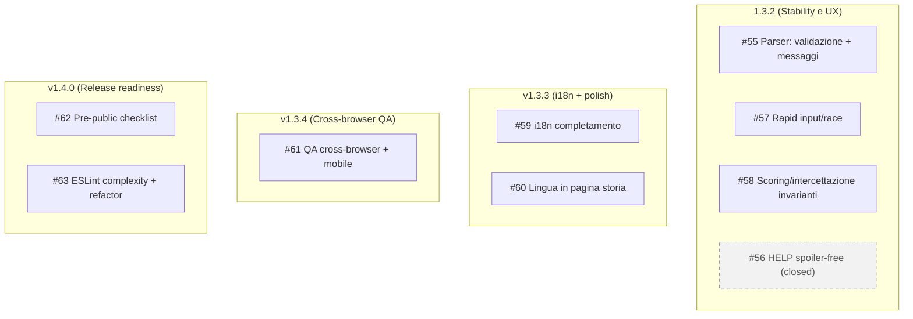

# 2026-01-13 — Next steps (Issues & Milestones)

## Abstract
Questo documento sintetizza i prossimi step di sviluppo di **Missione Odessa App** alla data **13 gennaio 2026**, a partire dalle **GitHub Issues** già create e collegate alle **Milestones**.

## Premessa
### Scope
- Fornire una vista “navigabile” (umana) delle attività pianificate.
- Collegare in modo esplicito **Issues ↔ Milestones**.
- Riportare per ogni issue: contesto, soluzione proposta, criteri di accettazione, labels e stato.

**Fonte di verità operativa:** GitHub (Issues + Milestones). Questo documento è una sintesi/indice.

### Contesto di progetto
- **Prodotto:** adventure testuale (single-player) con backend Node.js/Express, frontend statico e API REST basate su JSON caricati in memoria.
- **Stato sviluppo:** codebase consolidata, con test automatizzati (Vitest) e workflow di lint/build/test.
- **Complessità raggiunta:** esistono aree “core” con logica articolata (parser/engine, save/load, scoring, intercettazione). In particolare sono state evidenziate opportunità di miglioramento su complessità/manutenibilità (quality gates + refactor mirati).
- **Struttura progetto (macro):**
  - `src/` backend + logica (engine, parser, middleware, API routes)
  - `web/` frontend statico (storia/intro/main)
  - `tests/` suite Vitest
  - `docs/` documentazione e note tecniche

## Elenco issues (snapshot 2026-01-13)
| ID | Titolo | Stato (open/closed) | Milestone | Labels principali | Link |
|---:|---|---|---|---|---|
| 55 | Parser: validazione + messaggi per input/comandi invalidi | open | 1.3.2 (Stability e UX) | `type:chore`, `area:parser`, `priority:P1`, `stability` | https://github.com/Aqualung61/MissioneOdessa/issues/55 |
| 56 | HELP: ridurre hints (spoiler-free) e rendere l’aiuto più neutro | closed | 1.3.2 (Stability e UX) | `type:chore`, `priority:P2`, `ux`, `i18n` | https://github.com/Aqualung61/MissioneOdessa/issues/56 |
| 57 | Rapid input/race: prevenire doppie esecuzioni e desync UI/server | open | 1.3.2 (Stability e UX) | `type:chore`, `priority:P1`, `stability`, `ux` | https://github.com/Aqualung61/MissioneOdessa/issues/57 |
| 58 | Scoring/intercettazione/game over: debug esteso + invarianti + test | open | 1.3.2 (Stability e UX) | `type:chore`, `type:test`, `area:engine`, `priority:P2`, `stability` | https://github.com/Aqualung61/MissioneOdessa/issues/58 |
| 59 | i18n: completare messaggi e label mancanti (backend + frontend) | open | v1.3.3 (i18n + polish) | `type:chore`, `priority:P1`, `ux`, `i18n` | https://github.com/Aqualung61/MissioneOdessa/issues/59 |
| 60 | Lingua: selettore + persistenza in pagina storia | open | v1.3.3 (i18n + polish) | `type:chore`, `priority:P2`, `ux`, `i18n` | https://github.com/Aqualung61/MissioneOdessa/issues/60 |
| 61 | QA cross-browser + mobile: checklist riproducibile (intro/storia/main) | open | v1.3.4 (Cross-browser QA) | `type:chore`, `type:test`, `ux`, `portability` | https://github.com/Aqualung61/MissioneOdessa/issues/61 |
| 62 | Release readiness: checklist pubblicazione repo (pre-public) | open | v1.4.0 (Release readiness) | `enhancement`, `documentation`, `priority:P1` | https://github.com/Aqualung61/MissioneOdessa/issues/62 |
| 63 | ESLint complexity rules + refactor di executeCommand()/ensureVocabulary() | open | v1.4.0 (Release readiness) | `type:feature`, `area:ci`, `area:engine`, `area:parser`, `priority:P2` | https://github.com/Aqualung61/MissioneOdessa/issues/63 |

Nota: il **dettaglio** sotto include solo le issue **open**; le issue **closed** restano elencate solo nella tabella.

## Collegamento Issues ↔ Milestones (Mermaid)

---

## Issue #55 — Parser: validazione + messaggi per input/comandi invalidi
- **Stato:** open
- **Milestone:** 1.3.2 (Stability e UX)
- **Labels:** `priority:P1`, `area:parser`, `type:chore`, `stability`
- **Link:** https://github.com/Aqualung61/MissioneOdessa/issues/55

### Descrizione
**Contesto**
Alcuni input non previsti/scorretti possono generare risposte incoerenti (o errori non gestiti). Obiettivo: messaggi chiari e consistenti, senza leak tecnici, e allineamento IT/EN.

**Soluzione proposta**
- Definire un comportamento standard per input invalidi:
  - comando vuoto / solo spazi
  - caratteri non ammessi / control chars
  - verbo sconosciuto
  - pattern non parsabile (es. “PRENDI” senza oggetto quando richiesto)
- Centralizzare la generazione dei messaggi di errore “user-facing” (con chiavi i18n o testi coerenti).
- Garantire che nessun caso “invalid input” produca 500: deve restare un esito gestito (tipicamente 200 con messaggio “non capisco” oppure 400 se API).
- Aggiungere/rafforzare test sui casi limite.

**Criteri di accettazione**
- Input non valido non produce mai 500 né stack trace in risposta.
- Messaggi coerenti e non ambigui per le principali classi di errore (vuoto, verbo sconosciuto, sintassi non riconosciuta).
- IT/EN allineati (stesso significato e stessa severità).
- Test Vitest coprono almeno: vuoto, solo spazi, control chars, verbo sconosciuto, frase non parsabile.

---

## Issue #57 — Rapid input/race: prevenire doppie esecuzioni e desync UI/server
- **Stato:** open
- **Milestone:** 1.3.2 (Stability e UX)
- **Labels:** `priority:P1`, `type:chore`, `stability`, `ux`
- **Link:** https://github.com/Aqualung61/MissioneOdessa/issues/57

### Descrizione
**Contesto**
Con input molto rapido (invio ripetuto, key repeat, doppio click) possono verificarsi doppie esecuzioni o desincronizzazione tra UI e stato server.

**Soluzione proposta**
- Introdurre una strategia anti-race (una o più):
  - lock “in-flight” lato client: disabilitare input finché arriva la risposta
  - id di richiesta (requestId) e scarto di risposte fuori ordine
  - debounce/throttle sull’invio comando
- Definire il comportamento atteso quando arrivano più comandi in coda (scarto, accodamento, o blocco).
- Aggiungere test (unit/integration) dove possibile, o almeno una checklist riproducibile.

**Criteri di accettazione**
- Non si osservano doppie esecuzioni a parità di input inviato in rapida successione.
- Le risposte tardive non sovrascrivono lo stato “più recente”.
- L’UI segnala chiaramente lo stato “in elaborazione” (anche solo disabilitando input).
- Test o scenario riproducibile documentato.

---

## Issue #58 — Scoring/intercettazione/game over: debug esteso + invarianti + test
- **Stato:** open
- **Milestone:** 1.3.2 (Stability e UX)
- **Labels:** `area:engine`, `type:chore`, `type:test`, `priority:P2`, `stability`
- **Link:** https://github.com/Aqualung61/MissioneOdessa/issues/58

### Descrizione
**Contesto**
Serve rendere più verificabile e robusta la logica di scoring/intercettazione e le condizioni di game over: definire invarianti e aumentare copertura test sui punti critici.

**Soluzione proposta**
- Definire invarianti minime (esempi):
  - punteggio monotono (non diminuisce) oppure regole esplicite se può diminuire
  - game over blocca comandi/azioni successive (o comportamento esplicito)
  - contatori coerenti (es. intercettazioni, step, trigger)
- Aggiungere log/debug mirato (se già esiste una modalità debug) per isolare regressioni.
- Aggiungere test Vitest focalizzati su invarianti e casi limite.

**Criteri di accettazione**
- Invarianti definite e documentate (breve sezione in docs o README tecnico).
- Test coprono almeno:
  - progressione scoring in scenario base
  - condizione di game over e blocco/behavior post-game-over
  - coerenza contatori/trigger principali
- Nessuna regressione sulla suite esistente.

---

## Issue #59 — i18n: completare messaggi e label mancanti (backend + frontend)
- **Stato:** open
- **Milestone:** v1.3.3 (i18n + polish)
- **Labels:** `priority:P1`, `type:chore`, `ux`, `i18n`
- **Link:** https://github.com/Aqualung61/MissioneOdessa/issues/59

### Descrizione
**Contesto**
Ci sono testi/label non completati o fallback incoerenti tra IT/EN. Serve completare e uniformare la terminologia su backend e frontend.

**Soluzione proposta**
- Inventariare chiavi/testi mancanti o incoerenti (backend + frontend).
- Completare traduzioni IT/EN, rimuovere fallback “silenziosi” dove non desiderati.
- Uniformare terminologia (glossario minimo: verbi, stati, messaggi standard).
- Aggiungere test “anti-regressione” (es. nessuna chiave mancante o placeholder).

**Criteri di accettazione**
- Nessuna chiave mancante/placeholder nelle viste principali e nei messaggi engine.
- IT/EN coerenti (stesso concetto, stesso tono).
- Test automatico (o check) che fallisce se compaiono chiavi mancanti nelle aree coperte.

---

## Issue #60 — Lingua: selettore + persistenza in pagina storia
- **Stato:** open
- **Milestone:** v1.3.3 (i18n + polish)
- **Labels:** `type:chore`, `priority:P2`, `ux`, `i18n`
- **Link:** https://github.com/Aqualung61/MissioneOdessa/issues/60

### Descrizione
**Contesto**
Serve poter cambiare lingua nella pagina storia e mantenere la scelta (persistenza), con UI coerente con il resto dell’app.

**Soluzione proposta**
- Aggiungere selettore lingua in `web/odessa_storia.html`.
- Persistenza della scelta (localStorage) e applicazione al caricamento pagina.
- Allineare stile/UI al resto delle pagine (posizione, label, accessibilità minima).
- Garantire che la scelta lingua influenzi correttamente i contenuti testuali della pagina storia.

**Criteri di accettazione**
- Selettore lingua visibile e funzionante.
- Lingua persistita su refresh e su navigazione (quando si torna alla pagina).
- Nessun JS inline (coerenza con policy CSP adottata: script esterni).
- IT/EN completi nella pagina.

---

## Issue #61 — QA cross-browser + mobile: checklist riproducibile (intro/storia/main)
- **Stato:** open
- **Milestone:** v1.3.4 (Cross-browser QA)
- **Labels:** `type:chore`, `type:test`, `ux`, `portability`
- **Link:** https://github.com/Aqualung61/MissioneOdessa/issues/61

### Descrizione
**Contesto**
Serve verificare compatibilità e UX su browser principali (Edge/Safari) e su mobile, con una checklist ripetibile per evitare regressioni.

**Soluzione proposta**
- Definire una checklist “smoke” riproducibile:
  - rendering pagine intro/storia/main
  - viewport/responsiveness
  - input (tastiera, focus, invio comandi)
  - eventuali differenze Safari (autoplay, focus, storage, caching)
- Eseguire verifica manuale e annotare risultati/bug trovati.
- (Opzionale) aggiungere piccoli fix mirati emersi dalla checklist.

**Criteri di accettazione**
- Checklist documentata (1 pagina) e ri-eseguibile.
- Verifica completata su almeno: Edge desktop, Safari (se disponibile), 1 device mobile o emulazione credibile.
- Eventuali bug aperti come issue separate con passi di riproduzione.

---

## Issue #62 — Release readiness: checklist pubblicazione repo (pre-public)
- **Stato:** open
- **Milestone:** v1.4.0 (Release readiness)
- **Labels:** `enhancement`, `documentation`, `priority:P1`
- **Link:** https://github.com/Aqualung61/MissioneOdessa/issues/62

### Descrizione
**Contesto**
Per rendere il progetto pubblicabile servono controlli “pre-public”: segreti, configurazioni, hardening, licenze/attribution, contenuti.

**Soluzione proposta**
- Creare checklist di pubblicazione che includa:
  - assenza di segreti (API key, token) nel repo
  - presenza e correttezza di `.env.example` e doc di configurazione
  - hardening minimo (CSP, headers, rate limit, error handling) se deploy pubblico
  - verifica LICENSE/attribution contenuti (immagini, testi, terze parti)
  - revisione README (come avviare, come testare, come deployare)
- Eseguire la checklist e aprire issue separate per eventuali gap.

**Criteri di accettazione**
- Checklist documentata e completata (con esito PASS o con issue aperte per gap).
- Nessun segreto nel repo.
- Documentazione minima di avvio/test/deploy presente e verificata.

---

## Issue #63 — ESLint complexity rules + refactor di executeCommand()/ensureVocabulary()
- **Stato:** open
- **Milestone:** v1.4.0 (Release readiness)
- **Labels:** `type:feature`, `area:engine`, `area:parser`, `area:ci`, `priority:P2`
- **Link:** https://github.com/Aqualung61/MissioneOdessa/issues/63

### Descrizione
**Contesto**
Nel documento `docs/STATISTICHE_PROGETTO.md` è evidenziata una criticità di complessità/manutenibilità:
- `executeCommand()` in `src/logic/engine.js` (riferimento: export a partire da circa riga 1281)
- `ensureVocabulary()` in `src/logic/parser.js` (riferimento: export a partire da circa riga 38)

Obiettivo: prevenire regressioni future e rendere il refactor “misurabile” introducendo regole ESLint di complessità (e limiti dimensionali) come quality gate.

**Soluzione proposta**
- Abilitare in ESLint (flat config) regole di complessità/dimensione in `eslint.config.js`, ad esempio:
  - `complexity` (ciclomatica)
  - `max-lines-per-function` (dimensione)
  - opzionale: `max-statements` (se utile)
- Strategia di rollout “non distruttiva”:
  - fase A: regole in `warn` per baseline + inventario violazioni
  - fase B: dopo refactor delle 2 funzioni target, portare a `error` (enforced in CI)
- Refactor mirato senza cambiare comportamento:
  - `executeCommand()` → estrazione in handler per CommandType/sottocasi, riduzione branch annidati, funzioni helper pure
  - `ensureVocabulary()` → separare costruzione vocabolario, caching/invalidation e accesso a `global.odessaData`/state

**Criteri di accettazione**
- ESLint include regole di complessità/dimensione e le applica a JS/TS (config in `eslint.config.js`).
- `executeCommand()` e `ensureVocabulary()` scendono sotto le soglie concordate.
- CI passa (lint + test) e non ci sono regressioni funzionali.
- Se restano eccezioni, sono motivate e tracciate (es. `eslint-disable` con TODO e riferimento issue).
