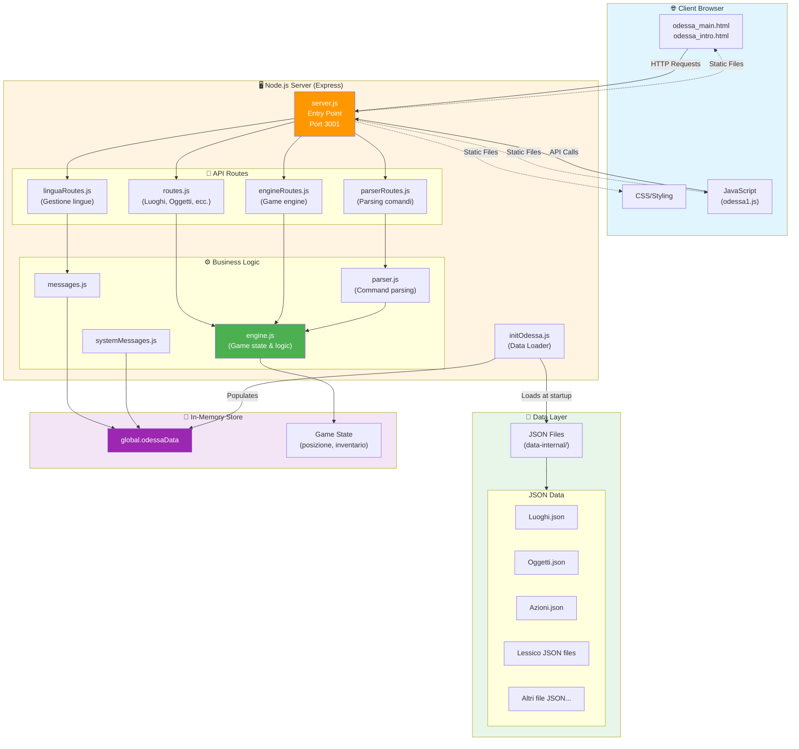
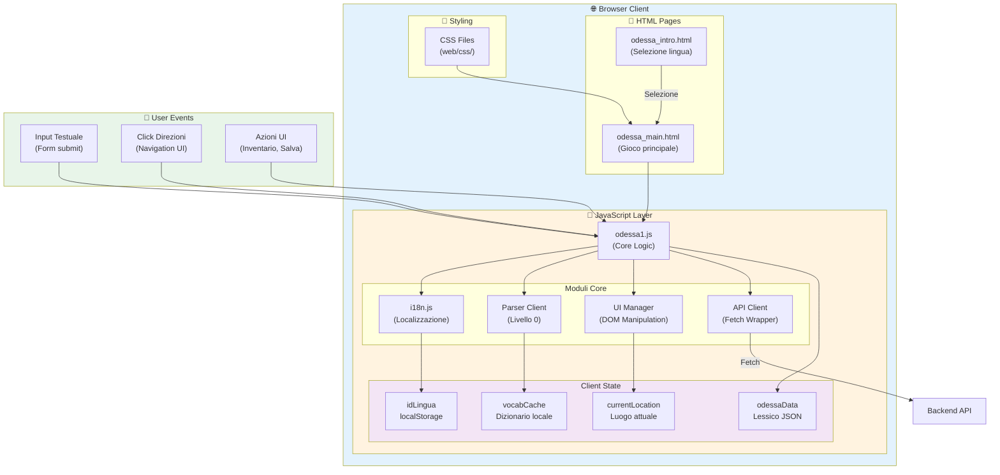
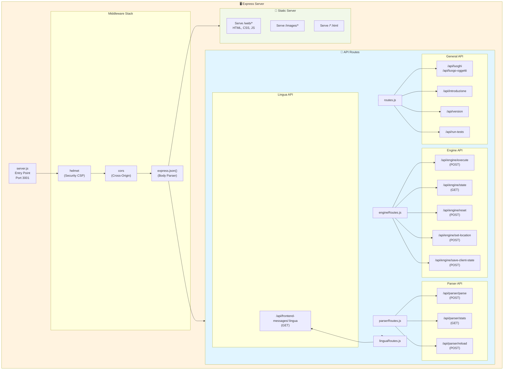
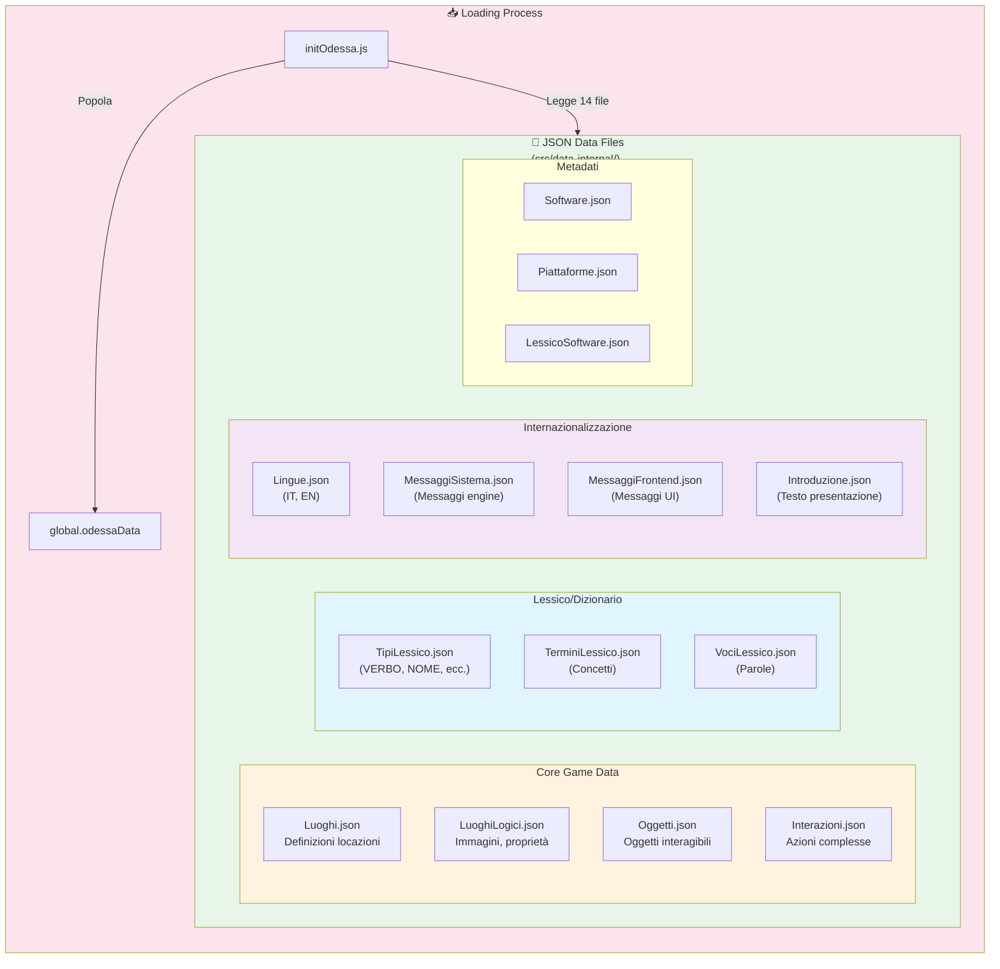
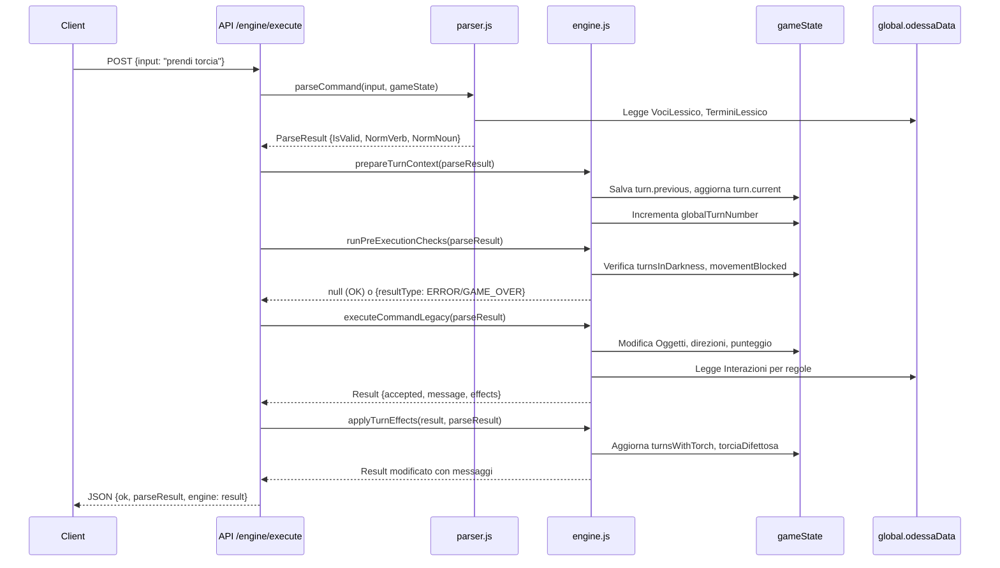
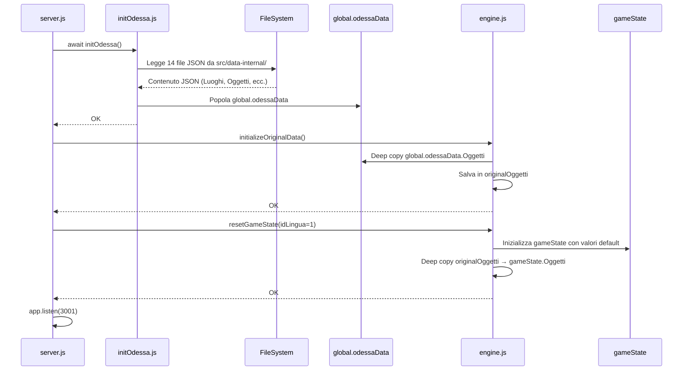

# Architettura Applicazione Missione Odessa

Questo documento descrive l'architettura completa dell'applicazione Missione Odessa.

## Diagramma Architetturale

## Componenti Principali

### 🌐 Client (Browser)
Interfaccia web statica basata su HTML/CSS/JavaScript:
- **odessa_main.html** - Interfaccia principale del gioco
- **odessa_intro.html** - Schermata iniziale con selezione lingua
- **odessa1.js** - Logica client-side per interazione con il gioco

### 🖥️ Server Node.js/Express
Backend eseguito sulla porta 3001 (configurabile):

#### Entry Point
- **server.js** - Punto di ingresso che:
  - Carica tutti i dati in memoria all'avvio
  - Configura middleware (helmet, cors, express.json)
  - Monta le route API
  - Serve file statici

#### API Routes
Quattro gruppi di endpoint REST:
- **routes.js** - API per luoghi, oggetti, direzioni, voci
- **linguaRoutes.js** - Gestione lingue e traduzioni
- **parserRoutes.js** - Parsing e interpretazione comandi utente
- **engineRoutes.js** - Game engine (stato gioco, azioni)

#### Business Logic
- **engine.js** - Core del gioco: gestisce stato, inventario, logica azioni
- **parser.js** - Interpreta comandi testuali dell'utente
- **messages.js** - Gestione messaggi e testi dinamici
- **systemMessages.js** - Caricamento messaggi di sistema

### 💾 Data Layer
Architettura dati ibrida:

#### JSON Files (src/data-internal/)
Dati statici caricati all'avvio:
- **Luoghi.json** - Definizione locazioni di gioco
- **Oggetti.json** - Oggetti interagibili
- **Azioni.json** - Azioni disponibili
- Altri file per direzioni, voci, ecc.

### 🧠 In-Memory Store
Dati mantenuti in memoria durante l'esecuzione:
- **global.odessaData** - Cache di tutti i dati JSON/DB
- **Game State** - Stato corrente della partita:
  - Posizione giocatore
  - Inventario
  - Stato oggetti (raccolti, usati, ecc.)
  - Progressione gioco

## Flusso di Dati

1. **Startup**: `server.js` invoca `initOdessa.js` che carica JSON e DB in `global.odessaData`
2. **Request**: Client invia richiesta HTTP/API
3. **Routing**: Express instrada a route specifica
4. **Logic**: Route invoca business logic (engine/parser)
5. **State**: Logic accede/modifica game state in memoria
6. **Response**: Dati ritornati al client come JSON

## Configurazione

- **Port**: 3001 (default) - configurabile via `process.env.PORT`
- **Base Path**: Supporto deployment in sottocartelle via `process.env.BASE_PATH`

## Deployment & Ambienti

- **Locale sviluppo**: `npm run dev` (porta 3001 di default), caricamento dati da JSON in memoria.
- **Sorgente**: repository GitHub (branch main) come unica fonte di verita'.
- **Produzione**: deploy su Railway; same codebase, statici serviti da Express; se usi sottocartelle configura `BASE_PATH`.
- **Note runtime**: niente database attivo (solo JSON in memoria), single istanza sufficiente per il carico previsto.

## Testing

- **Suite**: Vitest, esecuzione con `npm test` (o `npm run test:watch` in locale).
- **Copertura**: parser, engine, rotte principali e smoke end-to-end; usata come rete di sicurezza regressioni.
- **Strategia**: esegui i test prima di deploy su Railway.

## Note Performance/Scalabilita'

- Applicazione single-player, in-memory; carico previsto molto basso.
- Nessuna esigenza di scaling orizzontale; una singola istanza Railway e' sufficiente.
- Nessun uso di database esterno; i dati restano in memoria e su file JSON statici.

## Note Tecniche

- Server single-threaded Node.js con dati in memoria per performance
- Tutti i dati caricati da file JSON statici (no database attivo; SQLite/DDL legacy deprecati)
- Frontend completamente statico: può essere servito da qualsiasi web server
- API RESTful senza autenticazione (single-player locale)

---

## Diagrammi di Dettaglio

### 1. Client Layer (Browser)

**Componenti Client:**

- **HTML Pages**:
  - `odessa_intro.html`: Schermata iniziale con selezione lingua
  - `odessa_main.html`: Interfaccia principale del gioco (pannello luoghi, input comandi, inventario)

- **JavaScript Core** (`odessa1.js`):
  - **i18n**: Gestione localizzazione testi UI
  - **Parser Client**: Pre-parsing livello 0 (validazione comandi, cache vocabolario)
  - **UI Manager**: Manipolazione DOM (rendering luoghi, direzioni, feed messaggi)
  - **API Client**: Wrapper per chiamate fetch al backend

- **Client State**:
  - `currentLocation`: Luogo corrente visualizzato
  - `vocabCache`: Cache locale del dizionario comandi
  - `odessaData`: Strutture lessico caricate da JSON
  - `localStorage`: Persistenza lingua selezionata

---

### 2. Server Node.js Layer

**Server Components:**

- **Entry Point** (`server.js`):
  - Inizializza Express
  - Carica dati in memoria (`initOdessa()`)
  - Configura middleware security (Helmet CSP)
  - Monta route API e static file serving

- **API Routes** (4 gruppi):
  1. **routes.js**: API generali (luoghi, oggetti, introduzione, versione)
  2. **engineRoutes.js**: Game engine (execute, state, reset, save/load)
  3. **parserRoutes.js**: Parsing comandi (parse, stats, reload cache)
  4. **linguaRoutes.js**: Gestione lingue (messaggi frontend localizzati)

---

### 3. Data Layer (JSON Files)

**Struttura Dati JSON:**

1. **Core Game Data**:
   - `Luoghi.json`: Definizione 60+ locazioni (ID, descrizioni, direzioni)
   - `LuoghiLogici.json`: Proprietà luoghi (immagini, buio, pericolosità)
   - `Oggetti.json`: 40+ oggetti (ID, descrizione, locazione, stato Attivo)
   - `Interazioni.json`: Azioni complesse (prerequisiti, effetti, sblocchi)

2. **Lessico**:
   - `TipiLessico.json`: Categorie grammaticali (VERBO, NOME, DIREZIONE, ecc.)
   - `TerminiLessico.json`: Concetti astratti (PRENDERE, ESAMINARE, ecc.)
   - `VociLessico.json`: Parole concrete per lingua (prendi, take, ecc.)

3. **i18n**:
   - `Lingue.json`: Lingue disponibili (IT, EN)
   - `MessaggiSistema.json`: Messaggi engine (errori, feedback azioni)
   - `MessaggiFrontend.json`: Testi UI client-side
   - `Introduzione.json`: Testo presentazione gioco

---

### 4. In-Memory Store (DETTAGLIO MASSIMO)

```mermaid
graph TB
    subgraph GlobalMemory["🧠 global.odessaData"]
        subgraph StaticData["Dati Statici (Read-Only)"]
            GL["Luoghi[60+]<br/>Descrizioni, Direzioni"]
            GLL["LuoghiLogici[60+]<br/>Immagini, Buio"]
            GI["Interazioni[40+]<br/>Regole azioni complesse"]
            GLessico["Lessico (3 tabelle)<br/>TipiLessico, TerminiLessico,<br/>VociLessico"]
            GMsg["Messaggi (3 tabelle)<br/>MessaggiSistema,<br/>MessaggiFrontend,<br/>Introduzione"]
        end
    end
    
    subgraph GameState["🎮 gameState (Singleton Mutabile)"]
        subgraph CoreState["Stato Core"]
            Loc["currentLocationId: number<br/>Luogo attuale (default: 1)"]
            Lingua["currentLingua: number<br/>Lingua corrente (1=IT, 2=EN)"]
            Visited["visitedPlaces: Set<number><br/>Luoghi visitati (per punteggio)"]
            Ended["ended: boolean<br/>Flag partita terminata"]
        end
        
        subgraph ObjectState["Stato Oggetti"]
            Oggetti["Oggetti: Array<Object><br/>Deep copy di global.odessaData.Oggetti<br/>Modificabile per stato runtime"]
            OggettiStruct["Ogni oggetto:<br/>{ID, IDLingua, Oggetto,<br/>Attivo: 0/1/2/3,<br/>IDLuogo: number|null}"]
        end
        
        subgraph InteractionState["Stato Interazioni"]
            IntEseg["interazioniEseguite: Array<number><br/>ID interazioni completate<br/>(non ripetibili)"]
            DirSbloc["direzioniSbloccate: Object<br/>{'IDLuogo_Direzione': true}<br/>Sblocchi permanenti"]
            DirToggle["direzioniToggle: Object<br/>{'IDLuogo_Direzione': boolean}<br/>Sblocchi temporanei"]
            Sequenze["sequenze: Object<br/>{'nome': stato}<br/>Es. cassaforte: 'DSSD'"]
            OpenStates["openStates: Object<br/>{'NOME': boolean}<br/>Es. BOTOLA: true/false"]
        end
        
        subgraph ScoreSystem["Sistema Punteggio"]
            Score["punteggio.totale: number<br/>Punteggio totale (1+)"]
            ScoreInt["punteggio.interazioniPunteggio:<br/>Set<number><br/>ID interazioni completate"]
            ScoreMist["punteggio.misteriRisolti:<br/>Set<number><br/>ID misteri risolti"]
        end
        
        subgraph TurnSystem["Sistema Turn (v3.0)"]
            TurnGlobal["turn.globalTurnNumber: number<br/>Contatore assoluto turni"]
            TurnConsumed["turn.totalTurnsConsumed: number<br/>Turni che consumano tempo"]
            TurnTorch["turn.turnsWithTorch: number<br/>Turni con torcia accesa"]
            TurnDark["turn.turnsInDarkness: number<br/>Turni al buio senza luce"]
            TurnDanger["turn.turnsInDangerZone: number<br/>Turni in zona pericolosa"]
            
            subgraph CurrentTurn["turn.current (Snapshot Turno)"]
                TCParse["parseResult: Object<br/>Comando parsato"]
                TCConsume["consumesTurn: boolean<br/>Se consuma tempo"]
                TCLoc["location: number<br/>Luogo attuale"]
                TCLight["hasLight: boolean<br/>Se ha fonte luce attiva"]
                TCDanger["inDangerZone: boolean<br/>Se in zona pericolosa"]
            end
            
            subgraph PrevTurn["turn.previous (Turno Precedente)"]
                TPLoc["location: number"]
                TPLight["hasLight: boolean"]
                TPConsumed["consumedTurn: boolean"]
            end
        end
        
        subgraph TimerSystem["Sistema Timer"]
            TMovement["timers.movementCounter: number<br/>Contatore mosse (legacy)"]
            TTorcia["timers.torciaDifettosa: boolean<br/>Torcia guasta dopo 6 turni"]
            TLampada["timers.lampadaAccesa: boolean<br/>Stato lampada (Oggetto ID=27)"]
            TAzioni["timers.azioniInLuogoPericoloso: number<br/>Counter zona pericolosa (legacy)"]
            TUltimo["timers.ultimoLuogoPericoloso: number<br/>ID ultimo luogo pericoloso"]
        end
        
        subgraph VictorySystem["Sistema Vittoria"]
            VNarrative["narrativeState: string|null<br/>Enum fase narrativa<br/>(ENDING_PHASE_1A, ecc.)"]
            VPhase["narrativePhase: number<br/>Progressivo numerico (0+)"]
            VVictory["victory: boolean<br/>Flag vittoria finale"]
            VBlocked["movementBlocked: boolean<br/>Blocca navigazione (luogo 59)"]
            VCounter["unusefulCommandsCounter: number<br/>Comandi errati al luogo 59"]
            VAwaiting["awaitingContinue: boolean<br/>Attesa BARRA SPAZIO"]
            VCallback["continueCallback: Function|null<br/>Callback per CONTINUA"]
        end
        
        subgraph RestartSystem["Sistema Riavvio"]
            RAwaiting["awaitingRestart: boolean<br/>In attesa conferma SI/NO"]
        end
    end
    
    subgraph OriginalData["📦 originalOggetti (Immutabile)"]
        OrigOgg["Array<Object><br/>Deep copy iniziale di Oggetti<br/>(per reset partita)"]
    end
    
    GlobalMemory -->|Caricati all'avvio| GameState
    OriginalData -->|Backup per reset| ObjectState
    
    style GlobalMemory fill:#e8f5e9
    style GameState fill:#fff3e0
    style CoreState fill:#e1f5ff
    style ObjectState fill:#f3e5f5
    style InteractionState fill:#fce4ec
    style ScoreSystem fill:#e0f2f1
    style TurnSystem fill:#fff9c4
    style TimerSystem fill:#f1f8e9
    style VictorySystem fill:#ede7f6
    style RestartSystem fill:#fbe9e7
    style OriginalData fill:#d7ccc8
```

**Dettaglio In-Memory Store:**

#### A. `global.odessaData` (Statico, Read-Only)
Dati caricati da JSON all'avvio, **non modificati** durante il gioco:
- **Luoghi**: Array[60+] con descrizioni, direzioni base, proprietà
- **LuoghiLogici**: Metadati (immagini, buio, pericolosità)
- **Interazioni**: Regole azioni complesse (prerequisiti, effetti)
- **Lessico**: 3 tabelle per parsing (TipiLessico, TerminiLessico, VociLessico)
- **Messaggi**: MessaggiSistema, MessaggiFrontend, Introduzione

#### B. `gameState` (Mutabile, Stato Runtime)

**1. Stato Core:**
- `currentLocationId`: ID luogo attuale (1-60+)
- `currentLingua`: Lingua selezionata (1=IT, 2=EN)
- `visitedPlaces`: Set di ID luoghi visitati (per punteggio)
- `ended`: Flag game over/vittoria

**2. Stato Oggetti:**
- `Oggetti`: Deep copy di `global.odessaData.Oggetti`
- Modificabile per cambiare:
  - `Attivo`: 0 (invisibile), 1 (visibile), 2 (esaminabile), 3 (raccoglibile)
  - `IDLuogo`: null (nascosto), 0 (inventario), 1-60+ (posizione)

**3. Stato Interazioni:**
- `interazioniEseguite`: Array ID interazioni completate (non ripetibili)
- `direzioniSbloccate`: Oggetto `{'8_Est': true}` per sblocchi permanenti
- `direzioniToggle`: Oggetto per sblocchi temporanei (toggle on/off)
- `sequenze`: Oggetto per tracciare progressi sequenze (es. combinazione cassaforte)
- `openStates`: Stati apertura (es. `{BOTOLA: true}`)

**4. Sistema Punteggio:**
- `punteggio.totale`: Punteggio totale (luoghi + interazioni + misteri)
- `punteggio.interazioniPunteggio`: Set ID interazioni con punteggio
- `punteggio.misteriRisolti`: Set ID misteri completati

**5. Sistema Turn (v3.0):**
- **Contatori Globali**:
  - `globalTurnNumber`: Tutti i turni (inclusi non-consuming)
  - `totalTurnsConsumed`: Solo turni che consumano tempo
  - `turnsWithTorch`: Turni con torcia accesa (max 6 → si guasta)
  - `turnsInDarkness`: Turni al buio (max 3 → morte)
  - `turnsInDangerZone`: Turni in zona intercettazione (max 3 → morte)

- **Snapshot Turno Corrente** (`turn.current`):
  - `parseResult`: Comando parsato
  - `consumesTurn`: Boolean (INVENTARIO, AIUTO → false; altri → true)
  - `location`: Luogo attuale
  - `hasLight`: Se ha torcia/lampada attiva
  - `inDangerZone`: Se in zone 51,52,53,55,56,58

- **Turno Precedente** (`turn.previous`):
  - Salva stato precedente per comparazioni

**6. Sistema Timer (Legacy):**
- `movementCounter`: Contatore mosse (deprecato in favore di turn system)
- `torciaDifettosa`: Boolean, torcia si guasta dopo 6 turni
- `lampadaAccesa`: Boolean, stato lampada (Oggetto ID=27)
- `azioniInLuogoPericoloso`: Counter per intercettazione (deprecato)
- `ultimoLuogoPericoloso`: Per reset counter al cambio stanza

**7. Sistema Vittoria:**
- `narrativeState`: Enum fasi finali (ENDING_PHASE_1A, 1B, 2, ecc.)
- `narrativePhase`: Progressivo numerico
- `victory`: Boolean vittoria
- `movementBlocked`: Blocca navigazione (es. guardia luogo 59)
- `unusefulCommandsCounter`: Comandi errati consecutivi
- `awaitingContinue`: Attende pressione BARRA SPAZIO
- `continueCallback`: Funzione da eseguire al CONTINUA

**8. Sistema Riavvio:**
- `awaitingRestart`: Attende risposta SI/NO per riavvio dopo game over

#### C. `originalOggetti` (Immutabile, Backup)
Deep copy iniziale di `Oggetti` per reset partita senza riavvio server.

---

### Flussi Operativi Chiave

#### Flusso Esecuzione Comando:

#### Flusso Caricamento Dati Startup:

---

## Logiche Avanzate

### Sistema Turn v3.0
**Obiettivo**: Gestire effetti temporali (torcia, buio, intercettazione) in modo robusto.

**Fasi**:
1. **prepareTurnContext**: Snapshot stato pre-esecuzione
2. **runPreExecutionChecks**: Valida condizioni (game over, blocchi)
3. **executeCommandLegacy**: Esegue comando
4. **applyTurnEffects**: Applica effetti post-esecuzione

**Regole Temporizzazione**:
- Comandi informativi (INVENTARIO, AIUTO, PUNTI) **non consumano** turno
- Altri comandi validi **consumano** turno
- **Torcia**: Si guasta dopo 6 turni di uso (`torciaDifettosa = true`)
- **Buio**: Morte dopo 3 turni senza luce in luogo buio
- **Intercettazione**: Morte dopo 3 turni in zone pericolose (51,52,53,55,56,58)

### Sistema Oggetti Attivo
Ogni oggetto ha campo `Attivo`:
- **0**: Nascosto/rimosso (non visibile, non esaminabile)
- **1**: Visibile ma non raccoglibile (es. tavolo)
- **2**: Esaminabile con dettagli extra
- **3**: Raccoglibile nell'inventario

Campo `IDLuogo`:
- **null**: Nascosto completamente
- **0**: Nell'inventario giocatore
- **1-60+**: In un luogo specifico

### Sistema Interazioni
Tabella `Interazioni.json` definisce azioni complesse con:
- **Prerequisiti**: Condizioni da verificare (oggetti, luoghi, stato)
- **Effetti**: Modifiche da applicare (sblocca direzione, modifica oggetto, punteggio)
- **Messaggi**: Feedback localizzato per successo/fallimento
- **Punteggio**: Assegnazione punti per completamento
- **Ripetibilità**: Flag per azioni ripetibili o una-tantum
